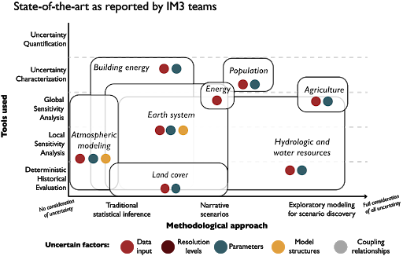

************
Introduction
************

This guidance text has been developed in support of the Integrated Multisector Multiscale Modeling (IM3) Science Focus Area’s objective to formally integrate uncertainty into its research tasks. IM3 is focused on innovative modeling to explore how human and natural system landscapes in the United States co-evolve in response to short-term shocks and long-term influences. The project’s challenging scope is to advance our ability to study the interactions between energy, water, land, and urban systems, at scales ranging from local (~1km) to the contiguous United States, while consistently addressing influences such as population change, technology change, heat waves, and drought. Uncertainty and careful model-driven scientific insights are central to IM3’s key MultiSector Dynamics (MSD) science objectives shown below.

**IM3 key MSD science objectives include:**

*Develop flexible, open-source, and integrated modeling capabilities that capture the structure, dynamic behavior, and emergent properties of the multiscale interactions within and between human and natural systems.*

*Use these capabilities to study the evolution, vulnerability, and resilience of interacting human and natural systems and landscapes from local to continental scales, including their responses to the compounding effects of long-term influences and short-term shocks.*

*Understand the implications of uncertainty in data, observations, models, and model coupling approaches for projections of human-natural system dynamics.*

Addressing the objectives above poses a strong transdisciplinary challenge that heavily depends on a diversity of models and, more specifically, a consistent framing for making model-based science inferences. The term transdisciplinary science as used here formally implies a deep integration of disciplines to aid our hypothesis driven understanding of coupled human-natural systems--bridging differences in theory, hypothesis generation, modeling, and modes of inference :cite:p:`national2014convergence`. The IM3 MSD research focus and questions require a deep integration across disciplines, where new modes of analysis can emerge that rapidly synthesize and exploit advances for making decision relevant insights that at minimum acknowledge uncertainty and more ideally promote a rigorous quantitative mapping of its effects on the generality of claimed scientific insights. More broadly, diverse scientific disciplines engaged in the science of coupled human-natural systems, ranging from natural sciences to engineering and economics, employ a diversity of numerical computer models to study and understand their underlying systems of focus. The utility of these computer models hinges on their ability to represent the underlying real systems with sufficient fidelity and enable the inference of novel insights. This is particularly challenging in the case of coupled human-natural systems where there exists a multitude of interdependent human and natural processes taking place that could potentially be represented. These processes usually translate into modeled representations that are highly complex, non-linear, and exhibit strong interactions and threshold behaviors :cite:p:`elsawah2020eight,haimes2018risk,helbing2013globally`. Model complexity and detail have also been increasing as a result of our improving understanding of these processes, the availability of data, and the rapid growth in computing power :cite:p:`saltelli2019so`. As model complexity grows, modelers need to specify a lot more information than before: additional model inputs and relationships as more processes are represented, higher resolution data as more observations are collected, new coupling relationships and interactions as models are put together to answer multisector questions (e.g., the land-water-energy nexus). Typically, not all of this information is well known, nor is the impact of these many uncertainties on model outputs well understood. It is further especially difficult to distinguish the effects of individual as well as interacting sources of uncertainty when modeling coupled systems with multisector and multiscale dynamics :cite:p:`wirtz2017rocky`.

Given the challenge and opportunity posed by the disciplinary diversity of IM3, we utilized a team-wide survey to allow the project’s membership to provide their views on how their areas typically address uncertainty, emphasizing key literature examples and domain-specific reviews. Our synthesis of this survey information in Figure 1 summaries the team’s perspectives, enabling a summary of the commonalities and differences for how different disciplinary areas are typically addressing uncertainty. Figure 1 highlights the non-trivial challenge posed by seeking to carefully consider uncertainty across an MSD focused transdisciplinary team. There are significant differences across the team’s contributing disciplines in terms of the methodological approaches and tools used in the treatment of uncertainty. The horizontal axis of the figure represents a conceptual continuum of methodological approaches, ranging from deterministic (no uncertainty) modeling to the theoretical case of fully engaging in modeling all sources of uncertainty. The vertical axis of plot maps the analysis tools that are used in the disciplines’ literature, spanning error-driven historical analyses to full uncertainty quantification. Given that Figure 1 is a conceptual illustration, the mapping of each discipline’s boundaries is not meant to imply exactness. They encompass the scope of feedback attained in the team-wide survey responses. The color circles designate specific sources of uncertainty that could be considered. Within the mapped disciplinary approaches, the color circles distinguish those sources of uncertainty that are addressed in the bodies of literature reported by respondents. Note the complete absence of grey circles designating that at present few if any studies report results for understanding how model coupling relationships shape uncertainty. We can briefly distinguish the key terms of uncertainty quantification (UQ) and uncertainty characterization (UC). UQ refers to the formal focus on the full specification of likelihoods as well as distributional forms necessary to infer the joint  probabilistic response across all modeled factors of interest :cite:p:`cooke1991experts`. Alternatively, uncertainty characterization as defined here, refers to exploratory modeling of alternative hypotheses for the co-evolutionary dynamics of influences, stressors, as well as path dependent changes in the form and function of modelled systems :cite:p:`moallemi2020exploratory,walker2003defining`. Uncertain factors are any model component which is affected by uncertainty: inputs, resolution levels, coupling relationships, model relationships and parameters. When a model has been established as a sufficiently accurate representation of the system some of these factors may reflect elements of the real-world system that the model represents (for example, a population level parameter would reflect a sufficiently accurate representation of the population level in the system under study). As discussed in later sections, the choice of UQ or UC depends on the specific goals of studies, the availability of data, the types of uncertainties (e.g., well-characterized or deep), the complexity of underlying models as well as the computational limits. Deep uncertainty (as opposed to well-characterized) refers to situations where expert opinions consulted on a decision do not know or cannot agree on system boundaries, or the outcomes of interest and their relative importance, or the prior probability distribution for the various uncertain factors present :cite:p:`kwakkel2016coping,gass1997encyclopedia`.

    State-of-the-art in different modeling communities, as reported in the survey distributed to IM3 teams. Deterministic Historical Evaluation: model evaluation under fully determined conditions defined using historical observations; Local Sensitivity Analysis: model evaluation performed by varying uncertain factors around specific reference values; Global Sensitivity Analysis: model evaluation performed by varying uncertain factors throughout their entire feasible value space; Uncertainty Characterization: model evaluation under alternative factor hypotheses to explore their implications for model output uncertainty; Uncertainty Quantification: representation of model output uncertainty using probability distributions; Traditional statistical inference: use of analysis results to describe deterministic or probabilistic outcomes resulting from the presence of uncertainty; Narrative scenarios: use of a limited decision-relevant number of scenarios to describe (sets of) changing system outcomes; Exploratory modeling for scenario discovery: use of large ensembles of uncertain conditions to discover decision-relevant combinations of uncertain factors

At present, there is no singular guide for confronting the computational and conceptual challenges of the multi-model, transdisciplinary workflows that characterize ambitious projects such as IM3 :cite:p:`saltelli2015climate`. The primary aim of this text is to begin to address this gap and provide guidance for facing these challenges. Chapter 2 provides an overview of diagnostic modeling and the different perspectives for how we should evaluate our models. Chapter 3 the basic methods and concepts for sensitivity analysis. Chapter 4 delves into more technical applications of sensitivity analysis to support diagnostic model evaluation and exploratory modeling. Chapter 5 transitions to an overview of the key concepts and tools for UQ. Chapter 6 transitions to the use of UQ to capture risks and extremes in MSD systems. Chapter 7 provides concluding remarks across the UC and UQ topics covered in this text. The appendices of this text include a glossary of the key concepts as well as example test cases and scripts to showcase various UC and UQ related tools.
