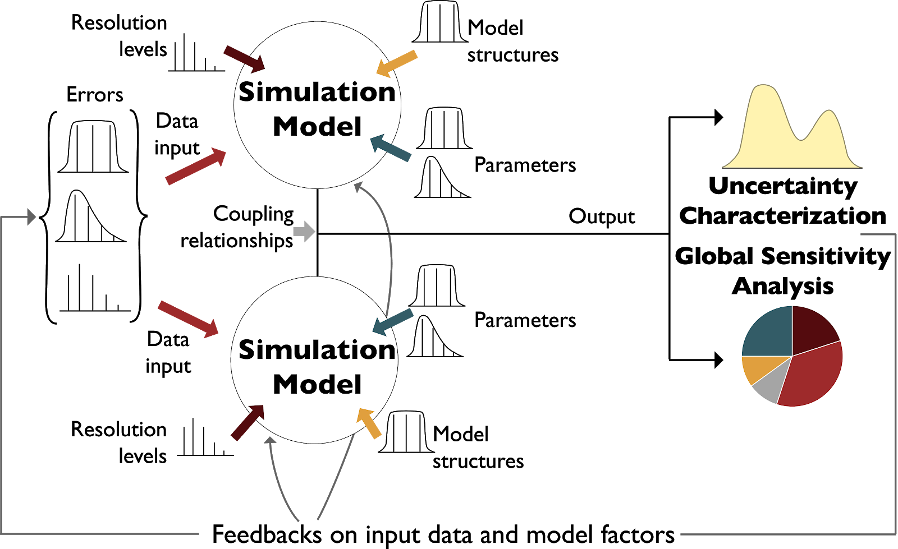

Overview of model diagnostics
#############################

Model diagnostics provide a rich basis for hypothesis testing, model innovation, and improved inferences when classifying what is controlling highly consequential results (e.g., vulnerability or resilience in coupled human-natural systems). :numref:`Figure_2_1`, adapted from :cite:p:`saltelli2019so`, presents idealized illustrations of the relationship between UC and global sensitivity analysis for two coupled simulation models. The figure illustrates how UC can be used to address how uncertainties in various modeling decisions (e.g., data inputs, parameters, model structures, coupling relationships) can be sampled and simulated to yield the empirical model output distribution(s) of interest. Monte Carlo frameworks allow us to sample and propagate (or integrate) the ensemble response of the model(s) of focus. The first step of any UC analysis is the specification of the initial input distributions as illustrated in :numref:`Figure_2_1`. The second step is to perform the Monte Carlo simulations. The question can then be raised, which of the modeling assumptions in our Monte Carlo experiment are the most responsible for the resulting output uncertainty. We can answer this question using global sensitivity analysis as illustrated in :numref:`Figure_2_1`. Global sensitivity analysis can be defined as a formal Monte Carlo sampling and analysis of modeling choices (structures, parameters, inputs) to quantify their influence on direct model outputs (or output-informed metrics). UC experiments by themselves do not explain why a particular uncertain outcome is produced, but produce distributions of model outcomes, as portrayed by the yellow curve. The pie chart shown in :numref:`Figure_2_1` is a conceptual representation of the results of using a global sensitivity analysis to identify those factors that are most dominantly influencing results, either individually or interactively :cite:`saltelli_global_2008`.

.. _Figure_2_1:

    Idealized uncertainty characterization and global sensitivity analysis for two coupled simulation models. Uncertainty coming from various sources (e.g., inputs, model structures, coupling relationships) is propagated through the coupled model(s) to generate empirical distributions of outputs of interest (uncertainty characterization). This model output uncertainty can be decomposed to its origins, by means of sensitivity analysis. Figure adapted from :cite:t:`saltelli2019so`.

UC and global sensitivity analysis are not independent modeling analyses. As illustrated here, any global sensitivity analysis requires an initial UC hypothesis in the form of statistical assumptions and representations for the modeling choices of focus (structural, parametric, and data inputs). Information from these two model diagnostic tools can then be used to inform data needs for future model runs, experiments to reduce the uncertainty present, or the simplification or enhancement of the model where necessary. Together UC and global sensitivity analysis provide a foundation for diagnostic exploratory modeling that has a consistent focus on the assumptions, structural model forms, alternative parameterizations, and input data sets that are used to characterize the behavioral space of one or more models.
