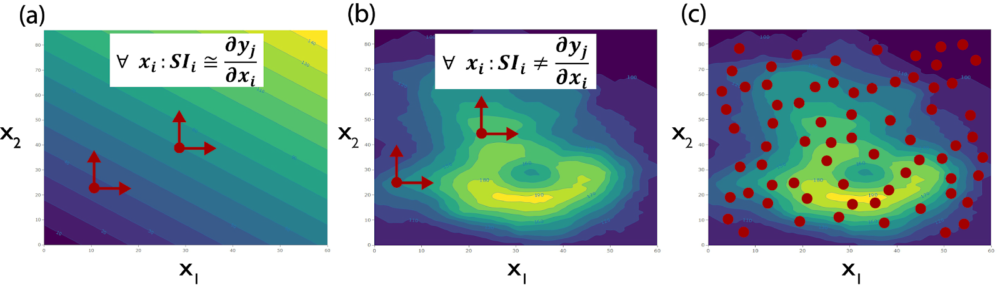

Global Versus Local Sensitivity
###############################

Out of the several definitions for sensitivity analysis presented in literature, the most widely used has been proposed by Saltelli et al. (2004) as “the study of how uncertainty in the output of a model (numerical or otherwise) can be apportioned to different sources of uncertainty in the model input”. In other words, sensitivity analysis explores the relationship between the model’s N input variables, x=[x1,x2,...,xN], and M output variables, y=[y1,y2,...,yM] with y=g(x), where g is the model that maps the model inputs to the outputs (Borgonovo and Plischke, 2016). Therefore, sensitivity analysis provides us with a set of alternatives to conducting large empirical experiments which are costly and often, in practice, next to impossible.
Historically, there have been two broad categories of sensitivity analysis techniques: local and global. Local sensitivity analysis is performed by varying model parameters around specific reference values, with the goal of exploring how small input perturbations influence model performance. Due to its convenience, this approach has been widely used in literature, but has important limitations (Rakovec et al., 2014; Saltelli and Annoni, 2010). If the model is not linear, the results of local sensitivity analysis can be heavily biased, as they will vary depending on the range of the chosen input (e.g., (Tang et al., 2007)). If the model’s factors interact, local sensitivity analysis will underestimate their importance, as it does not account for those effects (e.g., (Hamm et al., 2006)). In general, as local sensitivity analysis only partially and locally explores the parametric space, it is not considered a valid approach for nonlinear models (Saltelli et al., 2019). This is illustrated in Fig. 3 (a-b), presenting contour plots of a model response (y1) with an additive linear model (in a) and with a nonlinear model (in b). In a linear model without interactions between the terms x1 and x2, local sensitivity analysis can produce appropriate sensitivity indices (Fig. 3 a). If however, factors x1 and x2 interact, the local and partial consideration of the space can not properly account for each factor’s effects on the model response (Fig. 3 b), as it is only informative at the base point where it is applied. In contrast, a global sensitivity analysis varies uncertain factors within the entire feasible space of variability (Fig. 3 c). This approach reveals the global effects of each parameter on the model output, including any interactive effects. For models that cannot be proven linear, global sensitivity analysis is preferred and this text is primarily discussing global sensitivity analysis methods. In general, whenever we use the term sensitivity analysis we are referring to its global application.

    Treatment of a two-dimensional space of variability by local (panels a-b) and global (panel c) sensitivity analyses. Local sensitivity analysis is only an appropriate approach to sensitivity in the case of linear models without interactions between terms (a). In the case of more complex models, local sensitivity will miscalculate sensitivity indices (b), and global sensitivity methods should be used instead (c).
