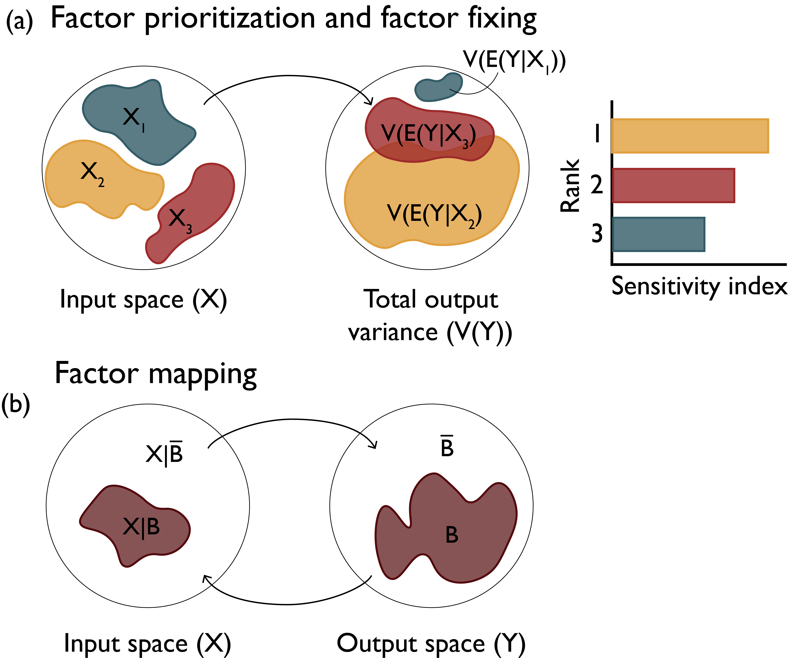

.. _why_SA:

Why Perform Sensitivity Analysis
################################

It is important to understand the many ways in which a SA might be of use to your modeling effort. Most commonly, one might be motivated to perform sensitivity analysis for the following reasons:

*Model evaluation*: Sensitivity analysis can be used to gauge model inferences when assumptions about the structure of the model or its parameterization are dubious or have changed. For instance, consider a numerical model that uses a set of calibrated parameter values to produce outputs, which we then use to inform decisions about the real-world system represented. One might like to know if small changes in these parameter values significantly change this model’s output and the decisions it informs or if, instead, our parameter inferences yield stable model behavior regardless of the uncertainty present in the specific parameterized processes or properties. This can either discredit or lend credence to the model at hand, as well as any inferences drawn that are founded on its accurate representation of the system. Sensitivity analysis can identify which uncertain model factors cause this undesirable model behavior.

*Model simplification*: Sensitivity analysis can also be used to identify factors or components of the model that appear to have limited effects on direct outputs or metrics of interest. Consider a model that has been developed in an organization for the purposes of a specific research question and is later used in the context of a different application. Some processes represented in significant detail might no longer be of the same importance while consuming significant data or computational resources, as different outputs might be pertinent to the new application. Sensitivity analysis can be used to identify unimportant model components and simplify them to nominal values and reduced model forms. Model complexity and computational costs can therefore be reduced.

*Model refinement*: Alternatively, sensitivity analysis can reveal the factors or processes that are highly influential to the outputs or metrics of interest, by assessing their relative importance. In the context of model evaluation, this can inform which model components warrant additional investigation or measurement so the uncertainty surrounding them and the resulting model outputs or metrics of interest can be reduced.

*Exploratory modeling*: When sufficient credence has been established in the model, sensitivity analysis can be applied to a host of other inquiries. Inferences about the factors and processes that most (or least) control a model’s outputs of interest can be extrapolated to the real system they represent and be used in a heuristic manner to inform model-based inferences. On this foundation, a model paired with the advanced techniques presented in this text can be used to “discover” decision relevant and highly consequential outcomes (i.e., scenario discovery, discussed in more detail in :numref:`consequential_scenarios` :cite:p:`bankes_exploratory_1993, bryant2010thinking`).

The nature and context of the model shapes the specific objectives of applying a sensitivity analysis, as well as methods and tools most appropriate and defensible for each application setting :cite:`saltelli2004sensitivity, saltelli2002relative, wagener_what_2019`. The three most common sensitivity analysis modes (*Factor Prioritization*, *Factor Fixing*, and *Factor Mapping*) are presented below, but the reader should be aware that other uses have been proposed in the literature (e.g., :cite:`anderson2014uncertainty,borgonovo2010sensitivity`).

*Factor prioritization*: This sensitivity analysis application mode (also referred to as *factor ranking*) refers to when one would like to identify the uncertain factors that have the greatest impact on the variability of the output, and which, when fixed to their true value (i.e., if there were no uncertainty regarding their value), would lead to the greatest reduction in output variability :cite:`saltelli2008global`. Information from this type of analysis can be crucial to model improvement as these factors can become the focus of future measurement campaigns or numerical experiments so that uncertainty in the model output can be reduced. The impact of each uncertain input on the variance of the model output is often used as the criterion for factor prioritization. :numref:`Figure_3_2` (a) shows the effects of three uncertain variables (:math:`X_1`, :math:`X_2`, and :math:`X_3`) on the variance of output :math:`Y`. :math:`V(E(Y|X_i))` indicates the variance in :math:`Y` if factor :math:`X_i` is left to vary freely while all other factors remain fixed to nominal values. In this case, factor :math:`X_2` makes the largest contribution to the variability of output :math:`Y` and it should therefore be prioritized. In the context of risk analysis, factor prioritization can be used to reduce output variance to below a given tolerable threshold (also known as variance cutting).

*Factor fixing*: This mode of sensitivity analysis (also referred to as *factor screening*) aims to identify the model components that have a negligible effect or make no significant contributions to the variability of the outputs or metrics of interest (usually referred to as non-influential :cite:`saltelli2008global`). In the stylized example of :numref:`Figure_3_2` (a), :math:`X_1` makes the smallest contribution to the variability of output :math:`Y` suggesting that the uncertainty in its value could be negligible and the factor itself fixed in subsequent model executions. Eliminating these factors or processes in the model or fixing them to a nominal value can help reduce model complexity as well as the unnecessary computational burden of subsequent model runs, results processing, or other sensitivity analyses (the fewer uncertain factors considered, the fewer runs are necessary to illuminate their effects on the output). Significance of the outcome can be gauged in a variety of manners, depending on the application. For instance, if applying a variance-based method, a minimum threshold value of contribution to the variance could be considered as a significance ‘cutoff’, and factors with indices below that value can be considered non-influential. Conclusions about factor fixing should be made carefully, considering all of the effects a factor has, individually and in interaction with other factors (explained in more detail in the :numref:`variance-based_methods`).

*Factor mapping*: Finally, factor mapping can be used to pinpoint which values of uncertain factors lead to model outputs within a given range of the output space :cite:`saltelli2008global`. In the context of model diagnostics, it is possible that the model’s output changes in ways considered impossible based on the represented processes, or other observed evidence. In this situation, factor mapping can be used to identify which uncertain model factors cause this undesirable model behavior by ‘filtering’ model runs that are considered ‘non-behavioral’ :cite:`edwards2011precalibrating,pianosi2016sensitivity,spear1980eutrophication`. In :numref:`Figure_3_2` (b), region :math:`B` of the output space :math:`Y` denotes the set of behavioral model outcomes and region :math:`\bar{B}` denotes the set of non-behavioral outcomes, resulting from the entirety of input space :math:`X`. Factor mapping refers to the process of tracing which factor values of input space :math:`X` produce the behavioral model outcomes in the output space.

.. _Figure_3_2:

    Factor prioritization, factor fixing and factor mapping settings of sensitivity analysis.

The language used above reflects a use of sensitivity analysis for model fidelity evaluation and refinement. However, as previously mentioned, when a model has been established as a sufficiently accurate representation of the system, sensitivity analysis can produce additional inferences (i.e., exploratory modeling and scenario discovery). For instance, under the factor mapping use, the analyst can now focus on undesirable system states and discover which factors are most responsible for them: for instance, “population growth of above 25% would be responsible for unacceptably high energy demands”. Factor prioritization and factor fixing can be used to make equivalent inferences, such as “growing populations and increasing temperatures are the leading factors for changing energy demands” (prioritizing of factors) or “changing dietary needs are inconsequential to increasing energy demands for this region” (a factor that can be fixed in subsequent model runs). All these inferences hinge on the assumption that the real system’s stakeholders consider the model states faithful enough representations of system states. As elaborated in :numref:`perspectives`, this view on sensitivity analysis is founded on a relativist perspective on modeling, which tends to place more value on model usefulness rather than strict accuracy of representation in terms of error. As such, sensitivity analysis performed with decision-making relevance in mind will focus on model outputs or metrics that are consequential and decision relevant (e.g., energy demand in the examples above).
