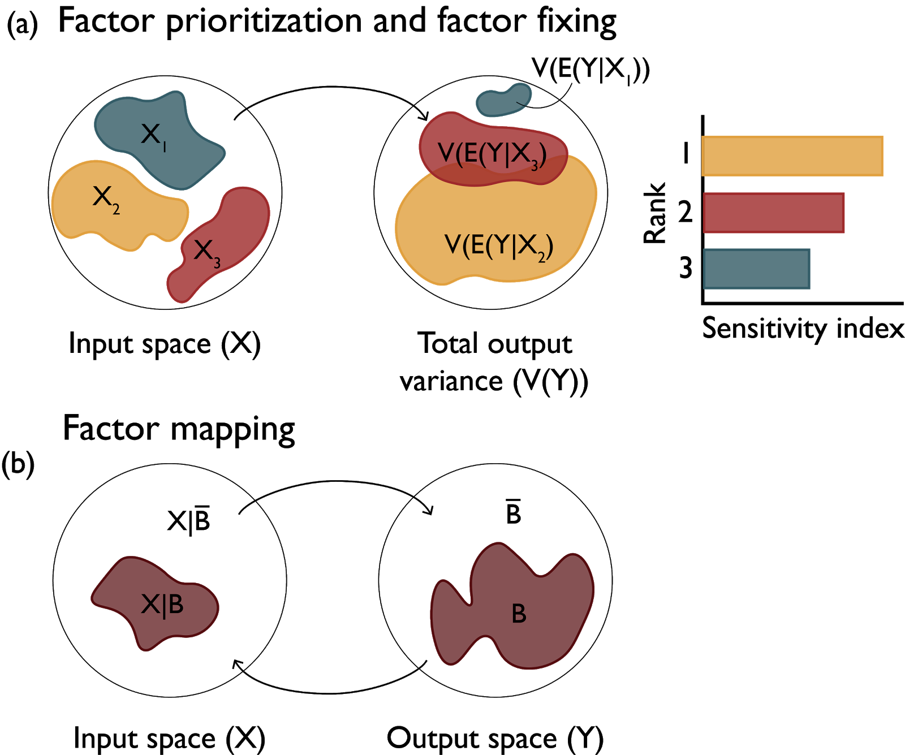

Sensitivity Analysis Applications for Model Evaluation and Fidelity Testing
###########################################################################

Elucidation of the specific type of problem faced shapes the specific objectives of applying a sensitivity analysis, as well as methods and tools most appropriate and defensible for each application setting (Saltelli et al., 2004; Saltelli and Tarantola, 2002). The three most common sensitivity analysis applications (Factor Prioritization, Factor Fixing, and Factor Mapping) are presented below, but the reader should be aware that other uses have been proposed in the literature (e.g., (Anderson et al., 2014; Borgonovo, 2010)).

*Factor prioritization*: This sensitivity analysis application type  (also referred to as factor ranking) refers to when one would like to identify the uncertain factors which, when fixed to their true value, would lead to the greatest reduction in output variability (Saltelli et al., 2008). Information from this type of analysis can be crucial to model improvement as these factors can become the focus of future measurement campaigns or numerical experiments so that uncertainty in the model output can be reduced. Fig. 4 (a) shows the effects of three uncertain variables (X1, X2, and X3) on the variance of output Y.V(E(Y|Xi)) indicates the variance in Y if factor Xi is left to vary freely while all other factors remain fixed to nominal values. In this case, factor X2 makes the largest contribution to the variability of output Y and it should therefore be prioritized. In the context of risk analysis, factor prioritization can be used to reduce output variance to below a given tolerable threshold (also known as variance cutting). As the number of factors of focus and their degree of interactions increases, the computational experiments and analysis techniques increase in their demands as well as sophistication (this is further elaborated in the Global versus Local Sensitivity and the Design of Experiments sections).

*Factor fixing*: Conversely, sensitivity analysis used in this mode (also referred to as factor screening) aims to identify the model components that have a negligible effect or make no significant contributions to the variability of the outputs or metrics of interest (usually referred to as non-influential; Saltelli et al., 2008). In the stylized example of Fig. 4 (a), X1 makes the smallest contribution to the variability of output Y suggesting that the uncertainty in its value could be negligible and the factor itself fixed in subsequent model executions. Eliminating these factors or processes in the model or fixing them to a nominal value can help reduce model complexity as well as the unnecessary computational burden of subsequent model runs, results processing, or other sensitivity analyses (the fewer uncertain factors considered, the fewer runs are necessary to illuminate their effects on the output). Significance of the outcome can be gauged in a variety of manners, depending on the application. For instance, if applying a variance-based method, a minimum threshold value of contribution to the variance could be considered as a significance ‘cutoff’, and factors with indices below that value can be considered non-influential. Nb: conclusions about factor fixing should be made based on total-order effects, i.e., considering all the effects a factor has, individually and in interaction with other factors (explained in more detail in the Variance-based methods section).

*Factor mapping*: Finally, factor mapping can be used to pinpoint which values of uncertain factors lead to model outputs within a given range of the output space (Saltelli et al., 2008). In the context of model diagnostics, it is possible that the model’s output changes in ways considered impossible based on the represented processes, or other observed evidence. In this situation, factor mapping can be used to identify which uncertain model factors cause this undesirable model behavior by ‘filtering’ model runs that are considered ‘non-behavioral’ (Edwards et al., 2011; Pianosi et al., 2016; Spear and Hornberger, 1980). In Fig. 4 (b), region B of the output space denotes the set of behavioral model outcomes, which can be traced back to input space X (e.g., using Monte Carlo Filtering or pre-calibration).

    Factor prioritization, factor fixing and factor mapping settings of sensitivity analysis.
