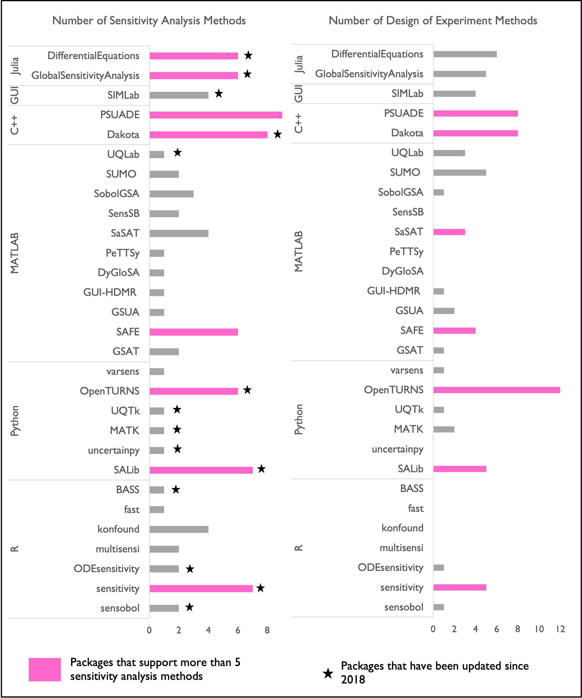

.. _software_toolkits:

Software Toolkits
#################

This section presents available open source sensitivity analysis software tools, based on the programming language they use and the methods they support :numref:`Figure_3_6`. Our review covers five widely used programming languages: R, MATLAB, Julia, Python, and C++, as well as one tool that provides a graphical user interface (GUI). Each available SA tool was assessed on the number of SA methods and design of experiments methods it supports. For example, the *sensobol* package in R only supports the variance-based Sobol method. However, it is the only package we came across that calculates third-order interactions among parameters. On the other side of the spectrum, there are SA software packages that contain several popular SA methods. For example, *SALib* in Python :cite:`herman2017salib` supports seven different SA methods. The *DifferentialEquations* package is a comprehensive package developed for Julia, and *GlobalSensitivityAnalysis* is another Julia package that has mostly adapted SALib methods. :numref:`Figure_3_6` also identifies the SA packages that have been updated since 2018, indicating active support and development.

.. _Figure_3_6:

    Sensitivity analysis packages available in different programming language platforms (R, Python, Julia, MATLAB, and C++), with the number of methods they support. Packages supporting more than five methods are indicated in pink. Packages updated since 2018 are indicated with asterisks. 

