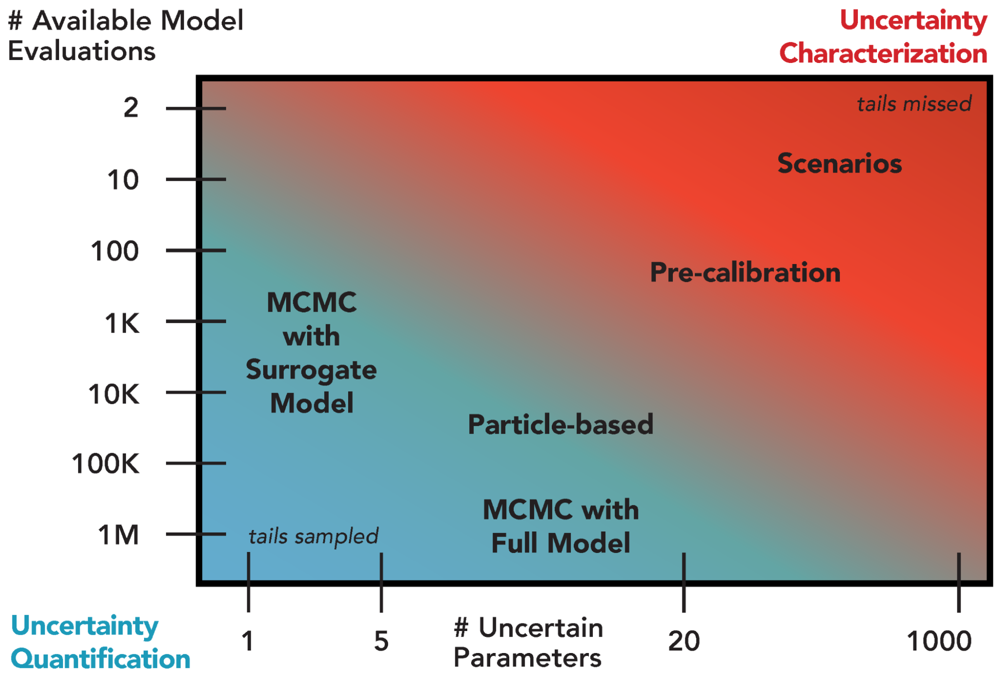

Introduction
############

As defined in :numref:`introduction`, uncertainty quantification (UQ) refers to the formal focus on the full specification of likelihoods as well as distributional forms necessary to infer the joint  probabilistic response across all modeled factors of interest :cite:`cooke1991experts`. This is in contrast to UC (the primary focus of the main document of this book), which is instead aimed at identifying which modeling choices yield the most consequential changes or outcomes and exploring alternative hypotheses related to the form and function of modeled systems :cite:`moallemi2020exploratory, walker2003defining`.

UQ is important for quantifying the relative merits of hypotheses for at least three main reasons. First, identifying model parameters that are consistent with observations is an important part of model development. Due to several effects, including correlations between parameters, simplified or incomplete model structures (relative to the full real-world dynamics), and uncertainty in the observations, many different combinations of parameter values can be consistent with the model structure and the observations to varying extents. Accounting for this uncertainty is conceptually preferable to selecting a single “best fit” parameter vector, particularly as consistency with historical or present observations does not necessarily  guarantee skillful future projections.

The act of quantification requires specific assumptions about distributional forms and likelihoods, which may be more or less justified depending on prior information about the system or model behavior. As a result, UQ is well-suited for studies accounting for or addressing hypotheses related to systems with a relatively large amount of available data and models which are computationally inexpensive, particularly when the emphasis is on prediction. As shown in :numref:`Figure_A1_1`, there is a fundamental tradeoff between the available number of model evaluations (for a fixed computational budget) and the number of parameters treated as uncertain. Sensitivity analyses are therefore part of a typical UQ workflow to identify which factors can be fixed and which ought to be prioritized in the UQ.

.. _Figure_A1_1:

    Overview of selected existing approaches for uncertainty quantification and their appropriateness given the number of uncertain model parameters and the number of available model simulations. Green shading denotes regions suitable for uncertainty quantification and red shading indicates regions more appropriate for uncertainty characterization.

The choice of a particular UQ method depends on both the desired level of quantification and the ability to navigate the tradeoff between computational expense and the number of uncertain parameters (:numref:`Figure_A1_1`). For example, Markov chain Monte Carlo with a full system model can provide an improved representation of uncertainty compared to the coarser pre-calibration approach :cite:`ruckert_assessing_2017`, but requires many more model evaluations. The use of a surrogate model to approximate the full system model can reduce the number of needed model evaluations by several orders of magnitude, but the uncertainty quantification can only accommodate a limited number of parameters.

The remainder of this appendix will focus on introducing workflows for particular UQ methods, including a brief discussion of advantages and limitations.