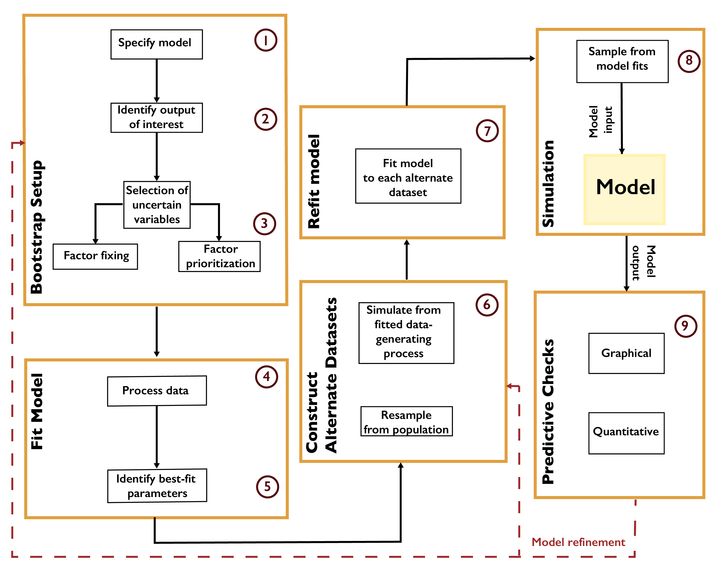

Parametric Bootstrap
####################

The parametric bootstrap :cite:p:`efron_bootstrap_1986` refers to a process of model recalibration to alternate realizations of the data. The bootstrap was originally developed to estimate standard errors and confidence intervals without ascertaining key assumptions that might not hold given the available data. In a setting where observations can be viewed as independent realizations of an underlying stochastic process, a sufficiently rich dataset can be treated as a population representing the data distribution. New datasets are then generated by resampling from the data with replacement, and the model can be refit to each new dataset using maximum-likelihood estimation. The resulting distribution of estimates can then be viewed as a representation of parametric uncertainty.

A typical workflow for the parametric bootstrap is shown in :numref:`Figure_A1_2`. After identifying outputs of interest and preparing the data, the parametric model is fit by some procedure such as minimizing root-mean-square-error or maximizing the likelihood. Alternate datasets are constructed by resampling from the population or by generating new samples from the fitted data-generating process. It is important at this step that the resampled quantities are independent of one another. For example, in the context of temporally- or spatially-correlated data, such as time series, the raw observations cannot be treated as independent realizations. However, the residuals resulting from fitting the model to the data could be (depending on their structure). For example, if the residuals are treated as independent, they can then be resampled with replacement, and these residuals added to the original model fit to create new realizations. If the residuals are assumed to be the result of an autoregressive process, this process could be fit to the original residual series and new residuals be created using this model :cite:`sriver_characterizing_2018`. The model is then refit to each new realization.

.. _Figure_A1_2:

    Workflow for the parametric bootstrap.

The bootstrap is computationally convenient, particularly as the process of fitting the model to each realization can be easily parallelized. This approach also requires minimal prior assumptions. However, due to the assumption that the available data are representative of the underlying data distribution, the bootstrap can neglect key uncertainties which might influence the results. For example, when using an autoregressive process to generate new residuals, uncertainty in the autocorrelation parameter and innovation variance is neglected, which may bias estimates of, for example, low-probability but high-impact events :cite:`ruckert_effects_2017`.
