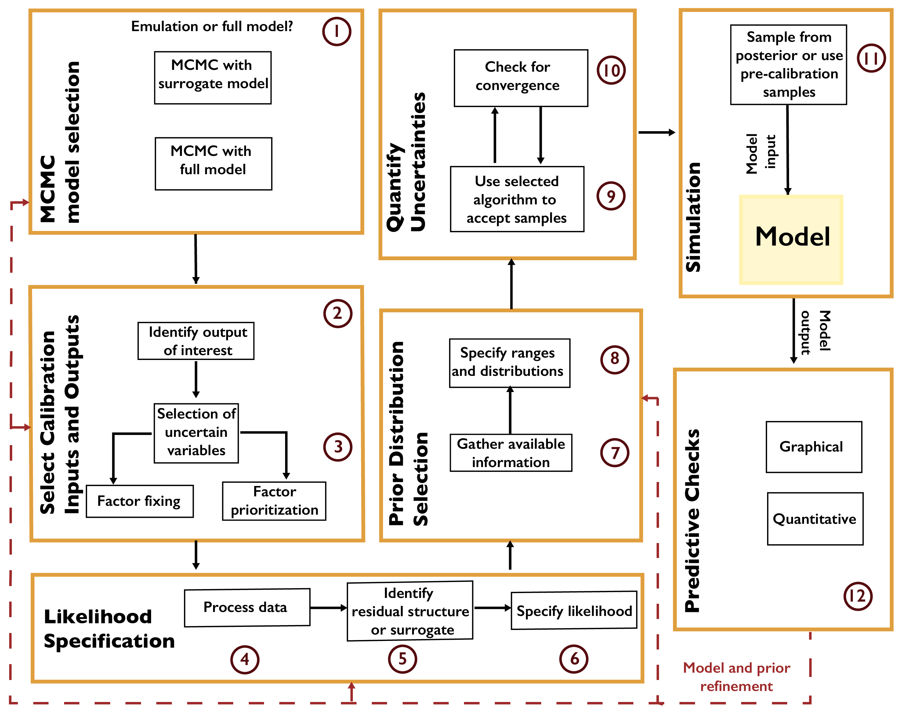

Markov Chain Monte Carlo
########################

Markov chain Monte Carlo (MCMC) is a “gold standard” approach to full uncertainty quantification. MCMC refers to a category of algorithms which systematically sample from a target distribution (in this case, the posterior distribution) by constructing a Markov chain. A Markov chain is a probabilistic structure consisting of a state space, an initial probability distribution over the states, and a transition distribution between states. If a Markov chain satisfies certain properties :cite:p:`robert_monte_2013, robert_metropolishastings_2015`, the probability of being in each state will eventually converge to a stable, or stationary, distribution, regardless of the initial probabilities.

MCMC algorithms construct a Markov chain of samples from a parameter space (the combination of model and statistical parameters). This Markov chain is constructed so that the stationary distribution is a target distribution, in this case the (Bayesian) posterior distribution. As a result, after the transient period, the resulting samples can be viewed as a set of dependent samples from the posterior (the dependence is due to the autocorrelation between samples resulting from the Markov chain transitions). Expected values can be computed from these samples (for example, using batch-means estimators :cite:p:`flegal_markov_2008`), or the chain can be sub-sampled or thinned and the resulting samples used as independent Monte Carlo samples due to the reduced or eliminated autocorrelation.

A general workflow for MCMC is shown in :numref:`Figure_A1_4`. The first decision is whether to use the full model or a surrogate model (or emulator). Typical surrogates include Gaussian process emulation :cite:p:`currin_bayesian_1991, sacks_design_1989`, polynomial chaos expansions :cite:p:`ghanem_spectral_1991, xiu_wiener--askey_2002`, support vector machines :cite:p:`ciccazzo_svm_2016, pruett_creation_2016`, and neural networks :cite:p:`eason_adaptive_2014, gorissen_sequential_2009`. Surrogate modeling can be faster, but requires a sufficient number of model evaluations for the surrogate to accurately represent the model’s response surface, and this typically limits the number of parameters which can be included in the analysis.

.. _Figure_A1_4:

    Workflow for Markov chain Monte Carlo.

After selecting the variables which will be treated as uncertain, the next step is to specify the likelihood based on the selected surrogate model or the structure of the data-model residuals. For example, it may not always be appropriate to treat the residuals as independent and identically distributed (as is commonly done in linear regression). A mis-specification of the residual structure can result in biases and over- or under-confident inferences and projections :cite:p:`brynjarsdottir_learning_2014`.

After specifying the prior distributions (see :numref:`critical_first_step`), the selected MCMC algorithm should be used to draw samples from the posterior distribution. There are many MCMC algorithms, all of which have advantages and disadvantages for a particular problem. These include the Metropolis-Hastings algorithm :cite:p:`robert_metropolishastings_2015` and Hamiltonian Monte Carlo :cite:p:`betancourt_conceptual_2017, neal_mcmc_2011`. Software packages typically implement one MCMC method, sometimes designed for a particular problem setting or likelihood specification. For example, R’s *adaptMCMC* implements an adaptive Metropolis-Hastings algorithm :cite:p:`vihola_robust_2012`, while *NIMBLE* :cite:p:`valpine_programming_2017, nimble_development_team_nimble_2021` uses a user-customizable Metropolis-Hastings implementation, as well as functionality for Gibbs sampling (which is a special case of Metropolis-Hastings where the prior distribution has a convenient mathematical form). Some recent implementations, such as *Stan* :cite:p:`stan_development_team_stan_2021`, *pyMC3* :cite:p:`salvatier_probabilistic_2016`, and *Turing* :cite:p:`ge_turing_2018` allow different algorithms to be used.

A main consideration when using MCMC algorithms is testing for convergence to the target distribution. As convergence is guaranteed only for a sufficiently large number of transitions, it is impossible to conclude for certain that a chain has converged for a fixed number of iterations. However, several heuristics have been developed :cite:p:`flegal_markov_2008, gelman_inference_1992` to increase evidence that convergence has occurred.
