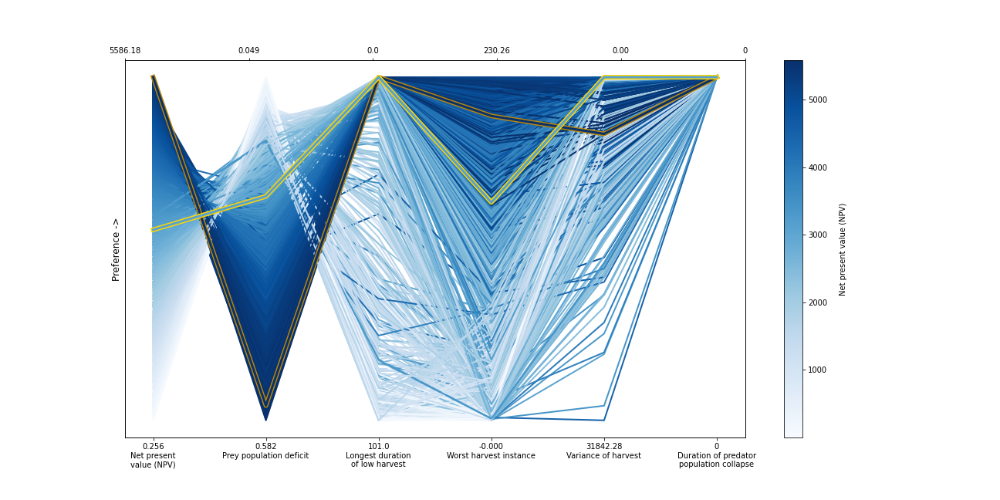

Fishery Dynamics Tutorial
*************************

.. note::

    | Run the tutorial interactively:  `Fishery Dynamics Notebook <nb_fishery_dynamics_>`_.
    | Please be aware that notebooks can take a couple minutes to launch.
    | To run the notebooks yourself, download the files `here <https://github.com/IMMM-SFA/msd_uncertainty_ebook/tree/main/notebooks>`_ and use these `requirements <https://github.com/IMMM-SFA/msd_uncertainty_ebook/blob/main/requirements.txt>`_.

Tutorial: Sensitivity Analysis (SA) to discover factors shaping consequential dynamics
======================================================================================

This notebook demonstrates the application of sensitivity analysis to
discover factors that shape the behavior modes of a socio-ecological
system with dynamic human action.

The system of differential equations below represent a system of prey
(defined in the equation below as x) and predator (defined as y) fish,
with a human actor harvesting the prey fish. You can read more about
this system at `Hadjimichael et
al. (2020) <https://doi.org/10.1155/2020/4170453>`__.

.. image:: _static/eqn2.png

The table below defines the parameters in the system and also denotes
the baseline and ranges associated with each uncertain parameter.

The system is simple but very rich in the dynamic behaviors it exhibits.
This complexity is accompanied by the presence of several equilibria
that come in and out of existence with different parameter values. The
equilibria also change in their stability according to different
parameter values, giving rise to different behavior modes as shown by
the diverse predator and prey abundace trajectories in the figure below.

In the unharvested system (without the human actor) the stability of
several of these equilibria can be derived analytically. The task
becomes significantly more difficult when the adaptive human actor is
introduced, deciding to harvest the system at different rates according
to their objectives and preferences.

Sensitivity analysis methods can help us identify the factors that most
control these dynamics by exploring the space of parameter values and
seeing how system outputs change as a result.

Through previously conducted optimization, there already exists a set of
potential harvesting strategies that were identified in pursuit of five
objectives:

-  Maximize Harvesting Discounted Profits (Net Present Value)
-  Minimize Prey Population Deficit
-  Minimize Longest Duration of Consecutive Low Harvest
-  Maximize Worst Harvest Instance
-  Minimize Harvest Variance

The identified harvesting strategies also meet the necessary constraint
of not causing inadvertent predator collapse.

We will be examining the effects of parametric uncertainty on these
identified strategies, particularly focusing on two strategies: one
selected to maximize harvesting profits and one identified through
previous analysis to perform ‘well enough’ for all objectives across a
wide range of states of the world (referred to as the ‘robust’
harvesting policy).

Let’s get started!
------------------

In this tutorial, we will be loading in data that has been produced in
Hadjimichael et al. (2020). Before we start our analysis, we’ll load the
relevant Python libraries. **NOTE**: To step through the notebook,
execute each gray (code) box by typing “Shift+Enter”.

.. code:: ipython3

    #Import necessary libraries

    import msdbook
    import numpy as np
    import matplotlib.pyplot as plt
    from SALib.sample import saltelli
    from SALib.analyze import sobol
    from matplotlib import patheffects as pe

    # load example data
    msdbook.install_package_data()

    %matplotlib inline
    %config InlineBackend.print_figure_kwargs = {'bbox_inches':None}

.. parsed-literal::

    Downloading example data for msdbook version 0.1.5...
    Unzipped: /srv/conda/envs/notebook/lib/python3.7/site-packages/msdbook/data/uncertain_params_bounds.txt
    Unzipped: /srv/conda/envs/notebook/lib/python3.7/site-packages/msdbook/data/sa_metric_s1.npy
    Unzipped: /srv/conda/envs/notebook/lib/python3.7/site-packages/msdbook/data/sa_vary_delta.npy
    Unzipped: /srv/conda/envs/notebook/lib/python3.7/site-packages/msdbook/data/sa_by_mth_s1.npy
    Unzipped: /srv/conda/envs/notebook/lib/python3.7/site-packages/msdbook/data/solutions.resultfile
    Unzipped: /srv/conda/envs/notebook/lib/python3.7/site-packages/msdbook/data/3704614_heatmap.npy
    Unzipped: /srv/conda/envs/notebook/lib/python3.7/site-packages/msdbook/data/LHsamples_original_1000.txt
    Unzipped: /srv/conda/envs/notebook/lib/python3.7/site-packages/msdbook/data/3704614_pseudo_r_scores.csv
    Unzipped: /srv/conda/envs/notebook/lib/python3.7/site-packages/msdbook/data/param_values.csv
    Unzipped: /srv/conda/envs/notebook/lib/python3.7/site-packages/msdbook/data/sa_by_yr_s1.npy
    Unzipped: /srv/conda/envs/notebook/lib/python3.7/site-packages/msdbook/data/sa_by_mth_delta.npy
    Unzipped: /srv/conda/envs/notebook/lib/python3.7/site-packages/msdbook/data/7000550_pseudo_r_scores.csv
    Unzipped: /srv/conda/envs/notebook/lib/python3.7/site-packages/msdbook/data/collapse_days.csv
    Unzipped: /srv/conda/envs/notebook/lib/python3.7/site-packages/msdbook/data/hymod_params_256samples.npy
    Unzipped: /srv/conda/envs/notebook/lib/python3.7/site-packages/msdbook/data/sa_vary_s1.npy
    Unzipped: /srv/conda/envs/notebook/lib/python3.7/site-packages/msdbook/data/7000550_heatmap.npy
    Unzipped: /srv/conda/envs/notebook/lib/python3.7/site-packages/msdbook/data/7200799_heatmap.npy
    Unzipped: /srv/conda/envs/notebook/lib/python3.7/site-packages/msdbook/data/sa_by_yr_delta.npy
    Unzipped: /srv/conda/envs/notebook/lib/python3.7/site-packages/msdbook/data/7200799_pseudo_r_scores.csv
    Unzipped: /srv/conda/envs/notebook/lib/python3.7/site-packages/msdbook/data/LeafCatch.csv
    Unzipped: /srv/conda/envs/notebook/lib/python3.7/site-packages/msdbook/data/hymod_simulations_256samples.csv
    Unzipped: /srv/conda/envs/notebook/lib/python3.7/site-packages/msdbook/data/Robustness.txt

Step 1: Load identified solutions and explore performance
---------------------------------------------------------

Here we load in the solution set obtained in Hadjimichael et al. (2020).
The solution set contains the decision variables and objectives
associated with a variety of harvesting policies. For this tutorial, we
focus on comparing two policies: harvesting profits and one that
performs robustly across all objectives. Below, we are reading in the
decision variables and objectives from an external file that can be
found within the msdbook package data.

.. code:: ipython3

    robustness = msdbook.load_robustness_data()
    results = msdbook.load_profit_maximization_data()

    robust_solution = np.argmax(robustness[:,-1]) #pick robust solution
    profit_solution = np.argmin(results[:,6]) #pick profitable solution
    objective_performance = -results[:,6:] #Retain objective values

    # Get decision variables for each of the policies
    highprofitpolicy = results[profit_solution,0:6]
    mostrobustpolicy = results[robust_solution,0:6]

Next we plot the identified solutions with regards to their objective
performance in a parallel axis plot

.. tip:: View the source code used to create this plot here: `plot_objective_performance <https://uc-ebook.org/docs/html/A3_plotting_code.html#plot-objective-performance>`_

.. code:: ipython3

    ax, ax1 = msdbook.plot_objective_performance(objective_performance, profit_solution, robust_solution)

The solution set from the optimization in Hadjimichael et al. (2020) are
presented in a parallel axis plot where each of the five objectives (and
one constraint) are represented as an axis. Each solution on the Pareto
front is represented as a line where the color of the line indicates the
value of the NPV objective. The preference for objective values is in
the upward direction. Therefore, the ideal solution would be a line
straight across the top of the plot that satisfies every objective.
However, no such line exists because there are tradeoffs when sets of
objectives are prioritized over the others. When lines cross in between
axes, this indicates a tradeoff between objectives (as seen in the first
two axes).The solution that is most robust in the NPV objective has the
highest value on the first axis and is outlined in dark gold. The
solution that is most robust across all objectives is outlined in a
brighter yellow. A parallel axis is an effective visual to characterize
high-dimensional tradeoffs in the system and visualize differences in
performance across policies.

Step 2: Use SALib to generate a sample for a Sobol sensitivity analysis
-----------------------------------------------------------------------

In Step 1, we showed how the optimized harvesting policies performed in
the objective space, which utilized the baseline parameters outlined in
the table above. Now, we are interested in understanding how sensitive
our two policies are to alternative states of the world that may be
characterized by different parameter values. To do so, we first need to
define the problem dictionary that allows us to generate these
alternative states of the world.

.. code:: ipython3

    # Set up SALib problem
    problem = {
      'num_vars': 9,
      'names': ['a', 'b', 'c', 'd', 'h', 'K', 'm', 'sigmaX', 'sigmaY'],
      'bounds': [[0.002, 2], [0.005, 1], [0.2, 1], [0.05, 0.2], [0.001, 1],
                 [100, 5000], [0.1, 1.5], [0.001, 0.01], [0.001, 0.01]]
    }

Then we use the following command to generate a Saltelli sample from
these defined ranges:

.. code:: python

   param_values = saltelli.sample(problem, 1024, calc_second_order=False)

Generally, it is a good idea to save the result of the sample since it
is often reused and regenerating it produces a different sample set. For
this reason, we will load one from file that was previously generated.

.. code:: ipython3

    # load previously generated Saltelli sample from our msdbook package data
    param_values = msdbook.load_saltelli_param_values()

Step 3: Evaluate the system over all generated states of the world
------------------------------------------------------------------

Now we re-evaluate how well the policies do in the new states of the
world. In order to characterize failure of a policy, we identify the
states where the predator population collapses, as an inadvertent
consequence of applying the harvesting strategy under a state of the
world different from the one originally assumed. Due to how long this
step takes to execute within the tutorial, we will read in the solutions
from an external file. However, the block of code below shows how
evaluation can be implemented.

.. code:: python

   # create array to store collapse values under both policies
   collapse_days = np.zeros([len(param_values), 2])

   # evaluate performance under every state
   for i in range(len(param_values)):

       additional_inputs = np.append(['Previous_Prey'],
                                     [param_values[i,0],
                                      param_values[i,1],
                                      param_values[i,2],
                                      param_values[i,3],
                                      param_values[i,4],
                                      param_values[i,5],
                                      param_values[i,6],
                                      param_values[i,7],
                                      param_values[i,8]])

       collapse_days[i,0]=fish_game(highprofitpolicy, additional_inputs)[1][0]
       collapse_days[i,1]=fish_game(mostrobustpolicy, additional_inputs)[1][0]

.. code:: ipython3

    # load the simulation data from our msdbook package data
    collapse_days = msdbook.load_collapse_data()

Step 4: Calculate sensitivity indices
-------------------------------------

Now we use a Sobol sensitivity analysis to calculate first-order,
second-order, and total-order sensitivity indices for each parameter and
for each of the two policies. These indicies help determine which
factors explain the most variability in the number of days of predator
population collapse.

.. code:: ipython3

    #Perform the Sobol SA for the profit-maximizing solution
    Si_profit = sobol.analyze(problem, collapse_days[:, 0],
                              calc_second_order=False,
                              conf_level=0.95,
                              print_to_console=True)

.. code:: ipython3

    #Perform the Sobol SA for the robust solution
    Si_robustness = sobol.analyze(problem,
                                  collapse_days[:, 1],
                                  calc_second_order=False,
                                  conf_level=0.95,
                                  print_to_console=True)

.. parsed-literal::

                  ST   ST_conf
    a       0.226402  0.036146
    b       0.066819  0.013347
    c       0.004395  0.004023
    d       0.024509  0.006993
    h       0.009765  0.005488
    K       0.020625  0.009494
    m       0.897971  0.066470
    sigmaX  0.000136  0.000149
    sigmaY  0.000739  0.001040
                  S1   S1_conf
    a       0.087936  0.044236
    b       0.000554  0.021474
    c      -0.002970  0.004590
    d       0.001206  0.015881
    h       0.004554  0.007998
    K       0.003843  0.012661
    m       0.751301  0.071862
    sigmaX -0.000325  0.001245
    sigmaY -0.001887  0.002768

Looking at the total-order indices, (ST) factors :math:`m`, :math:`a`,
:math:`b`, :math:`d` and :math:`K` explain a non-negligible amount of
variance therefore have an effect on the stability of this system.
Looking at the first-order indices (S1), we also see that besides
factors :math:`m` and :math:`a`, all other factors are important in this
system through their interactions, which make up the difference between
their S1 and ST indices. This shows the danger of limiting sensitivity
analyses to first order effects, as factor importance might be
significantly misjudged.

These findings are supported by the analytical condition of equilibrium
stability in this system:

.. image:: _static/eqn4.png

In an unharvested system, this condition is both necessary and
sufficient for the equilibrium of the two species coexisting to be
stable.

When adaptive human action is introduced however, this condition is
still necessary, but no longer sufficient, as harvesting reduces the
numbers of prey fish and as a result reduces the resources for the
predator fish. Since this harvesting value is not constant, but can
dynamically adapt according to the harvester’s objectives, it cannot be
introduced into this simple equation.

Step 5: Explore relationship between uncertain factors and performance
----------------------------------------------------------------------

In the following steps, we will use the results of our sensitivity
analysis to investigate the relationships between parametric
uncertainty, equilibrium stability and the performance of the two
policies.

We can use the top three factors identified (:math:`m`, :math:`a`, and
:math:`b`) to visualize the performance of our policies in this
three-dimensional parametric space.

We first define the stability condition, as a function of :math:`b` and
:math:`m`, and calculate the corresponding values of :math:`a`.

.. code:: ipython3

    def inequality(b, m, h, K):
        return ((b**m)/(h*K)**(1-m))

    # boundary interval that separates successful and failed states of the world
    b = np.linspace(start=0.005, stop=1, num=1000)
    m = np.linspace(start=0.1, stop=1.5, num=1000)
    h = np.linspace(start=0.001, stop=1, num=1000)
    K = np.linspace(start=100, stop=2000, num=1000)
    b, m = np.meshgrid(b, m)
    a = inequality(b, m, h, K)
    a = a.clip(0,2)

.. tip:: View the source code used to create this plot here: `plot_factor_performance <https://uc-ebook.org/docs/html/A3_plotting_code.html#plot-factor-performance>`_

.. code:: ipython3

    # generate plot
    ax1, ax2 = msdbook.plot_factor_performance(param_values, collapse_days, b, m, a)

.. image:: _static/fishery_output_22_0.png

These figures show the combinations of factors that lead to success or
failure in different states of the world for the profit-maximizing and
robust policies. Each point is a state of the world, characterized by
specific values of the parameters, and ideally, we would like the color
of the point to be blue, to represent that there are a low number of
days with a predator collapse in that world. The gray curve denotes the
highly non-linear nature of the boundary, defined by the stability
condition, that separates successful and failed states of the world. The
figures demonstrate the following key points:

First, as asserted above, the policies interact with the system in
different and complex ways. In the presence of human action, the
stability condition is not sufficient in determining whether the policy
will succeed, even though it clearly shapes the system in a fundamental
manner.

Secondly, the robust policy manages to avoid collapse in many more of the sampled states of the world, indicated by the number of blue points. The robust policy avoids collapse in 31% of worlds versus 14% in the profit-maximizing policy.This presents a clear tradeoff between profit-maximizing performance androbustness against uncertainty.

Tips to Apply Sobol SA and Scenario Discovery to your Problem
-------------------------------------------------------------

In this tutorial, we demonstrated a Sobol SA to identify the most
important factors driving the behavior of a system (i.e. the number of
the collapse days). In order to apply this methodology to your problem,
you will need to have a set of optimized policies for your system that
you are interested in analyzing. The general workflow is as follows:

1. Choose sampling bounds for your parameters and set up the problem
   dictionary as in Step 2 above.
2. Generate samples, or alternative states of the world using the
   ``saltelli.sample`` function.
3. Evaluate your policies on the alternative states of the world. For
   your application, you will also need to develop a rule for
   determining success or failure of your policy in a new SOW. In this
   tutorial, success was denoted by a small number of collapse days.
   Ultimately, the rule will be specific to your application and can
   include various satisficing criteria.
4. Calculate the Sobol indices and discover the most important
   parameters driving success and failure.
5. Finally, use a similar plotting procedure as in step 5 to identify
   the combination of parameter values that lead to success and failure
   in the system.
