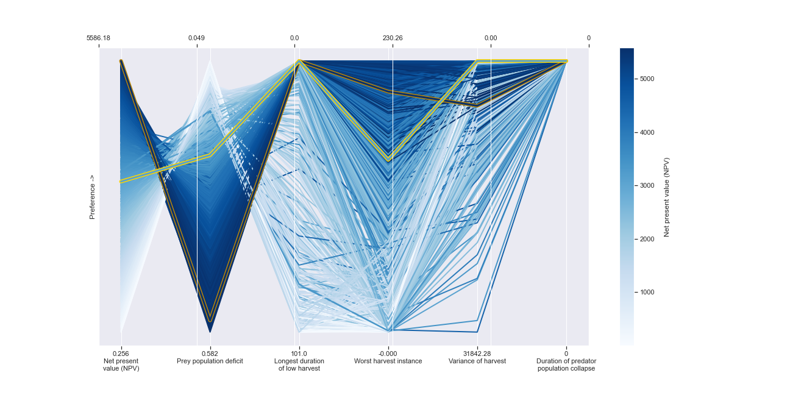
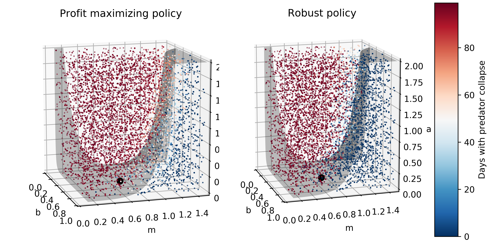

Fishery Dynamics Tutorial
*************************

.. note:: Run the tutorial interactively:  `Fishery Dynamics Notebook <https://mybinder.org/v2/gh/IMMM-SFA/msd_uncertainty_ebook/b8a490616a456c2b366066702f31e5b6fe07f701?filepath=notebooks%2Ffishery_dynamics.ipynb>`_

Sensitivity Analysis (SA) to discover factors shaping consequential dynamics
----------------------------------------------------------------------------

This notebook demonstrates the application of sensitivity analysis to
discover factors that shape the behavior modes of a socio-ecological
system with dynamic human action.

The model represents a system of prey and predator fish, with a human
actor harvesting the prey fish. The system is simple but very rich in
the dynamic behaviors it exhibits. You can read more about this system
at `Hadjimichael et
al. (2020) <https://doi.org/10.1155/2020/4170453>`__.

This complexity is accompanied by the presence of several equilibria
that come in and out of existence with different parameter values. The
equilibria also change in their stability according to different
parameter values, giving rise to different behavior modes.

In the unharvested system (without the human actor) the stability of
several of these equilibria can be derived analytically. The task
becomes significantly more difficult when the adaptive human actor is
introduced, deciding to harvest the system at different rates according
to their objectives and preferences.

Sensitivity analysis methods can help us identify the factors that most
control these dynamics by exploring the space of parameter values and
seeing how system outputs change as a result.

Through previously conducted optimization, there already exists a set of
potential harvesting strategies that were identified in pursuit of five
objectives:

-  Maximize Harvesting Discounted Profits (Net Present Value)
-  Minimize Prey Population Deficit
-  Minimize Longest Duration of Consecutive Low Harvest
-  Maximize Worst Harvest Instance
-  Minimize Harvest Variance

The identified harvesting strategies also meet the necessary constraint
of not causing inadvertent predator collapse.

We will be examining the effects of parametric uncertainty on these
identified strategies, particularly focusing on two strategies, one
selected to maximize harvesting profits and one identified through
previous analysis to perform ‘well enough’ for all objectives across a
wide range of states of the world (referred to as the ‘robust’
harvesting policy).

.. code:: ipython3

    import msdbook

    import numpy as np

    from SALib.sample import saltelli
    from SALib.analyze import sobol

    import matplotlib.pyplot as plt
    from mpl_toolkits.mplot3d import Axes3D
    from matplotlib import patheffects as pe

    %matplotlib inline
    %config InlineBackend.print_figure_kwargs = {'bbox_inches':None}

Step 1: Load identified solutions and explore performance
---------------------------------------------------------

Identify most robust and profit-maximizing solutions

.. code:: ipython3

    # load data from package
    robustness = msdbook.load_robustness_data()
    results = msdbook.load_result_data()

    robust_solution = np.argmax(robustness[:,-1]) #pick robust solution
    profit_solution = np.argmin(results[:,6]) #pick profitable solution
    objective_performance = -results[:,6:]

    # Get decision variables for each of the policies
    highprofitpolicy = results[profit_solution,0:6]
    mostrobustpolicy = results[robust_solution,0:6]

Plot the identified solutions with regards to their objective
performance.

.. code:: ipython3

    fig = plt.figure(figsize=(18,9)) # create the figure
    ax = fig.add_subplot(1, 1, 1)    # make axes to plot on

    objs_labels = ['Net present\nvalue (NPV)',
                   'Prey population deficit',
                   'Longest duration\nof low harvest',
                   'Worst harvest instance',
                   'Variance of harvest',
                   'Duration of predator\npopulation collapse'] # Constraint (always 0)

    # Normalization across objectives
    mins = objective_performance.min(axis=0)
    maxs = objective_performance.max(axis=0)
    norm_reference = objective_performance.copy()

    for i in range(5):
        mm = objective_performance[:,i].min()
        mx = objective_performance[:,i].max()
        if mm!=mx:
            norm_reference[:,i] = (objective_performance[:,i] - mm) / (mx - mm)
        else:
            norm_reference[:,i] = 1

    # colormap from matplotlib
    cmap = plt.cm.get_cmap("Blues")

    # plot all solutions
    for i in range(len(norm_reference[:,0])):
        ys = np.append(norm_reference[i,:], 1.0)
        xs = range(len(ys))
        ax.plot(xs, ys, c=cmap(ys[0]), linewidth=2)

    # to highlight robust solutions
    ys = np.append(norm_reference[profit_solution,:], 1.0)# Most profitable
    xs = range(len(ys))
    l1=ax.plot(xs[0:6], ys[0:6], c=cmap(ys[0]), linewidth=3, label='Most robust in NPV', path_effects=[pe.Stroke(linewidth=6, foreground='darkgoldenrod'), pe.Normal()])
    ys = np.append(norm_reference[robust_solution,:], 1.0) # Most robust in all criteria
    xs = range(len(ys))
    l2=ax.plot(xs[0:6], ys[0:6], c=cmap(ys[0]), linewidth=3, label='Most robust across criteria', path_effects=[pe.Stroke(linewidth=6, foreground='gold'), pe.Normal()])

    # build colorbar
    sm = plt.cm.ScalarMappable(cmap=cmap)
    sm.set_array([objective_performance[:,0].min(),objective_performance[:,0].max()])
    cbar = fig.colorbar(sm)
    cbar.ax.set_ylabel("\nNet present value (NPV)")

    # tick values
    minvalues = ["{0:.3f}".format(mins[0]),
                 "{0:.3f}".format(-mins[1]),
                 str(-mins[2]),
                 "{0:.3f}".format(-mins[3]),
                 "{0:.2f}".format(-mins[4]),
                 str(0)]

    maxvalues = ["{0:.2f}".format(maxs[0]),
                 "{0:.3f}".format(-maxs[1]),
                 str(-maxs[2]),
                 "{0:.2f}".format(maxs[3]),
                 "{0:.2f}".format(-maxs[4]),
                 str(0) ]

    ax.set_ylabel("Preference ->", size= 12)
    ax.set_yticks([])
    ax.set_xticks([0,1,2,3,4,5])
    ax.set_xticklabels([minvalues[i]+'\n'+objs_labels[i] for i in range(len(objs_labels))])

    # make a twin axis for toplabels
    ax1 = ax.twiny()
    ax1.set_yticks([])
    ax1.set_xticks([0,1,2,3,4,5])
    ax1.set_xticklabels([maxvalues[i] for i in range(len(maxs)+1)])

.. parsed-literal::

    [Text(0, 1, '5586.18'),
     Text(1, 1, '0.049'),
     Text(2, 1, '0.0'),
     Text(3, 1, '230.26'),
     Text(4, 1, '0.00'),
     Text(5, 1, '0')]

.. container:: alert alert-block alert-info

.. note:: If you want to save your figure, use:

   ``plt.savefig(‘your_figure_name.png’)``

The results of the optimization are presented in a parallel axis plot
where each of the five objectives (and one constraint) are represented
as an axis. Each solution on the Pareto front is represented as a line
where the color of the line indicates the value of the NPV objective.
The preference for objective values is moving in the upward direction.
Therefore, the ideal solution would be a line straight across the top of
the plot that satisfies every objective. However, no such line exists
because there are tradeoffs when sets of objectives are prioritized over
the others. When lines cross in between axes, this indicates a tradeoff
between objectives (as seen in the first two axes).The solution that is
most robust in the NPV objective has the highest value on that axis and
is denoted in dark gold. The solution that is most robust across all
criteria is denoted in yellow.

Step 2: Use SALib to generate a sample for a Sobol sensitivity analysis
-----------------------------------------------------------------------

To do so, we first need to define the problem dictionary

.. code:: ipython3

    # set up SALib problem
    problem = {
      'num_vars': 9,
      'names': ['a', 'b', 'c', 'd', 'h', 'K', 'm', 'sigmaX', 'sigmaY'],
      'bounds': [[0.002, 2], [0.005, 1], [0.2, 1], [0.05, 0.2], [0.001, 1],
                 [100, 5000], [0.1, 1.5], [0.001, 0.01], [0.001, 0.01]]
    }

    # generate samples
    param_values = saltelli.sample(problem, 512, calc_second_order=False)

.. note:: You can save or load generated samples for future reference using:

    To save:  ``np.savetxt('param_values.csv', delimiter=",")``
    To load:  ``param_values = np.loadtxt('param_values.csv', delimiter=",")``

Step 3: Evaluate the system over all generated states of the world
------------------------------------------------------------------

We need to dentify the states where the predator population collapses,
as an inadvertent consequence of applying the harvesting strategy under
a state of the world different from the one originally assumed.

.. code:: ipython3

    # create array to store collapse values under both policies
    collapse_days = np.zeros([len(param_values), 2])

    # evaluate performance under every state
    for i in range(len(param_values)):

        additional_inputs = np.append(['Previous_Prey'],
                                      [param_values[i,0],
                                       param_values[i,1],
                                       param_values[i,2],
                                       param_values[i,3],
                                       param_values[i,4],
                                       param_values[i,5],
                                       param_values[i,6],
                                       param_values[i,7],
                                       param_values[i,8]])

        collapse_days[i, 0] = msdbook.fish_game(highprofitpolicy, additional_inputs)[1][0]
        collapse_days[i, 1] = msdbook.fish_game(mostrobustpolicy, additional_inputs)[1][0]

Step 4: Calculate sensitivity indices
-------------------------------------

.. code:: ipython3

    Si_profit = sobol.analyze(problem,
                              collapse_days[:,0],
                              calc_second_order=False,
                              conf_level=0.95,
                              print_to_console=True)

    Si_robustness = sobol.analyze(problem,
                                  collapse_days[:,1],
                                  calc_second_order=False,
                                  conf_level=0.95,
                                  print_to_console=True)

Looking at the total-order indices (ST) we obtain, factors m, a, b, d
and K appear to affect the stability of this system. Looking at the
first-order indices (S1), we also see that besides factors m and a, all
other factors are important in this system through their interactions,
which make up the difference between their S1 and ST indices. This is
another point evidence against limiting sensitivity analyses to first
order effects, as factor importance might be significantly misjudged.

These findings are supported by the analytical condition of equilibrium
stability in this system:

In an unharvested system, this condition is both necessary and
sufficient for the equilibrium of the two species coexisting to be
stable.

When adaptive human action is introduced however, this condition is
still necessary, but no longer sufficient, as harvesting reduces the
numbers of prey fish and as a result reduces the resources for the
predator fish. Since this harvesting value is not constant, but can
dynamically adapt according to the harvester’s objectives, it cannot be
introduced into this simple equation.

Step 5: Explore relationship between uncertain factors and performance
----------------------------------------------------------------------

In the following steps, we will use the results of our sensitivity
analysis to investigate the relationships between parametric
uncertainty, equilibrium stability and the performance of the two
policies.

We can use the top three factors identified (m, a, and b) to visualize
the performance of our policies in this three-dimensional parametric
space.

We first define the stability condition, as a function of b and m, and
calculate the corresponding values of a.

.. code:: ipython3

    def inequality(b, m, h, K):
        return (b**m)/(h*K)**(1-m)

    b= np.linspace(start=0.005, stop=1, num=1000)
    m= np.linspace(start=0.1, stop=1.5, num=1000)
    h= np.linspace(start=0.001, stop=1, num=1000)
    K= np.linspace(start=100, stop=2000, num=1000)

    b, m = np.meshgrid(b, m)

    a = inequality(b,m,h,K)

    a = a.clip(0,2)

.. code:: ipython3

    # set matplotlib colormap
    cmap = plt.cm.get_cmap("RdBu_r")

    # initialize figure
    fig = plt.figure(figsize=plt.figaspect(0.5), dpi=600, constrained_layout=True)

    ax1 = fig.add_subplot(1, 2, 1, projection='3d')
    sows = ax1.scatter(param_values[:,1], param_values[:,6], param_values[:,0], c=collapse_days[:,0], cmap=cmap, s=0.5)
    pts_ineq = ax1.plot_surface(b, m, a, color='black', alpha=0.25, zorder=1)
    pt_ref = ax1.scatter(0.5,0.7,0.005, c='black', s=50, zorder=0)
    sm = plt.cm.ScalarMappable(cmap=cmap)
    ax1.set_xlabel("b")
    ax1.set_ylabel("m")
    ax1.set_zlabel("a")
    ax1.set_zlim([0.0,2.0])
    ax1.set_xlim([0.0,1.0])
    ax1.set_ylim([0.0,1.5])
    ax1.xaxis.set_view_interval(0,  0.5)
    ax1.set_facecolor('white')
    ax1.view_init(12, -17)
    ax1.set_title('Profit maximizing policy')

    ax2 = fig.add_subplot(1, 2, 2, projection='3d')
    sows = ax2.scatter(param_values[:,1], param_values[:,6], param_values[:,0], c=collapse_days[:,1], cmap=cmap, s=0.5)
    pts_ineq = ax2.plot_surface(b, m, a, color='black', alpha=0.25, zorder=1)
    pt_ref = ax2.scatter(0.5,0.7,0.005, c='black', s=50, zorder=0)
    sm = plt.cm.ScalarMappable(cmap=cmap)
    ax2.set_xlabel("b")
    ax2.set_ylabel("m")
    ax2.set_zlabel("a")
    ax2.set_zlim([0.0,2.0])
    ax2.set_xlim([0.0,1.0])
    ax2.set_ylim([0.0,1.5])
    ax2.xaxis.set_view_interval(0,  0.5)
    ax2.set_facecolor('white')
    ax2.view_init(12, -17)
    ax2.set_title('Robust policy')

    sm = plt.cm.ScalarMappable(cmap=cmap)
    sm.set_array([collapse_days.min(), collapse_days.max()])
    cbar = fig.colorbar(sm)
    cbar.set_label('Days with predator collapse')

These figures show the values of the factors that lead to success or
failure in different states of the world when the NPV-maximizing and
Robust policies are utilized. Each point is a state of the world,
characterized by specific values of the parameters, and ideally, we
would like the color of the point to be blue, to represent that there
are a low number of days without a predator collapse in that state. The
gray curve denotes the highly non-linear nature of the boundary that
separates successful and failed states of the world. The figures
demonstrate the following key points:

First, that as asserted above, the policies interact with the system in
different and complex ways. In the presence of human action the
stability condition is not sufficient in determining whether the policy
will succeed, even though it clearly shapes the system in a fundamental
manner.

Secondly, the robust policy manages to avoid collapse in many more of
the sampled states of the world, indicated by the number of blue points.
This presents a clear tradeoff between profit-maximizing performance and
robustness against uncertainty.
