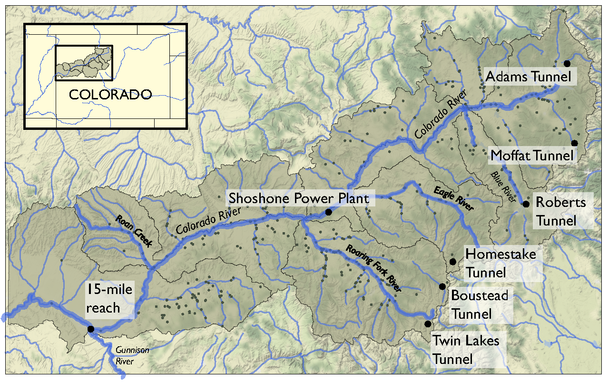

Logistic Regression Tutorial
****************************

.. note::

    | Run the tutorial interactively:  `Logistic Regression Tutorial <nb_logistic_regression_>`_.
    | Please be aware that notebooks can take a couple minutes to launch.
    | To run the notebooks yourself, download the files `here <https://github.com/IMMM-SFA/msd_uncertainty_ebook/tree/main/notebooks>`_ and use these `requirements <https://github.com/IMMM-SFA/msd_uncertainty_ebook/blob/main/requirements.txt>`_.

Tutorial: Logistic Regression for Factor Mapping
================================================

This tutorial replicates a scenario discovery analysis performed in
`Hadjimichael et
al. (2020) <https://agupubs.onlinelibrary.wiley.com/doi/abs/10.1029/2020EF001503>`__.

Background
----------

Planners in the the Upper Colorado River Basin (UCRB, shown in the
figure below) are seeking to understand the vulnerability of water users
to uncertainties stemming from climate change, population growth and
water policy changes. The UCRB spans 25,682 km2 in western Colorado and
is home to approximately 300,000 residents and 1,012 km2 of irrigated
land. Several thousand irrigation ditches divert water from the main
river and its tributaties for irrigation (shown as small black dots in
the figure). Transmountain diversions of approximately 567,400,000 m3
per year are exported for irrigation, industrial and municipal uses in
northern and eastern Colorado, serving the major population centers of
Denver and Colorado Springs. These diversions are carried through
tunnels, shown as large black dots in the figure.

An important planning consideration is the water rights of each user,
defined by seniority across all water uses (irrigation diversions,
transboundary diversions, power plants etc.) in the basin. To assess the
vulnerability of users with varying degrees of water rights seniority,
planners simulate the system across an ensemble of scenarios using the
state of Colorado’s StateMod platform. The model simulates streamflow,
diversions, instream demands, and reservoir operations.

Hadjimichael et al. (2020) employ an exploratory analysis by simulating
a large ensemble of plausible scenarios using StateMod and then
identifying consequential decision-relevant combinations of uncertain
factors, termed scenario discovery. Focusing on decision-relevant
metrics (metrics that are important to the user, the scenario discovery
is applied to the water shortages experienced by each individual user
(i.e., not on a single basin-wide or sector-wide metric). For this
training example, we’ll be performing scenario discovery for three
different water users: two irrigation users and one municipal user.

Let’s get started!
------------------

In this tutorial, we will be loading in data that has been produced in
Hadjimichael et al. (2020). Before we start our analysis, we’ll load the
relevant Python libraries, example data, and information for the three
users.

.. code:: ipython3

    #import libraries
    import msdbook
    import numpy as np
    import pandas as pd
    import matplotlib as mpl
    import matplotlib.pyplot as plt

    # load example data from Hadjimichael et al. (2020)
    msdbook.install_package_data()

    # Select the IDs for the three users that we will perform the analysis for
    all_IDs = ['7000550','7200799','3704614']
    usernames = ['Medium seniority irrigation',
                 'Low seniority irrigation',
                 'Transbasin municipal diversion']
    nStructures = len(all_IDs)

.. parsed-literal::

    Downloading example data for msdbook version 0.1.5...
    Unzipped: /srv/conda/envs/notebook/lib/python3.7/site-packages/msdbook/data/uncertain_params_bounds.txt
    Unzipped: /srv/conda/envs/notebook/lib/python3.7/site-packages/msdbook/data/sa_metric_s1.npy
    Unzipped: /srv/conda/envs/notebook/lib/python3.7/site-packages/msdbook/data/sa_vary_delta.npy
    Unzipped: /srv/conda/envs/notebook/lib/python3.7/site-packages/msdbook/data/sa_by_mth_s1.npy
    Unzipped: /srv/conda/envs/notebook/lib/python3.7/site-packages/msdbook/data/solutions.resultfile
    Unzipped: /srv/conda/envs/notebook/lib/python3.7/site-packages/msdbook/data/3704614_heatmap.npy
    Unzipped: /srv/conda/envs/notebook/lib/python3.7/site-packages/msdbook/data/LHsamples_original_1000.txt
    Unzipped: /srv/conda/envs/notebook/lib/python3.7/site-packages/msdbook/data/3704614_pseudo_r_scores.csv
    Unzipped: /srv/conda/envs/notebook/lib/python3.7/site-packages/msdbook/data/param_values.csv
    Unzipped: /srv/conda/envs/notebook/lib/python3.7/site-packages/msdbook/data/sa_by_yr_s1.npy
    Unzipped: /srv/conda/envs/notebook/lib/python3.7/site-packages/msdbook/data/sa_by_mth_delta.npy
    Unzipped: /srv/conda/envs/notebook/lib/python3.7/site-packages/msdbook/data/7000550_pseudo_r_scores.csv
    Unzipped: /srv/conda/envs/notebook/lib/python3.7/site-packages/msdbook/data/collapse_days.csv
    Unzipped: /srv/conda/envs/notebook/lib/python3.7/site-packages/msdbook/data/hymod_params_256samples.npy
    Unzipped: /srv/conda/envs/notebook/lib/python3.7/site-packages/msdbook/data/sa_vary_s1.npy
    Unzipped: /srv/conda/envs/notebook/lib/python3.7/site-packages/msdbook/data/7000550_heatmap.npy
    Unzipped: /srv/conda/envs/notebook/lib/python3.7/site-packages/msdbook/data/7200799_heatmap.npy
    Unzipped: /srv/conda/envs/notebook/lib/python3.7/site-packages/msdbook/data/sa_by_yr_delta.npy
    Unzipped: /srv/conda/envs/notebook/lib/python3.7/site-packages/msdbook/data/7200799_pseudo_r_scores.csv
    Unzipped: /srv/conda/envs/notebook/lib/python3.7/site-packages/msdbook/data/LeafCatch.csv
    Unzipped: /srv/conda/envs/notebook/lib/python3.7/site-packages/msdbook/data/hymod_simulations_256samples.csv
    Unzipped: /srv/conda/envs/notebook/lib/python3.7/site-packages/msdbook/data/Robustness.txt

Step 1: Load Latin hypercube sample and set up problem
------------------------------------------------------

To examine regional vulnerability, we generate an ensemble of plausible
future states of the world (SOWs) using Latin Hypercube Sampling. For
this tutorial, we’ll load a file containing 1,000 samples across 14
parameters. The sampled parameters encompass plausible changes to the
future state of the basin, including changes to hydrology, water demands
(irrigation, municipal & industry, transbasin), and institutional and
environmental factors (environmental flows, reservoir storage, operation
of the Shoshone Power Plant). These samples are taken from ranges
identified in ``param_bounds``. Below we load in the 1000 samples, the
range of values that the samples can take for each parameter, and the
parameter names. More information on what each parameter constitutes can
be found in Table 1 of Hadjimichael et al., 2020.

.. code:: ipython3

    #Identify the bounds for each of the 14 parameters
    param_bounds = msdbook.load_basin_param_bounds()

    #Load in the parameter samples
    LHsamples = msdbook.load_lhs_basin_sample()

    #Create an array of the parameter names
    param_names=['Irrigation demand multiplier','Reservoir loss','Transbasin demand multiplier',
                 'Municipal & industrial multiplier', 'Shoshone','Environmental flows',
                 'Evaporation change','Mean dry flow','Dry flow variance',
                 'Mean wet flow','Wet flow variance','Dry-dry probability',
                 'Wet-wet probability', 'Snowmelt shift']

Step 2: Define decision-relevant metrics for illustration
---------------------------------------------------------

Scenario discovery attempts to identify parametric regions that lead to
‘success’ and ‘failure’. For this demonstration we’ll be defining
‘success’ as states of the world where a shortage level doesn’t exceed
its historical frequency.

Step 3: Run the logistic regression
-----------------------------------

Logistic regression estimates the probability that a future SOW will be
classified as a success or failure given a set of performance criteria.
A logistic regression model is defined by:

.. math:: ln \bigg (\frac{p_i}{1-p_i} \bigg ) = X^T_i \beta

where :math:`p_i` is the probability the performance in the
:math:`i^{th}` SOW will be classified as a success, :math:`X_i` is the
vector of covariates describing the :math:`i^{th}` SOW, and
:math:`\beta` is the vector of coefficients describing the relationship
between the covariates and the response, which here will be estimated
using maximum likelihood estimation.

A logistic regression model was fit to the ensemble of SOWs using the
performance criteria defined in step 2. Logistic regression modeling was
conducted using the `Statsmodel
Python <https://www.statsmodels.org/stable/index.html>`__ package. The
data required for the full analysis is too large to include in this
tutorial, but results can be found in the data file loaded below.

The results files contain the occurence of different shortage frequency
and magnitude combinations under the experiment, in increments of 10,
between 0 and 100. These combinations (100 for each user) are
alternative decision-relevant metrics that can be used for scenario
discovery.

.. code:: ipython3

    # Set arrays for shortage frequencies and magnitudes
    frequencies = np.arange(10, 110, 10)
    magnitudes = np.arange(10, 110, 10)
    realizations = 10

    # Load performance and pseudo r scores for each of the users
    results = [msdbook.load_user_heatmap_array(all_IDs[i]) / 100 for i in range(len(all_IDs))]

Step 4: Factor ranking
----------------------

To rank the importance of each uncertain factor, we utilize McFadden’s
psuedo-R2, a measure that quantifies the improvement of the model when
utilizing each given predictor as compared to prediction using the mean
of the data set:

.. math:: R^2_{McFadden}=1-\frac{ln \hat{L}(M_{full})}{ln \hat{L}(M_{intercept})}

Here :math:`ln \hat{L}(M_{full})` is the log likelihood of the full
model (including the predictor) and :math:`ln \hat{L}(M_{intercept})` is
the log likelihood of the intercept model (which predicts the mean
probability of success across all SOWs).

Higher values of McFadden’s psuedo-R2 indicate higher factor importance
(when the likelihood of the full model approaches one, the ratio of the
likelihood of the full model compared to the intercept model will get
very small).

.. code:: ipython3

    #Load the pseudo-R^2 scores
    scores = [msdbook.load_user_pseudo_scores(all_IDs[i]) for i in range(len(all_IDs))]

    # Select indices of frequency and magnitudes that will be used for the visualization
    freq = [1,0,0]
    mag = [7,3,7]

Step 5: Draw factor maps
------------------------

The McFadden’s psuedo-R2 scores files contain preliminary logistic
regression results on parameter importance for each of these
combinations. Using these psuedo-R2 scores we will identify the two most
important factors for each metric which we’ll use to generate the final
scenario discovery maps (note: there may be more than two important
metrics for each user, but here we will demonstrate by mapping two).

.. code:: ipython3

    # setup figure
    fig, axes = plt.subplots(3,1, figsize=(6,18), tight_layout=True)
    fig.patch.set_facecolor('white')

    for i in range(len(axes.flat)):

        ax = axes.flat[i]

        allSOWsperformance = results[i]
        all_pseudo_r_scores = scores[i]

        # construct dataframe
        dta = pd.DataFrame(data=np.repeat(LHsamples, realizations, axis = 0), columns=param_names)
        dta['Success'] = allSOWsperformance[freq[i],mag[i],:]

        pseudo_r_scores = all_pseudo_r_scores[str(frequencies[freq[i]])+'yrs_'+str(magnitudes[mag[i]])+'prc'].values
        top_predictors = np.argsort(pseudo_r_scores)[::-1][:2] #Sort scores and pick top 2 predictors

        # define color map for dots representing SOWs in which the policy
        # succeeds (light blue) and fails (dark red)
        dot_cmap = mpl.colors.ListedColormap(np.array([[227,26,28],[166,206,227]])/255.0)

        # define color map for probability contours
        contour_cmap = mpl.cm.get_cmap('RdBu')

        # define probability contours
        contour_levels = np.arange(0.0, 1.05,0.1)

        # define base values of the predictors
        SOW_values = np.array([1,1,1,1,0,0,1,1,1,1,1,0,0,0]) # default parameter values for base SOW
        base = SOW_values[top_predictors]
        ranges = param_bounds[top_predictors]

        # define grid of x (1st predictor), and y (2nd predictor) dimensions
        # to plot contour map over
        xgrid = np.arange(param_bounds[top_predictors[0]][0],
                          param_bounds[top_predictors[0]][1], np.around((ranges[0][1]-ranges[0][0])/500,decimals=4))
        ygrid = np.arange(param_bounds[top_predictors[1]][0],
                          param_bounds[top_predictors[1]][1], np.around((ranges[1][1]-ranges[1][0])/500,decimals=4))
        all_predictors = [ dta.columns.tolist()[i] for i in top_predictors]
        dta['Interaction'] = dta[all_predictors[0]]*dta[all_predictors[1]]

        # logistic regression here
        predictor_list = [all_predictors[i] for i in [0,1]]
        result = msdbook.fit_logit(dta, predictor_list)

        # plot contour map
        contourset = msdbook.plot_contour_map(ax, result, dta, contour_cmap,
                                              dot_cmap, contour_levels, xgrid,
                                              ygrid, all_predictors[0], all_predictors[1], base)

        ax.set_title(usernames[i])

    # set up colorbar
    cbar_ax = fig.add_axes([0.98, 0.15, 0.05, 0.7])
    cbar = fig.colorbar(contourset, cax=cbar_ax)
    cbar_ax.set_ylabel('Probability of Success', fontsize=16)
    cbar_ax.tick_params(axis='y', which='major', labelsize=12)

.. parsed-literal::

    /srv/conda/envs/notebook/lib/python3.7/site-packages/statsmodels/base/model.py:127: ValueWarning: unknown kwargs ['disp']
      warnings.warn(msg, ValueWarning)

.. parsed-literal::

    Optimization terminated successfully.
             Current function value: 0.378619
             Iterations 8
    Optimization terminated successfully.
             Current function value: 0.397285
             Iterations 8
    Optimization terminated successfully.
             Current function value: 0.377323
             Iterations 8

.. image:: _static/notebook_logistic_output_11_1.png

The figure above demonstrates how different combinations of the
uncertain factors lead to success or failure in different states of the
world, which are denoted by the blue and red dots respectively. The
probability of success and failure are further denoted by the contours
in the figure. Several insights can be drawn from this figure.

First, using metrics chosen to be decision-relevant (specific to each
user) causes different factors to be identified as most important by
this scenario-discovery exercise (the x- and y-axes for each of the
subplots). In other words, depending on what the decision makers of this
system want to prioritize they might choose to monitor different
uncertain factors to track performance.

Second, in the top panel, the two identified factors appear to also have
an interactive effect on the metric used (shortages of a certain level
and frequency in this example). In terms of scenario discovery, the
Patient Rule Induction Method (PRIM) or Classification And Regression
Trees (CART) would not be able to delineate this non-linear space and
would therefore misclassify parameter combinations as ‘desirable’ when
they were in fact undesirable, and vice versa.

Lastly, logistic regression also produces contours of probability of
success, i.e. different factor-value combinations are assigned different
probabilities that a shortage level will be exceeded. This allows the
decision makers to evaluate these insights while considering their risk
aversion.

Tips to Apply Scenario Discovery to Your Own Problem
----------------------------------------------------

In this tutorial, we demonstrated how to perform a scenario discovery
analysis for three different users in the UCRB. The analysis allowed us
to determine which parameters the users would be most affected by and to
visualize how different ranges of these parameters lead to success and
failure for different users. This framework can be applicable to any
other application where it is of interest to characterize success and
failure based on uncertain parameter ranges. In order to apply the same
framework to your own problem:

1. Choose sampling bounds for your parameters of interest, which will
   represent uncertainties that characterize your system.
2. Generate samples for these parameters (this can be done using the
   ``saltelli.sample`` function or externally).
3. Define what constitutes success and failure in your problem. In this
   tutorial, success was defined based on not surpassing the historical
   drought frequency. Choose a metric that is relevant to your problem
   and decision-makers that might be involved. If your model involves an
   optimization, you can also define metrics based on meeting certain
   values of these objectives.
4. Run the parameter sets through your model and calculate success and
   failure based on your metrics and across different users if
   applicable. This step will allow you to create the scatter plot part
   of the final figure.
5. If it is of interest, the contours on the figure can be created by
   fitting the logistic regression model in a similiar manner as denoted
   in Steps 3 and 5 of the tutorial.
