HYMOD Dynamics Tutorial
*************************

.. note:: Run the tutorial interactively:  `HYMOD Notebook <https://mybinder.org/v2/gh/IMMM-SFA/msd_uncertainty_ebook/6baaa2d214ca3d8a53f01f5bfb7340bf1e097ac2?filepath=notebooks%2Fhymod.ipynb>`_

Tutorial: Sensitivity Analysis of the HYMOD Model
=================================================

This tutorial has been developed to showcase some of the sensitivity
analysis and uncertainty quantification concepts and tools established
in the main text in the context of HYMOD, a rainfall-runoff model. The
tutorial includes the following sections:

Introduction to HYMOD and Sensitivity Analysis
----------------------------------------------

`1- Introduction to a simple hydrologic model (HYMOD) <#hymod>`__ `2- An
overview of sensitivity analysis using SALib <#sensitivity>`__ `3-
Calculation of sensitivity analysis metrics <sa_metrics>`__

Time-Varying Sensitivity Analysis
---------------------------------

`4- Time-varying sensitivity analysis <#TVSA>`__

Ensemble-based Parametric Uncertainty
-------------------------------------

`5- Generalized Likelihood Uncertainty Estimation (GLUE) <#GLUE>`__ `6-
Pre-Calibration <#precalibration>`__

It is important to note that, although in this tutorial we focus on
HYMOD, which is a hydrologic model, it can also be thought of as an
example of a model that abstracts complex non-linear systems. Therefore,
many of the methods that we use in the tutorial can be applied to
numerical models that simulate other complex non-linear systems.

Introduction to HYMOD and Sensitivity Analysis
==============================================

1- HYMOD
==============================================

HYMOD is a simple hydrologic model (rainfall-runoff model) that
simulates key hydrologic fluxes such as infiltration, streamflow and
evapotranspiration. The model has been originally developed and used for
river flow forecasting. However, in the last two decades the model has
been widely used to explore different sensitivity analysis (e.g.,
`Herman et al.,
2013 <https://agupubs.onlinelibrary.wiley.com/doi/full/10.1002/wrcr.20124>`__),
uncertainty quantification (e.g., `Smith et al.,
2008 <https://agupubs.onlinelibrary.wiley.com/doi/full/10.1029/2006WR005205>`__),
and optimization (e.g., `Ye et al.,
2014 <https://www.sciencedirect.com/science/article/pii/S0022169414006362?casa_token=IRqE19Hkfa8AAAAA:_fXOqfwpzxMpchvu8_0njCe0Ok9H29Gyw2F46l9PzG9UVODDTUg6wIOSiyp6uybGevNVnZ7N>`__)
concepts.

There are two main assumptions in the model: 1) Rainfall is generated
through infiltration excess overland flow. 2) Runoff generation can be
formulated by the probability-distributed principle (Moore, 1985).
Therefore the cumulative rate storage capacity :math:`(F(C))` can be
calculated using the following relationship:

.. math:: F(C) = 1 - (1 - \frac{C}{C_{MAX}})-{B_{exp}}

where *:math:`C`* is the water storage capacity; **:math:`C_{MAX}`** is
the parameter describing basin maximum water storage capacity (mm); and
**:math:`B_{exp}`** is the parameter describing the degree of spatial
variability within the basin.

The portion of precipitation that exceeds the water storage capacity is
treated as runoff. The evapotranspiration is equal to potential
evapotranspiration (:math:`PET`) if enough water is available.
Otherwise, it equals the available water storage.

Then, based on a parameter :math:`Alpha`, the runoff is divided into
quick flow and slow flow, which are routed through three identical quick
flow tanks :math:`Q1, Q2, Q3` and a parallel slow flow tank,
respectively.

The flow rates in the routing system are described by the resident time
in the quick tanks :math:`K_q` (day) and the slow tank :math:`K_s`
(day), respectively.

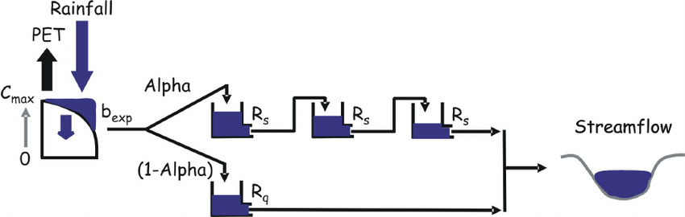

   alt text

Vrugt et al., (2008)

1-1 Model Parameters
--------------------

:math:`C_{MAX}`: parameters describing basin maximum water storage
capacity (mm)

:math:`B_{exp}`: parameters describing the degree of spatial variability
within the basin between 0 and Huz

:math:`Alp`: Fraction of runoff contributing to quick flow

:math:`K_q`: Quick flow residence time of linear infinite reservoir (the
Kq values of all three linear reservoirs are the same)

:math:`K_s`: Slow flow residence time of linear infinite reservoir

1-2 Input data
---------------

The HYMOD model only requires precipitation and potential
evapotranspiration as inputs. The Leaf River example that we use here is
also a widely used test case of HYMOD. The dataset also includes
observed runoff that we later use to evaluate the performace of each
sensitvity analysis sample set.

We can use the following to read the input file:

.. code:: ipython3

    import msdbook

    import numpy as np
    import pandas as pd
    import seaborn as sns

    from sklearn import metrics
    from matplotlib import pyplot as plt

    # load example data
    msdbook.install_package_data()

.. parsed-literal::

    Downloading example data for msdbook version 0.1.5...
    Unzipped: /srv/conda/envs/notebook/lib/python3.7/site-packages/msdbook/data/uncertain_params_bounds.txt
    Unzipped: /srv/conda/envs/notebook/lib/python3.7/site-packages/msdbook/data/sa_metric_s1.npy
    Unzipped: /srv/conda/envs/notebook/lib/python3.7/site-packages/msdbook/data/sa_vary_delta.npy
    Unzipped: /srv/conda/envs/notebook/lib/python3.7/site-packages/msdbook/data/sa_by_mth_s1.npy
    Unzipped: /srv/conda/envs/notebook/lib/python3.7/site-packages/msdbook/data/solutions.resultfile
    Unzipped: /srv/conda/envs/notebook/lib/python3.7/site-packages/msdbook/data/3704614_heatmap.npy
    Unzipped: /srv/conda/envs/notebook/lib/python3.7/site-packages/msdbook/data/LHsamples_original_1000.txt
    Unzipped: /srv/conda/envs/notebook/lib/python3.7/site-packages/msdbook/data/3704614_pseudo_r_scores.csv
    Unzipped: /srv/conda/envs/notebook/lib/python3.7/site-packages/msdbook/data/param_values.csv
    Unzipped: /srv/conda/envs/notebook/lib/python3.7/site-packages/msdbook/data/sa_by_yr_s1.npy
    Unzipped: /srv/conda/envs/notebook/lib/python3.7/site-packages/msdbook/data/sa_by_mth_delta.npy
    Unzipped: /srv/conda/envs/notebook/lib/python3.7/site-packages/msdbook/data/7000550_pseudo_r_scores.csv
    Unzipped: /srv/conda/envs/notebook/lib/python3.7/site-packages/msdbook/data/collapse_days.csv
    Unzipped: /srv/conda/envs/notebook/lib/python3.7/site-packages/msdbook/data/hymod_params_256samples.npy
    Unzipped: /srv/conda/envs/notebook/lib/python3.7/site-packages/msdbook/data/sa_vary_s1.npy
    Unzipped: /srv/conda/envs/notebook/lib/python3.7/site-packages/msdbook/data/7000550_heatmap.npy
    Unzipped: /srv/conda/envs/notebook/lib/python3.7/site-packages/msdbook/data/7200799_heatmap.npy
    Unzipped: /srv/conda/envs/notebook/lib/python3.7/site-packages/msdbook/data/sa_by_yr_delta.npy
    Unzipped: /srv/conda/envs/notebook/lib/python3.7/site-packages/msdbook/data/7200799_pseudo_r_scores.csv
    Unzipped: /srv/conda/envs/notebook/lib/python3.7/site-packages/msdbook/data/LeafCatch.csv
    Unzipped: /srv/conda/envs/notebook/lib/python3.7/site-packages/msdbook/data/hymod_simulations_256samples.csv
    Unzipped: /srv/conda/envs/notebook/lib/python3.7/site-packages/msdbook/data/Robustness.txt

.. code:: ipython3

    # load the HYMOD input file
    leaf_data = msdbook.load_hymod_input_file()

    # extract the first eleven years of data
    leaf_data = leaf_data.iloc[0:4015].copy()

.. code:: ipython3

    # There are only three columns in the file including precipitation, potential evapotranspiration and  streamflow
    leaf_data.head()

.. raw:: html

    

    
    <table border="1" class="dataframe">
      <thead>
        <tr style="text-align: right;">
          <th></th>
          <th>Precip</th>
          <th>Pot_ET</th>
          <th>Strmflw</th>
        </tr>
      </thead>
      <tbody>
        <tr>
          <th>0</th>
          <td>0.0</td>
          <td>4.60</td>
          <td>0.29</td>
        </tr>
        <tr>
          <th>1</th>
          <td>0.0</td>
          <td>4.31</td>
          <td>0.24</td>
        </tr>
        <tr>
          <th>2</th>
          <td>0.0</td>
          <td>4.33</td>
          <td>0.21</td>
        </tr>
        <tr>
          <th>3</th>
          <td>0.0</td>
          <td>4.78</td>
          <td>0.19</td>
        </tr>
        <tr>
          <th>4</th>
          <td>0.0</td>
          <td>2.91</td>
          <td>0.18</td>
        </tr>
      </tbody>
    </table>
    

1-3 Baseline Model Simulation
------------------------------

We can start our sensitivity analysis experiment with running HYMOD
using its default parameters.

.. code:: ipython3

    # assign input parameters to generate a baseline simulated streamflow
    Nq = 3  # Number of quickflow routing tanks
    Kq = 0.5 # Quickflow routing tanks' rate parameter
    Ks =  0.001 # Slowflow routing tank's rate parameter
    Alp = 0.5 # Quick/slow split parameter
    Huz = 100 # Maximum height of soil moisture accounting tank
    B = 1.0 # Scaled distribution function shape parameter

    # Note that the number of years is 11 years. One year of model warm-up and ten years are used for actual simulation
    model = msdbook.hymod(Nq, Kq, Ks, Alp, Huz, B, leaf_data, ndays=4015)

1-4 Model Outputs
--------------------

Model outputs include actual evapotranspiration, quick and fast
streamflow, and combined runoff. In this tutorial we focus on the total
daily runoff (:math:`m-3/s`). We can use the following script to plot
simulated streamflow against observed streamflow.

Variables
--------------------

**PP**: Precipitation

**ET**: Evapotranspiration

**OV**: Runoff

**Qq**: Quick Flow

**Qs**: Slow Flow

**QQ**: Streamflow (Quick Flow + Slow Flow)

**XHuz** and **XCuz**: Current moisture state of soil moisture
accounting component (as depth XH or volume XC)

Plot the observed versus simulated streamflow.
----------------------------------------------

.. note::
    **Tip:** View the source code used to create this plot here:  `plot_observed_vs_simulated_streamflow <https://immm-sfa.github.io/msd_uncertainty_ebook/A3_plotting_code.html#plot-observed-vs-simulated-streamflow>`_

.. code:: python

    ax = msdbook.plot_observed_vs_simulated_streamflow(df=leaf_data, hymod_dict=model)

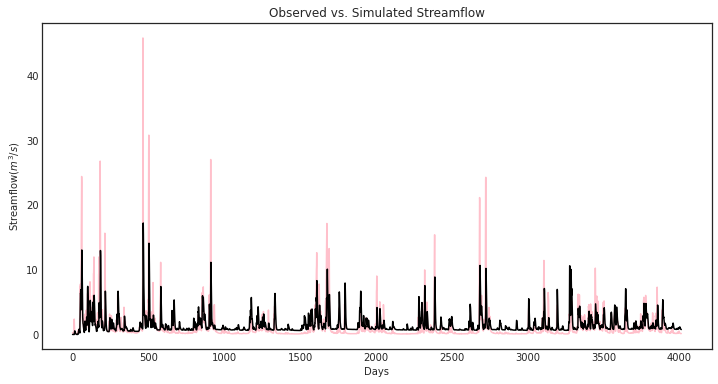

2- Sensitivity Analysis
==============================================

Here we use the SALib Python library to explore how different HYMOD
input parameters affect model streamflow simulations. For this exercise,
we only use Sobol variance-based method. The following commands can be
used to import SALib

.. code:: ipython3

    from SALib.sample import saltelli
    from SALib.analyze import sobol
    from SALib.analyze import delta

2-2 Model simulations for sensitivity analysis
--------------------------------------------------

We first define the model input and their ranges.

.. code:: ipython3

    problem_hymod = {
        'num_vars': 5,
        'names': ['Kq', 'Ks', 'Alp', 'Huz', 'B'],
        'bounds': [[0.1, 1],  # Kq
                   [0, 0.1],  # Ks
                   [0, 1],    # Alp
                   [0.1, 500],  # Huz
                   [0, 1.9]]  # B
    }

Now we need to sample and then run the model for each of the sample
sets. We will load a sample that has already been created
``param_values_hymod`` for demonstration purposes. The actual model
simulation takes an extended period, so we also load the simulation data
from a previous run. The following demonstrates how to conduct this
analysis:

.. code:: python

   # generate 256 samples. This is an arbitrary number.
   param_values_hymod = saltelli.sample(problem_hymod, 256)

   # dictionary to store outputs in
   d_outputs = {}

   # run simulation for each parameter sample
   for i in range(0, len(param_values_hymod)):

       # run model for each sensitivity analysis parameter sets
       hymod_output = msdbook.hymod(Nq,
                                    param_values_hymod[i, 0],
                                    param_values_hymod[i, 1],
                                    param_values_hymod[i, 2],
                                    param_values_hymod[i, 3],
                                    param_values_hymod[i, 4],
                                    leaf_data,
                                    ndays=4015)

       # store the simulated total flow discharge
       d_outputs[f"Q{i}"] = hymod_output["Q"]

   Q_df_bw = pd.DataFrame(d_outputs)

.. code:: ipython3

    # load previously generated parameter values
    param_values_hymod = msdbook.load_hymod_params()

    # number of samples
    n_samples = len(param_values_hymod)

    # load previously generated hymod simulated outputs
    Q_df_bw = msdbook.load_hymod_simulation()

    # column names of each sample simulation number
    sample_column_names = [i for i in Q_df_bw.columns if i[0] == 'Q']

Model Warm-up
_____________

A hydrological model such as HYMOD usually includes ordinary
differential equations that are sensitive to their initial condition.
They also have components in their underlying formulation that have long
memory such that prior time steps can affect their current simulations.
For example, soil moisture or groundwater can hold water for a long time
and therefore they are often considered to exhibit a long memory. This
can affect the partitioning of water to runoff and infiltration, while
also controlling the generation of base flow. Therefore, it is important
to have a reasonable initial value for them. To achieve this,
hydrologists usually extend their simulation period and after the
simulations, they remove that extended time period that has unreasonable
groundwater or surface water values. This time period is called the
warm-up time period.

Here we extended our simulation for one year (from 10 years to 11 years)
and we removed the first year of simulation, therefore our warm-up
period is one year.

.. code:: ipython3

    # exclude the first year of simulation from the simulations and reset the index
    Q_df = Q_df_bw.iloc[365:4015].copy().reset_index(drop=True)

    # exclude the first year of the input data and reset the index
    leaf_data = leaf_data.iloc[365:4015].copy().reset_index(drop=True)

2-3 Visual inspection of the model outputs
----------------------------------------------------

Here we create a figure that shows HYMOD streamflow outputs under
different sample sets, and compare them with the observed streamflow.

.. code:: ipython3

    # add date columns to our simulation data frame; for this data our start date is 1/1/2000
    date_ts = pd.date_range(start='1/1/2000', periods=3650, freq='D')
    Q_df['date'] = date_ts
    Q_df['year'] = date_ts.year
    Q_df['month'] = date_ts.month
    Q_df['day'] = date_ts.day

    # aggregate the simulated observed streamflow to monthly mean
    df_sim_mth_mean = Q_df.groupby(['year', 'month'])[sample_column_names].mean()

    # do the same for the observed data
    date_ts = pd.date_range(start='1/1/2000', periods=len(leaf_data), freq='D')
    leaf_data['date'] = date_ts
    leaf_data['year'] = date_ts.year
    leaf_data['month'] = date_ts.month
    leaf_data['day'] = date_ts.day

    # aggregate the daily observed streamflow to monthly mean
    df_obs_mth_mean = leaf_data.groupby(['year', 'month']).mean()

.. note::
    **Tip:** View the source code used to create this plot here:  `plot_observed_vs_sensitivity_streamflow <https://immm-sfa.github.io/msd_uncertainty_ebook/A3_plotting_code.html#plot-observed-vs-sensitivity-streamflow>`_

.. code:: ipython3

    ax = msdbook.plot_observed_vs_sensitivity_streamflow(df_obs=df_obs_mth_mean,
                                                         df_sim=df_sim_mth_mean)

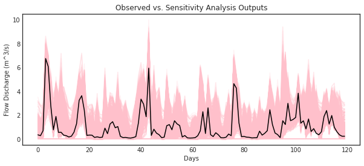

3- Calculation of Sensitivity Analysis Indices
===============================================

There are different options to calculate sensitivity indices. The
following section aggregates model streamflow outputs and calculates the
sensitivity indices.

3-1 Aggregated sensitivity analysis indices
----------------------------------------------------

This is the simplest way of calculating sensitivity analysis metrics,
however, averaging all model response can lead to loss of information
that we further explore in the following sections.

.. code:: ipython3

    # overall aggregated indices
    Y = Q_df[sample_column_names].mean().to_numpy()

    # Perform analysis
    Si = delta.analyze(problem_hymod, param_values_hymod, Y, print_to_console=False)

.. code:: ipython3

    print('First order indices = ', Si['S1'])

.. parsed-literal::

    First order indices =  [0.00810372 0.0049972  0.00508833 0.60039872 0.28942293]

.. code:: ipython3

    Si['S1'].sum()

.. parsed-literal::

    0.9080109105125653

3-2 How do different performance metrics affect the results of our sensitivity analysis?
-------------------------------------------------------------------------------------------

Streamflow has many different properties. In this section, we discuss
how the selection of metrics can lead to fundamentally different
sensitivity analysis results. For example, one can only focus on
aggregated streamflow metrics such as mean (what has been presented so
far), or only on extreme events such as drought or floods.

Here we compare three different metrics: 1- Mean error (ME) 2- Root Mean
Square Error (RMSE) 3- Log-Root Mean Square Error (Log(RMSE))

Each of these metrics focuses on a specific attribute of streamflow. For
example, RMSE highlights the impacts of extreme flood events, while
LOG(RMSE) focuses on model performance during low-flow events.

.. code:: ipython3

    # calculate error metrics
    me = Q_df[sample_column_names].apply(lambda x: (x-leaf_data["Strmflw"]), axis=0)
    mse = Q_df[sample_column_names].apply(lambda x: metrics.mean_squared_error(x, leaf_data["Strmflw"]), axis=0)
    rmse = mse**(1/2)

    # add error metrics to a dictionary
    d_metrics = {'ME': me.mean().values,
                 'RMSE': rmse.values,
                 'LOG[RMSE]': np.log10(rmse.values)}

    # convert to a dataframe
    df_metrics_SA = pd.DataFrame(d_metrics)

We can use the following to calculate the SA indices for each metric and
visualize it. Results are pre-loaded for efficiency.

.. code:: python

   # performance analysis
   df_metric_sa_result = pd.DataFrame(np.zeros((3, 5)), columns=['Kq', 'Ks', 'Alp', 'Huz', 'B'])

   # conduct sensitivity analysis for each metric
   for index, i in enumerate(d_metrics.keys()):

       # get the data as a numpy array for the target metric
       Y = d_metrics[i]

       # use the metric to conduct SA
       Si = delta.analyze(problem_hymod, param_values_hymod, Y, print_to_console=False)

       # add the sensitivity indices to the output data frame
       df_metric_sa_result.iloc[index, :] = Si['S1']

.. code:: ipython3

    # load previously ran simulation
    df_metric_sa_result = msdbook.load_hymod_metric_simulation()

    # view results
    df_metric_sa_result

.. raw:: html

    

    
    <table border="1" class="dataframe">
      <thead>
        <tr style="text-align: right;">
          <th></th>
          <th>Kq</th>
          <th>Ks</th>
          <th>Alp</th>
          <th>Huz</th>
          <th>B</th>
        </tr>
      </thead>
      <tbody>
        <tr>
          <th>0</th>
          <td>0.008104</td>
          <td>0.004997</td>
          <td>0.005088</td>
          <td>0.600399</td>
          <td>0.289423</td>
        </tr>
        <tr>
          <th>1</th>
          <td>0.106927</td>
          <td>0.018771</td>
          <td>0.191237</td>
          <td>0.300762</td>
          <td>0.027852</td>
        </tr>
        <tr>
          <th>2</th>
          <td>0.134509</td>
          <td>0.030292</td>
          <td>0.206209</td>
          <td>0.296245</td>
          <td>0.033833</td>
        </tr>
      </tbody>
    </table>
    

.. code:: ipython3

    # create seaborn heatmap with required labels
    plt.subplots(figsize=(10, 5))

    # labels for y-axis
    y_axis_labels = ['Mean Error', 'RSME', 'Log(RMSE)']

    # plot heatmap
    ax = sns.heatmap(df_metric_sa_result, yticklabels=y_axis_labels,  cmap='rocket')

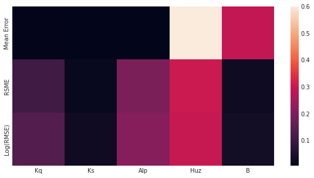

The results indicate that different goodness-of-fit metrics can produce
different sensitivity indices. This is because streamflow time series
have several dimensions and regimes (e.g., extreme high flow and low
flow) and focusing on only one metric will neglect the sensitivity of
other dimensions.

Therefore, we can argue that a single goodness-of-fit measure will never
be able to capture the entire response of model to different parametric
combinations. For more discussion about this topic readers can refer to
`Liu and Sun
(2010) <https://www.sciencedirect.com/science/article/pii/S1574954110000580?via%3Dihub>`__
and `Foglia et al.,
(2009) <https://agupubs.onlinelibrary.wiley.com/doi/full/10.1029/2008WR007255>`__.

4- Time-Varying Sensitivity Analysis
=====================================

Hydrological processes are often state-dependent, meaning that their
responses are affected by the time-varying condition that they are in.
For example, rainfall-runoff processes are different in winter and
summer. These processes are also different during wet years and dry
years.

Hydrological processes are also path-dependent, meaning that previous
time-steps on the model affect the present and future simulation of
different hydrologic components. To take these properties into account,
we can zoom into different time periods to explore how the sensitivity
of model parameters evolve in different time steps. This is referred to
as time-varying sensitivity analysis.

For more information about time-varying sensitivity analysis, readers
can refer to `Herman et
al. (2013) <https://agupubs.onlinelibrary.wiley.com/doi/full/10.1002/wrcr.20124>`__
and `Xu et
al. (2018) <https://link.springer.com/article/10.1007/s12206-018-0223-8>`__.

4-1 Sensitivity analysis indices for each month
----------------------------------------------------

.. code:: ipython3

    # aggregate simulated streamflow data to monthly time series
    df_sim_by_mth_mean = Q_df.groupby('month')[sample_column_names].mean()

    # aggregate observed streamflow data to monthly time series
    df_obs_by_mth_mean = leaf_data.groupby('month').mean()

We can use the following to calculate the SA indices for each month and
visualize it. Results are pre-loaded for efficiency.

.. code:: python

   # set up dataframes to store outputs
   df_mth_s1 = pd.DataFrame(np.zeros((12,5)), columns=['Kq', 'Ks', 'Alp', 'Huz', 'B'])
   df_mth_delta = df_mth_s1.copy()

   # iterate through each month
   for i in range(0, 12):

       # generate the simulation data
       Y = df_sim_by_mth_mean.iloc[i, :].to_numpy()

       # run SA
       Si = delta.analyze(problem_hymod, param_values_hymod, Y, print_to_console=False)

       # add to output dataframes
       df_mth_s1.iloc[i, :] = np.maximum(Si['S1'], 0)
       df_mth_delta.iloc[i, :] = np.maximum(Si['delta'], 0)

   # convert to arrays
   arr_mth_s1 = df_mth_s1.values
   arr_mth_delta = df_mth_delta.values

First-order Indices
___________________

The following can be used to visualize the time-varying first-order
indices. The first order represents the direct impacts of a specific
parameter on model outputs.

.. note::
    **Tip:** View the source code used to create this plot here:  `plot_monthly_heatmap <https://immm-sfa.github.io/msd_uncertainty_ebook/A3_plotting_code.html#plot-monthly-heatmap>`_

.. code:: ipython3

    # load previously ran data
    arr_mth_delta, arr_mth_s1 = msdbook.load_hymod_monthly_simulations()

    # plot figure
    ax, ax2 = msdbook.plot_monthly_heatmap(arr_sim=arr_mth_s1.T,
                                           df_obs=df_obs_by_mth_mean,
                                           title='First Order - Mean Monthly SA')

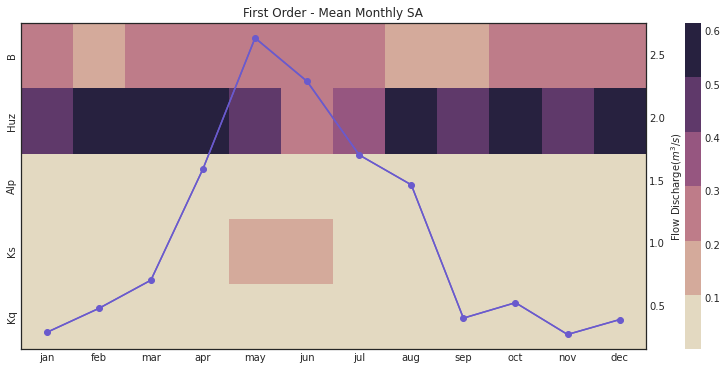

This figure demonstrates the first order sensitivity indices when the
streamflow data are aggregated by month. The purple line represents the
observed monthly discharge. The figure indicates that the first order
indices are highest for B and Huz across all months and lowest for Alp,
Ks, and Kq.

Total-order indices
____________________

We can also focus on the total order sensitivity index that includes
first-order SA indices and interactions between parameters

.. code:: ipython3

    # plot figure
    ax, ax2 = msdbook.plot_monthly_heatmap(arr_sim=arr_mth_delta.T,
                                           df_obs=df_obs_by_mth_mean,
                                           title='Total Order - Mean monthly SA')

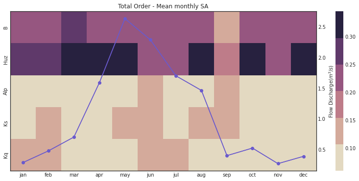

Notably, the total order sensitivity results are different than the
first order sensitivity results, which indicates that interactions
between the parameters (particularly in regards to :math:`Kq`,
:math:`Ks`, and :math:`Alp`) contribute to variance in the HYMOD output.

4-2 Annual sensitivity analysis indices
---------------------------------------

.. code:: ipython3

    # group by year and get mean
    df_sim_by_yr_mean = Q_df.groupby(['year'])[sample_column_names].mean()

    # group input data and get mean
    df_obs_by_yr_mean = leaf_data.groupby(['year']).mean()

We can also calculate the sensitivity analysis indices for each
individual year. This will allow us to understand if model control
changes during different years. The following code first aggregates the
outputs to annual time steps, and then calculates the SA indices.

.. code:: python

   # set up dataframes to store outputs
   df_yr_s1 = pd.DataFrame(np.zeros((10, 5)), columns=['Kq', 'Ks', 'Alp', 'Huz', 'B'])
   df_yr_delta = df_yr_s1.copy()

   # iterate through each year
   for i in range(0, 10):

       # generate the simulation data
       Y = df_sim_by_yr_mean.iloc[i, :].to_numpy()

       # run SA
       Si = delta.analyze(problem_hymod, param_values_hymod, Y, print_to_console=False)

       # add to output dataframes
       df_yr_s1.iloc[i, :] = np.maximum(Si['S1'], 0)
       df_yr_delta.iloc[i, :] = np.maximum(Si['delta'], 0)

   # convert to arrays
   arr_yr_s1 = df_mth_s1.values
   arr_yr_delta = df_mth_delta.values

First-order indices
____________________

.. note::
    **Tip:** View the source code used to create this plot here:  `plot_annual_heatmap <https://immm-sfa.github.io/msd_uncertainty_ebook/A3_plotting_code.html#plot-annual-heatmap>`_

.. code:: ipython3

    # load previously ran data
    arr_yr_delta, arr_yr_s1 = msdbook.load_hymod_annual_simulations()

    # plot figure
    ax, ax2 = msdbook.plot_annual_heatmap(arr_sim=arr_yr_s1.T,
                                          df_obs=df_obs_by_yr_mean,
                                          title='First Order - Mean Annual SA')

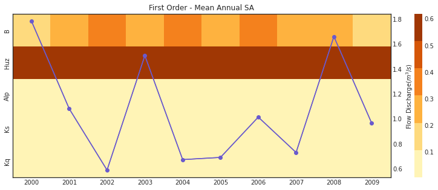

The first order sensitivities at the annual scale are not unlike the
first order monthly sensitivities. Once again, sensitivities vary across
year and Huz and B are the most consequential parameters.

Total-order indices
___________________

.. code:: ipython3

    # plot figure
    ax, ax2 = msdbook.plot_annual_heatmap(arr_sim=arr_yr_delta.T,
                                          df_obs=df_obs_by_yr_mean,
                                          title='Total Order - Mean Annual SA and Observed flow')

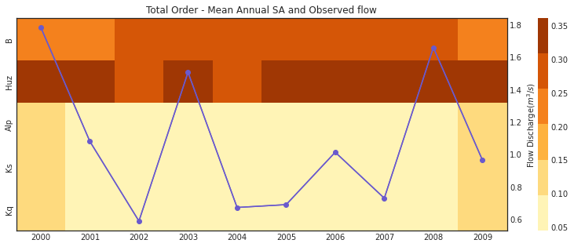

Our results indicate that sensitivity analysis indices vary in different
years and now that interactions are included, the Kq, Ks, and Alp
variables impact the sensitivity of the streamflow output.

4-3 Monthly time-varying sensitivity analysis
----------------------------------------------------

Although time-varying sensitivity analysis at average monthly and
average annual temporal resolutions is informative, TVSA is susceptible
to the aggregation issue that we discussed earlier in section 3-2. To
avoid that we can further discretize our time domain to zoom into
individual months. This will provide us with even more information about
model behavior and the sensitivity of different parameters in different
states of the system. The block of code demonstrates how to implement
the monthly TVSA.

.. code:: python

   # set up dataframes to store outputs
   df_vary_s1 = pd.DataFrame(np.zeros((df_obs_mth_mean.shape[0], 5)),
                             columns=['Kq', 'Ks', 'Alp', 'Huz', 'B'])

   df_vary_delta = df_vary_s1.copy()

   # iterate through each month
   for i in range(0, df_obs_mth_mean.shape[0]):

       # generate the simulation data
       Y = df_sim_mth_mean.iloc[i, :].to_numpy()

       # run SA
       Si = delta.analyze(problem_hymod, param_values_hymod, Y, print_to_console=False)

       # add to output dataframes
       df_vary_s1.iloc[i, :] = np.maximum(Si['S1'], 0)
       df_vary_delta.iloc[i, :] = np.maximum(Si['delta'], 0)

   # convert to arrays
   arr_vary_s1 = df_vary_s1.values
   arr_vary_delta = df_vary_delta.values

First-order indices
____________________

.. note::
    **Tip:** View the source code used to create this plot here:  `plot_varying_heatmap <https://immm-sfa.github.io/msd_uncertainty_ebook/A3_plotting_code.html#plot-varying-heatmap>`_

.. code:: ipython3

    # load in previously ran data
    arr_vary_delta, arr_vary_s1 = msdbook.load_hymod_varying_simulations()

    # plot figure
    ax, ax2 = msdbook.plot_varying_heatmap(arr_sim=arr_vary_s1.T,
                                          df_obs=df_obs_mth_mean,
                                          title='First Order - Time-Varying SA')

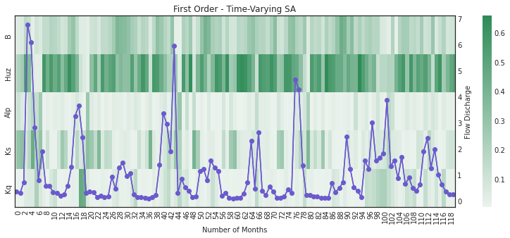

Compared to the TVSA when streamflow was aggregated, this figure
suggests that Kq is indeed a relevant parameter for influencing
streamflow output when individual months are considered.

Total order - time varying sensitivity analysis
________________________________________________

.. code:: ipython3

    # plot figure
    ax, ax2 = msdbook.plot_varying_heatmap(arr_sim=arr_vary_delta.T,
                                          df_obs=df_obs_mth_mean,
                                          title='Total Order - Time-Varying SA')

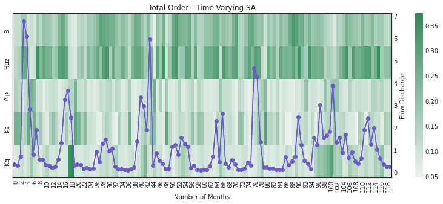

As above, the total order sensitivities further indicate the importance
of Kq that is not apparent if aggregation is utilized.

Ensemble-based Parametric Uncertainty
=====================================

5- Generalized Likelihood Uncertainty Estimation (GLUE)
=======================================================

The Generalized Likelihood Uncertainty Estimation (GLUE) is an
uncertainty analysis algorithm that has been widely used in hydrologic
studies. The main argument behind GLUE is rooted in model calibration
and the concept of equifinality. Calibration of complex simulation tools
such as hydrological models often produces more than one optimal or
near-optimal solutions and these solutions have equivalent chances to be
chosen `(Beven and Freer,
2001) <https://www.sciencedirect.com/science/article/abs/pii/S0022169401004218>`__.
This situation is called equifinality. GLUE provides a methodological
framework to handle this problem and consider more than one optimal
calibration set.

GLUE usually includes the following steps `(Beven and Bineley,
1992) <https://onlinelibrary.wiley.com/doi/abs/10.1002/hyp.3360060305?casa_token=o2ooj-6wmC4AAAAA:WpVg1ysAtD59QbSpdHKX6IOjfjeHsOfqxCC6RvoXgiW6bDBRGNfdkOv-AH6h3WhT7-2mD4xmwzMi>`__:

1) Definition of a likelihood function
2) Definition of ranges of parameters
3) Sensitivity analysis
4) Calculating likelihood (goodness-of-fit) values for each model
   simulation
5) Define a threshold and find sample sets that have higher likelihoods
   than the threshold
6) Visualize the sample sets

5-1 Calculation of GLUE metrics
---------------------------------------

Likelihood calculation (inverse error variance)
________________________________________________

There are various likelihood metrics that have been used in previous
studies that use GLUE. A widely used example is inverse error variance
(IEV; `Vrugt et
al. 2009 <https://link.springer.com/article/10.1007/s00477-008-0274-y>`__
and `Beven and Bineley,
1992 <https://onlinelibrary.wiley.com/doi/abs/10.1002/hyp.3360060305?casa_token=o2ooj-6wmC4AAAAA:WpVg1ysAtD59QbSpdHKX6IOjfjeHsOfqxCC6RvoXgiW6bDBRGNfdkOv-AH6h3WhT7-2mD4xmwzMi>`__):

.. math::  IEV = {({\sigma_{e}}-{2})}-{-T} = ({{\frac{SSR}{n-2}}})-{-T}

The other metric that can be used as an estimation of likelihood is
normalized inverse error variance:

.. math::  NIEV = \frac{IEV}{\sum_{i=1}-{n} IEV(i)}

where *SSR* is the sum of squared residuals; :math:`n` is the number of
samples; and :math:`T` is an arbitrary coefficient. Low :math:`T` values
lead to equal weights placed on each sample set while higher :math:`T`
values concentrate on the best parameter sets.

.. code:: ipython3

    # From Vrugt et al (2008) : inverse error variance

    # T=0 means that we only select the best simulated values that are closer to the observed values
    #  T=infinity means that all sample sets have the same probability
    T= 0.70

    # calculate metrics from Beven and Binley, 1992
    df_metrics_SA["SSR"] = df_metrics_SA["RMSE"]**2 * 3650
    df_metrics_SA["InverseErrorVariance"] = (df_metrics_SA["SSR"] / df_metrics_SA.shape[0])**(-T)
    df_metrics_SA["Normalized_IEV"] = df_metrics_SA["InverseErrorVariance"] / df_metrics_SA["InverseErrorVariance"].sum()

    # convert array to dataframe
    param_values_hymod_df = pd.DataFrame(param_values_hymod, columns=['Kq', 'Ks', 'Alp', 'Huz', 'B'])

    # combine the metrics and param values dataframes and calculate combined metrics
    concat_df = pd.concat([df_metrics_SA, param_values_hymod_df], axis=1)
    concat_df["Ks_rescale"] = concat_df["Ks"] / 0.1
    concat_df["Huz_rescale"] = concat_df["Huz"] / 500
    concat_df["B_rescale"] = concat_df["B"] / 2

    # display the first 5 rows of the dataframe
    df_metrics_SA.head()

.. raw:: html

    

    
    <table border="1" class="dataframe">
      <thead>
        <tr style="text-align: right;">
          <th></th>
          <th>ME</th>
          <th>RMSE</th>
          <th>LOG[RMSE]</th>
          <th>SSR</th>
          <th>InverseErrorVariance</th>
          <th>Normalized_IEV</th>
        </tr>
      </thead>
      <tbody>
        <tr>
          <th>0</th>
          <td>-1.067901</td>
          <td>2.601592</td>
          <td>0.415239</td>
          <td>24704.2204</td>
          <td>0.23241</td>
          <td>0.000217</td>
        </tr>
        <tr>
          <th>1</th>
          <td>-1.067901</td>
          <td>2.601592</td>
          <td>0.415239</td>
          <td>24704.2204</td>
          <td>0.23241</td>
          <td>0.000217</td>
        </tr>
        <tr>
          <th>2</th>
          <td>-1.067901</td>
          <td>2.601592</td>
          <td>0.415239</td>
          <td>24704.2204</td>
          <td>0.23241</td>
          <td>0.000217</td>
        </tr>
        <tr>
          <th>3</th>
          <td>-1.067901</td>
          <td>2.601592</td>
          <td>0.415239</td>
          <td>24704.2204</td>
          <td>0.23241</td>
          <td>0.000217</td>
        </tr>
        <tr>
          <th>4</th>
          <td>-1.067901</td>
          <td>2.601592</td>
          <td>0.415239</td>
          <td>24704.2204</td>
          <td>0.23241</td>
          <td>0.000217</td>
        </tr>
      </tbody>
    </table>
    

Distribution of likelihoods (inverse error variance) values
____________________________________________________________

.. code:: ipython3

    # density plot and histogram of the inverse error variance
    h = sns.histplot(data=df_metrics_SA,
                     x="InverseErrorVariance",
                     kde=True,
                     bins=int(180/5),
                     color = 'gold')

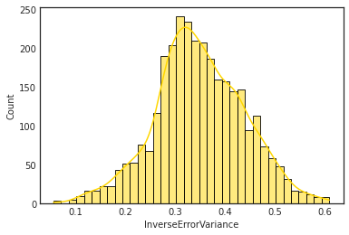

Distribution of normalized inverse error variance values
____________________________________________________________

.. code:: ipython3

    # density plot and histogram of the normalized inverse error variance
    h = sns.histplot(data=df_metrics_SA,
                     x="Normalized_IEV",
                     kde=True,
                     bins=int(180/5),
                     color='darkred')

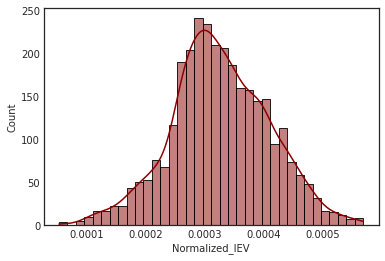

Selection of important sample sets and setting a threshold for physical/non-physical sample sets
_________________________________________________________________________________________________

.. code:: ipython3

    # selection of important sample sets
    percentile = 95

    threshold = np.percentile(concat_df["InverseErrorVariance"], percentile)
    print(f"Threshold using the {percentile} percentile:  {threshold}")

    # select values greater than the threshold
    selected_values_glue = concat_df[concat_df["InverseErrorVariance"] > threshold]

.. parsed-literal::

    Threshold using the 95 percentile:  0.4981408917485908

5-2 Visual inspection of GLUE results
--------------------------------------

.. code:: ipython3

    # format the data frame so that it may be used for plotting
    to_plot = pd.melt(selected_values_glue,
                      id_vars=['ME'],
                      value_vars=['Kq', 'Ks_rescale', 'Alp', 'Huz_rescale', 'B_rescale'])

.. code:: ipython3

    # build a plot with multiple panels of scatter plots where ME is the target metric
    g = sns.FacetGrid(to_plot, col="variable")

    # map the scatter plots to the facet grid panels
    gf = g.map(sns.scatterplot, "value", "ME",  alpha=0.7)

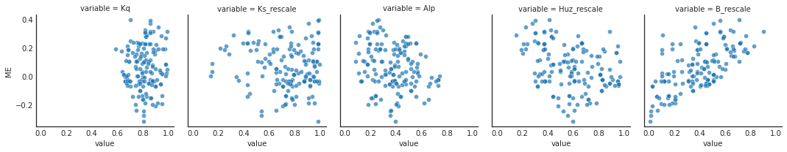

.. code:: ipython3

    # build a plot with multiple panels of histogram plots where ME is the target metric
    g = sns.FacetGrid(to_plot, col="variable")

    # map the plots to the facet grid panels
    gf = g.map(sns.histplot, "value", kde=True)

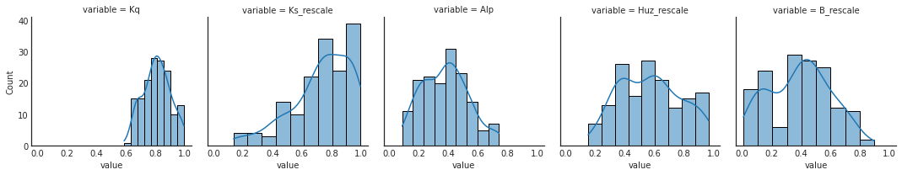

5-3 Comment on the GLUE results
--------------------------------------

Our results suggest that it is challenging to find an clear and
interpretable relationship between different selected near-optimal
sample sets at least by visual inspection. The main reason for this is
that HYMOD includes a complex non-linear system of equations that is
also affected by initial conditions and complexity of its input time
series. Therefore, it does not have a clear control.

Glue has been widely used in hydrology, the original paper has more than
5000 citations. However, the likelihood measure that GLUE uses is not
actually a statistically sound likelihood metric and is in fact a
goodness-of-fit measure. Therefore, it might not produce valid insights
when dealing with situations of non-normality, heteroscedasticity, and
serial correlation. For more on these issues reader can refer to
`Stedinger et al.,
(2008) <https://agupubs.onlinelibrary.wiley.com/doi/full/10.1029/2008WR006822%4010.1002/%28ISSN%291944-7973.ASSESS1>`__,
`Mantovan and Todini,
(2006) <https://www.sciencedirect.com/science/article/pii/S0022169406002162?casa_token=Ml8dhBrO5PkAAAAA:Ake1YuQo0OxK6BaaG-8wIdHa_kd4cuUpm7WiHBFur-G_DlRze6Z0_GkwWH3qHDLKwbJDO9mN>`__,
and `Beven And Binley,
(2014) <https://onlinelibrary.wiley.com/doi/full/10.1002/hyp.10082>`__.

6- Pre-Calibration
===================

Pre-calibration `(Edwards et al,
2010) <https://link.springer.com/article/10.1007/s00382-010-0921-0>`__
is a simplified method to deal with uncertainty in complex environmental
models. Pre-calibration can also be thought of as another method that
tackles the shortcomings and conceptual challenges involved in
calibration of complex environmental models. In pre-calibration instead
of finding the best solutions, we focus on finding the sample sets that
create outputs that are against the common understanding of the system.
These parameter sets are called non-physical parameter sets. In other
words, the probability that these parameters are among the best sample
sets is zero or near zero and can be neglected in practice.

Pre-calibration can include the following steps: 1) Sensitivity analysis
2) Definition of non-physical boundaries 3) Delineating regions in the
output space which are non-physical (Implausible) 4) Map non-physical
sets back to input space 5) Interpret the non-physical sample sets

6-1 Pre-calibration calculations
--------------------------------------

Distribution of mean error, RMSE, and Log[RMSE] under different sample sets
________________________________________________________________________________

.. code:: ipython3

    # set up figure and axis objects
    fig, axs = plt.subplots(nrows=3, figsize=(14,16))

    # axis 1 (first row in figure)
    a = sns.histplot(data=concat_df,
                     x="RMSE",
                     ax=axs[0],
                     kde=True,
                     bins=int(180/5),
                     color='peachpuff').set_title('Distribution of RMSE in Different Sample Sets')

    # axis 2 (second row in figure)
    b = sns.histplot(data=concat_df,
                     x="ME",
                     ax=axs[1],
                     kde=True,
                     bins=int(180/5),
                     color='lightgreen').set_title('Distribution of ME in Different Sample Sets')

    # axis 3 (third row in figure)
    c = sns.histplot(data=concat_df,
                     x="LOG[RMSE]",
                     ax=axs[2],
                     kde=True,
                     bins=int(180/5),
                     color = 'lightseagreen').set_title('Distribution of LOG[RMSE] in Different Sample Sets')

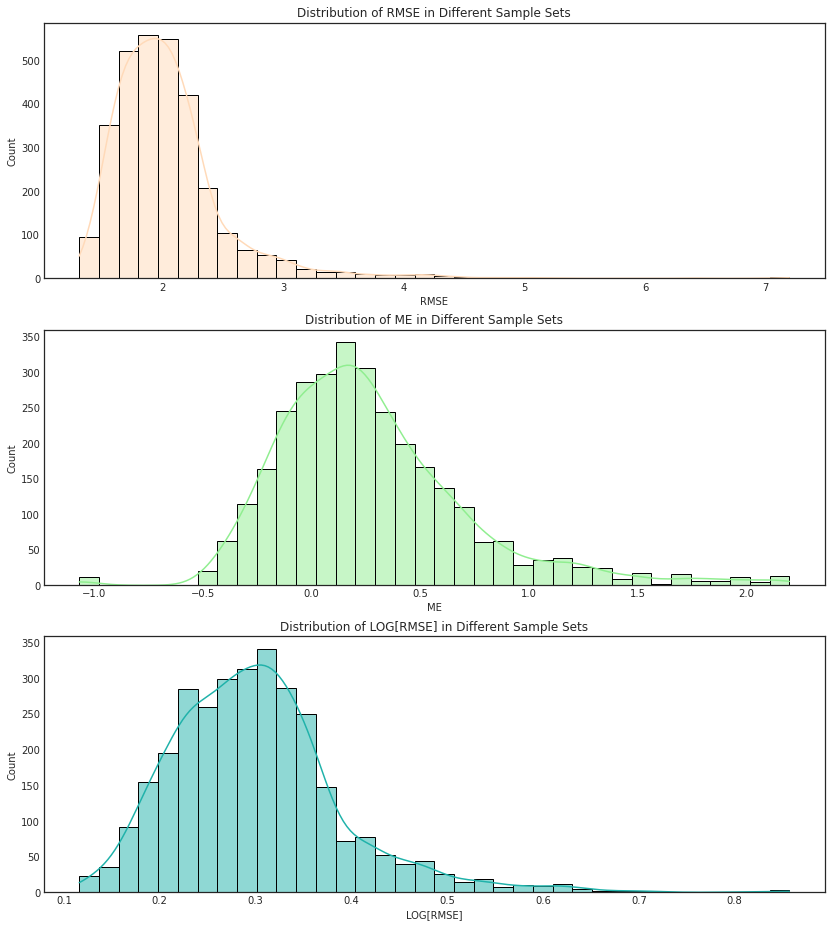

Setting a threshold for physical/non-physical sample sets
________________________________________________________________

.. code:: ipython3

    # selection of physical/non-physical sample sets
    percentile = 95

    threshold_precal = np.percentile(concat_df["RMSE"], percentile)
    print(f"Threshold using the {percentile} percentile:  {threshold}")

    # select values greater than the threshold
    selected_values_precal = concat_df[concat_df["RMSE"] > threshold_precal]

.. parsed-literal::

    Threshold using the 95 percentile:  0.4981408917485908

Visual inspection of non-physical sample sets
________________________________________________

.. code:: ipython3

    # format the data frame so that it may be used for plotting
    to_plot_precal = pd.melt(selected_values_precal,
                             id_vars=['ME'],
                             value_vars=['Kq', 'Ks_rescale', 'Alp', 'Huz_rescale', 'B_rescale'])

.. code:: ipython3

    # build a plot with multiple panels of scatter plots where ME is the target metric
    g = sns.FacetGrid(to_plot_precal, col="variable")

    # map the scatter plots to the facet grid panels
    gh = g.map(sns.scatterplot, "value", "ME",  alpha=0.7, color='plum')

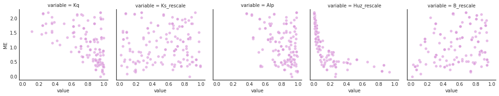

.. code:: ipython3

    # build a plot with multiple panels of histogram plots where ME is the target metric
    g = sns.FacetGrid(to_plot_precal, col="variable")

    # map the plots to the facet grid panels
    gh = g.map(sns.histplot, "value", kde=True, color='plum')

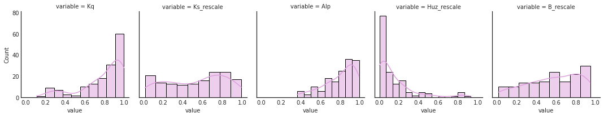

The following figure shows the flow discharge provided by the ensemble
of parameters sets from Pre-Calibration versus the observed flow data.

.. note::
    **Tip:** View the source code used to create this plot here:  `plot_precalibration_flow <https://immm-sfa.github.io/msd_uncertainty_ebook/A3_plotting_code.html#plot-precalibration-flow>`_

.. code:: ipython3

    # mean monthly indices
    Q_df_precal = pd.concat([Q_df.iloc[:, selected_values_precal.index],
                             Q_df[['month' , 'year']]],
                            axis=1)

    # calculate year, month mean
    df_precal_mth_mean = Q_df_precal.groupby(['year', 'month']).mean()

    # plot observed versus pre-calibration outputs
    ax = msdbook.plot_precalibration_flow(df_sim=df_precal_mth_mean,
                                          df_obs=df_obs_mth_mean)

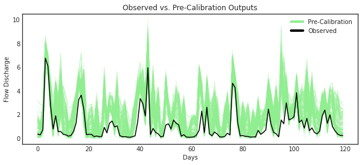

The following figure shows the flow discharge provided by the ensemble
of parameters sets from both pre-calibration and GLUE and how these
flows compare to the observed flow data.

.. note::
    **Tip:** View the source code used to create this plot here:  `plot_precalibration_glue <https://immm-sfa.github.io/msd_uncertainty_ebook/A3_plotting_code.html#plot-precalibration-glue>`_

.. code:: ipython3

    Q_df_glue = pd.concat([Q_df.iloc[:, selected_values_glue.index],
                           Q_df.loc[:,['month' , 'year']]],
                          axis=1)

    # calculate year, month mean
    df_glue_mth_mean = Q_df_glue.groupby(['year', 'month']).mean()

    # plot observed versus pre-calibration and GLUE outputs
    ax = msdbook.plot_precalibration_glue(df_precal=df_precal_mth_mean,
                                          df_glue=df_glue_mth_mean,
                                          df_obs=df_obs_mth_mean)

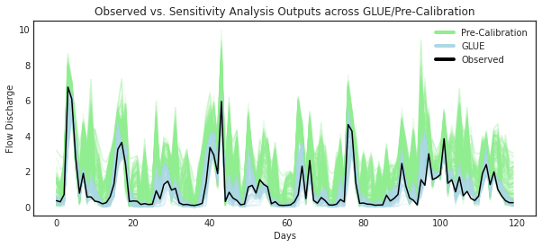

6-2 Comments on Pre-Calibration
-----------------------------------

Although Pre-calibrations provides a helpful and relatively simple
alternative for statistical inferences, it has some disadvantages. For
example, it is often subjective and challenging to provide a threshold
for non-physical model outputs. Moreover, as discussed earlier different
goodness-of-fit metrics can produce distinct physical and non-physical
sample sets.

More information about pre-calibration can be found in `(Edwards et al.,
2010) <https://link.springer.com/article/10.1007/s00382-010-0921-0>`__,
and `Ruckert et al.,
(2017) <https://journals.plos.org/plosone/article?id=10.1371/journal.pone.0170052>`__.
