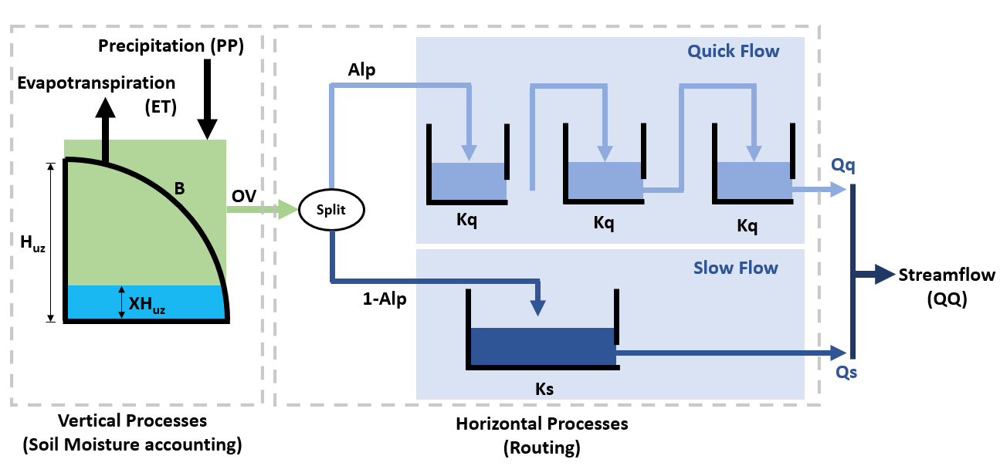
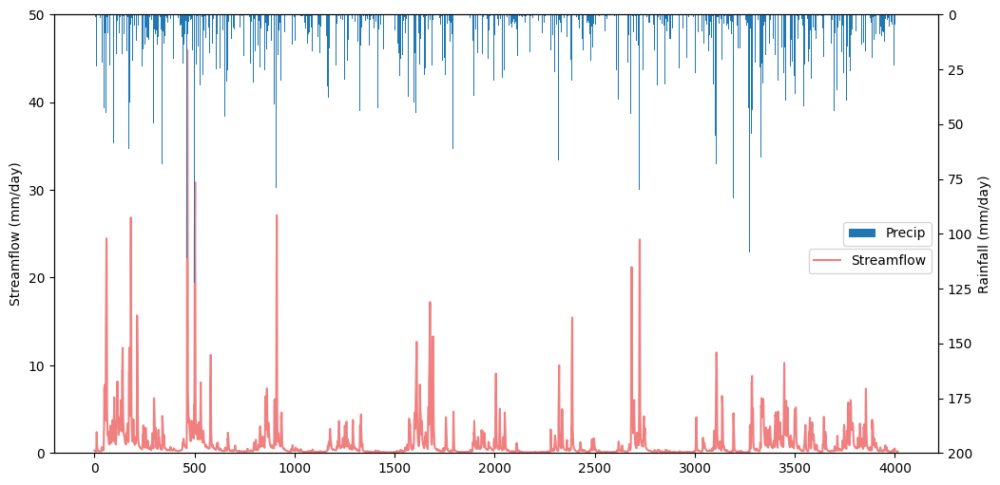
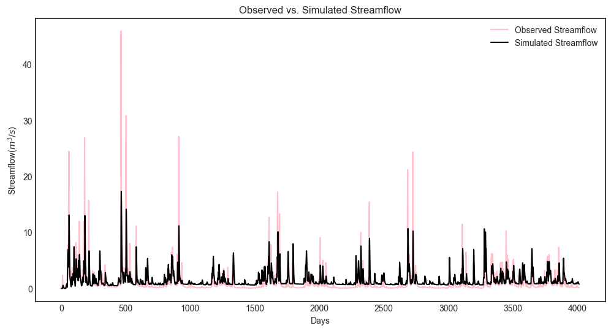
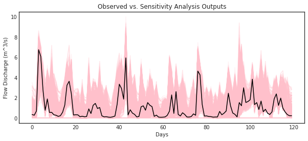
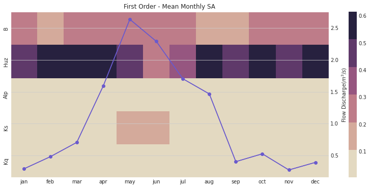
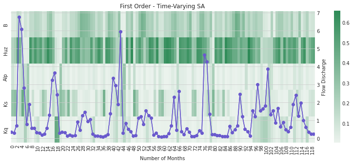

HYMOD Dynamics Tutorial
*************************

.. note::

    | Run the tutorial interactively:  `HYMOD Notebook <nb_hymod_>`_.
    | Please be aware that notebooks can take a couple minutes to launch.
    | To run the notebooks yourself, download the files `here <https://github.com/IMMM-SFA/msd_uncertainty_ebook/tree/main/notebooks>`_ and use these `requirements <https://github.com/IMMM-SFA/msd_uncertainty_ebook/blob/main/requirements.txt>`_.

Tutorial: Sensitivity Analysis of the HYMOD Model
=================================================

The purpose of this tutorial is to demonstrate the global sensitivity
analysis concepts and tools established in the Section 3.1 of the main
text of this eBook. This demonstration will highlight the central role
of design of experiments (Section 3.3), when implementing global
sensitivity analysis tools described in Section 3.4.

We’ll explore these tools and concepts using the HYdrological MODel
(HYMOD), a rainfall-runoff model developed and used for river flow
forecasting. HYMOD was chosen for demonstration because its purpose is
to abstract highly complex and non-linear systems. The methods
demonstrated in thistutorial can be applied to numerical models that
simulate other complex non-linear systems.

This tutorial will first introduce HYMOD and use it to simulate
streamflows in a river basin. Next, we’ll employ sensitivity analysis
concepets described in Section 3 of the main text to examine how values
of HYMOD’s parameters impact streamflow predictions. We’ll then explore
how the effects of these parameters may change over time using
time-varying sensitivtiy analysis. Finally, we’ll demonstrate concepts
presented in Chapter 7 through two ensemble-based methods of uncertainty
quantification - Generalized Likelihood Uncertainty Estimation (GLUE)
and Pre-Calibration.

The tutorial includes the following steps:

1. Introduction to HYMOD
^^^^^^^^^^^^^^^^^^^^^^^^

`1.1 - Introduction to a simple hydrologic model (HYMOD) <#hymod>`__

`1.2 - Input Data <#inputs>`__

`1.3 - Running a basic simulation <#baseline>`__

`1.4 - Model outputs <#outputs>`__

2. Global Sensitivity Analysis
^^^^^^^^^^^^^^^^^^^^^^^^^^^^^^

`2.1 - Design of Experiments <#sensitivity>`__

`2.2 - Sensitivity analysis for one output <#sametrics>`__

`2.3 - Sensitivity analysis across multiple outputs <#diffperformance>`__

`2.4 - Time-varying sensitivity analysis <#time>`__

1 - Introduction to HYMOD
=========================

.. _hymod:

1.1 Overview

HYMOD is a hydrologic model (rainfall-runoff model) that simulates key
hydrologic fluxes such as infiltration, streamflow and
evapotranspiration. The model was originally developed and used for
river flow forecasting, but it has also been been used to explore
different sensitivity analysis (e.g., `Herman et al.,
2013 <https://agupubs.onlinelibrary.wiley.com/doi/full/10.1002/wrcr.20124>`__),
uncertainty quantification (e.g., `Smith et al.,
2008 <https://agupubs.onlinelibrary.wiley.com/doi/full/10.1029/2006WR005205>`__),
and optimization (e.g., `Ye et al.,
2014 <https://www.sciencedirect.com/science/article/pii/S0022169414006362?casa_token=IRqE19Hkfa8AAAAA:_fXOqfwpzxMpchvu8_0njCe0Ok9H29Gyw2F46l9PzG9UVODDTUg6wIOSiyp6uybGevNVnZ7N>`__)
concepts.

HYMOD accepts two inputs - daily precepitation and daily potential
evapotranspiration (PET)- and generates predicitons of daily streamflow.
HYMOD abstracts the highly non-linear process of runoff routing by
dividing the flow into two components: quick flow, representing
precipitation that quickly runs off the surface of the watershed into
the stream, and slow flow, that moves through the soil and takes much
longer to arrive at the stream.

To generate streamflow predictions, HYMOD first models vertical
processes within the watershed to determine how much water infiltrates
and evaporates from the soil at a given time step. It then determines
how much water should be partitioned into quick flow and slow flow
processes. Within each process it abstracts residence time (the time it
takes a unit volume of water to move through the watershed and into the
stream) using a series of “reservoirs” each with a calibrated residence
time.

HYMOD’s representation of hydrologic processes are shown Figure 1 below
and controlled by the following parameters:

:math:`H_{uz}`: the maximum water storage capacity of the soil (mm)

:math:`B_{exp}`: parameters describing the degree of spatial variability
within the basin between 0 and Huz

:math:`Alp`: Fraction of runoff contributing to quick flow

:math:`K_q`: Quick flow residence time of linear infinite reservoir (the
Kq values of all three linear reservoirs are the same)

:math:`K_s`: Slow flow residence time of linear infinite reservoir

Vertical Processes
~~~~~~~~~~~~~~~~~~

HYMOD models the fraction of water that is stored in the soil
:math:`(F(XH_{uz}))` using the following relationship:

.. math:: F(XH_{uz}) = 1 - (1 - \frac{XH_{uz}}{H_{uz}})^{B}

where :math:`XH_{uz}` is the water storage capacity of the soil;
:math:`H_{uz}` is the parameter describing basin maximum water
storage capacity (mm); and :math:`B` is the parameter describing the
degree of spatial variability within the basin.

The portion of precipitation that exceeds the water storage capacity is
treated as runoff.

Horizontal Processes
~~~~~~~~~~~~~~~~~~~~

To route runoff to streamflow, the excess runoff from the vertical
processes is split into quick flow and slow flow. The proportion of
runoff partitioned into quick flow and slow flow is determined by a
parameter :math:`Alp`, which ranges between 0 and 1. Quick flow is
routed through :math:`N` identical quick flow tanks :math:`Q1, Q2... QN`
(shown above as :math:`N=3`). The rate at which runoff moves through the
quick flow system is described by the residence time of the quick frlow
tanks, :math:`Kq` (day). Slow flow is routed through a parallel slow
flow tank and the rate at which slow flow is routed is described by the
slow flow residences time, :math:`Ks` (day).

Citation: Wagener, T., Boyle, D. P., Lees, M. J., Wheater, H. S., Gupta,
H. V., & Sorooshian, S. (2001). A framework for development and
application of hydrological models. Hydrology and Earth System Sciences,
5(1), 13-26.

.. _inputs:

1.2 Input data

The HYMOD model only requires precipitation and potential
evapotranspiration as inputs. For this example, we’ll run HYMOD using
data from the Leaf River, a humid catchment located north of Collins
Mississippi that has been widely used to explore HYMOD. The dataset also
includes daily observed runoff that we later use to evaluate the
performace of each sensitvity analysis sample set.

In the following section of code, we’ll load the necessary python
libraries and read in the input file. For this exercise we’ll only use
the first eleven years of data. The first five rows of the input dataset
are printed to show what they look like:

.. code:: ipython3

    import msdbook

    import numpy as np
    import pandas as pd
    import seaborn as sns

    from sklearn import metrics
    from matplotlib import pyplot as plt

    # load example data
    msdbook.install_package_data()

    # load the Leaf River HYMOD input file
    leaf_data = msdbook.load_hymod_input_file()

    # extract the first eleven years of data
    leaf_data = leaf_data.iloc[0:4015].copy()

    print('Leaf River Data structure:')

    # There are only three columns in the file including precipitation, potential evapotranspiration and  streamflow
    leaf_data.head()

.. parsed-literal::

    Downloading example data for msdbook version 0.1.5...
    Unzipped: /srv/conda/envs/notebook/lib/python3.7/site-packages/msdbook/data/uncertain_params_bounds.txt
    Unzipped: /srv/conda/envs/notebook/lib/python3.7/site-packages/msdbook/data/sa_metric_s1.npy
    Unzipped: /srv/conda/envs/notebook/lib/python3.7/site-packages/msdbook/data/sa_vary_delta.npy
    Unzipped: /srv/conda/envs/notebook/lib/python3.7/site-packages/msdbook/data/sa_by_mth_s1.npy
    Unzipped: /srv/conda/envs/notebook/lib/python3.7/site-packages/msdbook/data/solutions.resultfile
    Unzipped: /srv/conda/envs/notebook/lib/python3.7/site-packages/msdbook/data/3704614_heatmap.npy
    Unzipped: /srv/conda/envs/notebook/lib/python3.7/site-packages/msdbook/data/LHsamples_original_1000.txt
    Unzipped: /srv/conda/envs/notebook/lib/python3.7/site-packages/msdbook/data/3704614_pseudo_r_scores.csv
    Unzipped: /srv/conda/envs/notebook/lib/python3.7/site-packages/msdbook/data/param_values.csv
    Unzipped: /srv/conda/envs/notebook/lib/python3.7/site-packages/msdbook/data/sa_by_yr_s1.npy
    Unzipped: /srv/conda/envs/notebook/lib/python3.7/site-packages/msdbook/data/sa_by_mth_delta.npy
    Unzipped: /srv/conda/envs/notebook/lib/python3.7/site-packages/msdbook/data/7000550_pseudo_r_scores.csv
    Unzipped: /srv/conda/envs/notebook/lib/python3.7/site-packages/msdbook/data/collapse_days.csv
    Unzipped: /srv/conda/envs/notebook/lib/python3.7/site-packages/msdbook/data/hymod_params_256samples.npy
    Unzipped: /srv/conda/envs/notebook/lib/python3.7/site-packages/msdbook/data/sa_vary_s1.npy
    Unzipped: /srv/conda/envs/notebook/lib/python3.7/site-packages/msdbook/data/7000550_heatmap.npy
    Unzipped: /srv/conda/envs/notebook/lib/python3.7/site-packages/msdbook/data/7200799_heatmap.npy
    Unzipped: /srv/conda/envs/notebook/lib/python3.7/site-packages/msdbook/data/sa_by_yr_delta.npy
    Unzipped: /srv/conda/envs/notebook/lib/python3.7/site-packages/msdbook/data/7200799_pseudo_r_scores.csv
    Unzipped: /srv/conda/envs/notebook/lib/python3.7/site-packages/msdbook/data/LeafCatch.csv
    Unzipped: /srv/conda/envs/notebook/lib/python3.7/site-packages/msdbook/data/hymod_simulations_256samples.csv
    Unzipped: /srv/conda/envs/notebook/lib/python3.7/site-packages/msdbook/data/Robustness.txt
    Leaf River Data structure:

.. raw:: html

    

    
    <table border="1" class="dataframe">
      <thead>
        <tr style="text-align: right;">
          <th></th>
          <th>Precip</th>
          <th>Pot_ET</th>
          <th>Strmflw</th>
        </tr>
      </thead>
      <tbody>
        <tr>
          <th>0</th>
          <td>0.0</td>
          <td>4.60</td>
          <td>0.29</td>
        </tr>
        <tr>
          <th>1</th>
          <td>0.0</td>
          <td>4.31</td>
          <td>0.24</td>
        </tr>
        <tr>
          <th>2</th>
          <td>0.0</td>
          <td>4.33</td>
          <td>0.21</td>
        </tr>
        <tr>
          <th>3</th>
          <td>0.0</td>
          <td>4.78</td>
          <td>0.19</td>
        </tr>
        <tr>
          <th>4</th>
          <td>0.0</td>
          <td>2.91</td>
          <td>0.18</td>
        </tr>
      </tbody>
    </table>
    

To visualize catchment hydrology, streamflow and precipitation data are
usually plotted together as a combined hydrograph (streamflow ) and
hyetograph (rainfall, from Greek.hyetos, “rain”). Streamflow is plotted
as a time series, while rainfall is shown as an inverted bar plot along
the top of the graph. Streamflow labels are shown on the left y-axis,
while rainfall labels are shown on the right y-axis.

.. code:: ipython3

    # make an axis for the hydrograph
    fig, strmflw_ax = plt.subplots(figsize=[12,6])
    strmflw_ax.set_ylim([0, 50])

    #make a second y-axis for the hyetograph
    precip_ax = strmflw_ax.twinx()
    precip_ax.set_ylim([0, 200])
    precip_ax.invert_yaxis()

    precip = leaf_data['Precip']
    strmflw_ax.plot(range(0, len(leaf_data['Precip'])), leaf_data['Strmflw'], color='lightcoral')
    strmflw_ax.set_ylabel('Streamflow (mm/day)')

    precip_ax.bar(range(0, len(leaf_data['Precip'])), leaf_data['Precip'], width=2)
    precip_ax.set_ylabel('Rainfall (mm/day)')
    precip_ax.legend(['Precip'], loc='center right')
    strmflw_ax.legend(['Streamflow'],bbox_to_anchor=(1, 0.48))

.. parsed-literal::

    <matplotlib.legend.Legend at 0x7f53b95c6850>

.. _baseline:

1.3 Running a Baseline Model Simulation

We’ll start our experiment by running HYMOD using its default
parameters.

.. code:: ipython3

    # assign input parameters to generate a baseline simulated streamflow
    Nq = 3  # Number of quickflow routing tanks
    Kq = 0.5 # Quickflow routing tanks' rate parameter
    Ks =  0.001 # Slowflow routing tank's rate parameter
    Alp = 0.5 # Quick/slow split parameter
    Huz = 100 # Maximum height of soil moisture accounting tank
    B = 1.0 # Scaled distribution function shape parameter

    # Note that the number of years is 11. One year of model warm-up and ten years are used for actual simulation
    model = msdbook.hymod(Nq, Kq, Ks, Alp, Huz, B, leaf_data, ndays=4015)

.. _outputs:

1.4 Model Outputs

Model outputs include actual evapotranspiration, quick and fast
streamflow, and combined runoff. In this tutorial we focus on the total
daily runoff, QQ (:math:`m^3/s`). We can use the following script to
plot simulated streamflow against observed streamflow.

.. tip:: View the source code used to create this plot here: `plot_observed_vs_simulated_streamflow <https://uc-ebook.org/docs/html/A3_plotting_code.html#plot-observed-vs-simulated-streamflow>`_

.. code:: ipython3

    ax = msdbook.plot_observed_vs_simulated_streamflow(df=leaf_data, hymod_dict=model)

So how does our model perform? We can investigate model performance
across several metrics:

1: Mean Absolute Error (MAE); MAE conveys how the model performs on
average across the 10 year simulation period, with smaller values
indicating better performance. The absolute value is taken so that
positive and negative errors do not cancel each other out.

.. math:: MAE = \frac{1}{N}\sum_{t=0}^N\left\lvert Q_{sim,t}-Q_{obs,t}\right\rvert

2: Root Mean Square Error (RMSE); RMSE is sum of square errors across
the 10 year simulation period. RMSE is sensitive to large errors between
the historical record and the simulated flows, and thus is useful for
highlighting the model’s ability to capture of extreme flood events.

.. math:: RMSE = \sqrt{\frac{1}{N}\sum_{t=1}^{N}(Q_{sim,t}-Q_{obs,t})^2}

3: Log-Root Mean Square Error (Log(RMSE)) LOG(RMSE) focuses on model
performance during low-flow events.

.. math:: LOG(RMSE) = log(RMSE)

.. code:: ipython3

    mae = np.mean(abs(leaf_data['Strmflw'] - model['Q']))
    mse = metrics.mean_squared_error(model['Q'], leaf_data['Strmflw'])
    rmse = mse**(1/2)

    print('MAE: ' + str(mae) + '\nRMSE: ' + str(mse) + '\nLOG(RMSE): ' + str(rmse))

.. parsed-literal::

    MAE: 1.0787471470460999
    RMSE: 4.375695937555197
    LOG(RMSE): 2.0918164206151544

The error metrics show that HYMOD performs reasonably well, the MAE is
around 1 :math:`m^3/s`, the RMSE is on the order of 10% of the largest
observed streamflow and the LOG(RMSE) is fairly low.

2- Global Sensitivity Analysis
==============================

.. _sensitivity:

2.1 Experimental Design and Setup

Now we’ll examine how sensitive streamflow simulations generated by
HYMOD are to the model’s input parameters. We’ll perform global
sensitivity analysis (see Section 3.1 of the main text) using the SALib
Python library.

.. code:: ipython3

    from SALib.sample import saltelli
    from SALib.analyze import sobol
    from SALib.analyze import delta

A first and critical step when conducting sensitivity analysis is
determining the experimental design (see Design of Experiments, Section
3.4 of the main text). Our experimental design involves defining the
uncertainties that we’ll be examining, the output of interest, the
ranges of each uncertainty that will be explored and the strategy for
sampling the uncertainty space.

For this experiment we’ll explore the five parameters highlighted in
Figure 1. We’ll draw their ranges from existing literature on the model
(note Jon H. paper). We’ll use a Sobol sampling an a quasi-random
sampling with low sequences approach to sample the uncertainty space
(Section 3.3.4).

In this demonstration we’ll utilize Sobol Sensitivity Analysis, a
variance based method (Section 3.4.5).

To explore HYMOD’s behavoir, we’ll examine the sensitivity of four model
ouputs to input parameters: 1) predicted flow, 2) Mean Absolute Error
(compared with the calibaration data set), 3) Root Mean Square Error and
4) Log Root Mean Square Error.

This analysis will employ SALib, a Python implementation also utilized
in the other SA tutorial (make this more formal).

To start our analysis, we’ll create a dictionary that describes our
model uncertainties and their ranges, this dictionary is named
“problem_hymod” (SALib refers to these dictionaries as “problems”).

.. code:: ipython3

    problem_hymod = {
        'num_vars': 5,
        'names': ['Kq', 'Ks', 'Alp', 'Huz', 'B'],
        'bounds': [[0.1, 1],  # Kq
                   [0, 0.1],  # Ks
                   [0, 1],    # Alp
                   [0.1, 500],  # Huz
                   [0, 1.9]]  # B
    }

After defining our uncertainites and ranges, we’ll use SALib to sample
the uncertainty space and run the model for each of the sample sets. We
will load a sample that has already been created ``param_values_hymod``
for demonstration purposes. For HYMOD, literature recommends running at
least N = 10,000 samples, to keep this demonstration easy to run
however, we utilize only 256 sobol samples of uncertainties. To generate
accurate approximations of second order sensitivity indicies SALib
generates N*(2k+2) sets of samples, where N=256 and k=5 (number of
uncertainties). For the math behind why this is needed, see (Saltelli,
A., 2002. Making best use of model evaluations to compute sensitivity
indices. Computer Physics Communications 145, 280–297.
https://doi.org/10.1016/S0010-4655(02)00280-1).

The actual model simulation takes an extended period, so we also load
the simulation data from a previous run. The following demonstrates how
to conduct this analysis:

.. code:: python

   # generate 256 samples.
   param_values_hymod = saltelli.sample(problem_hymod, 256)

   # dictionary to store outputs in
   d_outputs = {}

   # run simulation for each parameter sample
   for i in range(0, len(param_values_hymod)):

       # run model for each sensitivity analysis parameter sets
       hymod_output = msdbook.hymod(Nq,
                                    param_values_hymod[i, 0],
                                    param_values_hymod[i, 1],
                                    param_values_hymod[i, 2],
                                    param_values_hymod[i, 3],
                                    param_values_hymod[i, 4],
                                    leaf_data,
                                    ndays=4015)

       # store the simulated total flow discharge
       d_outputs[f"Q{i}"] = hymod_output["Q"]

   Q_df_bw = pd.DataFrame(d_outputs)

.. code:: ipython3

    # load previously generated parameter values
    param_values_hymod = msdbook.load_hymod_params()

    # number of samples
    n_samples = len(param_values_hymod)

    # load previously generated hymod simulated outputs
    Q_df_bw = msdbook.load_hymod_simulation()

    # column names of each sample simulation number
    sample_column_names = [i for i in Q_df_bw.columns if i[0] == 'Q']

Running HYMOD - Model Warm-up
^^^^^^^^^^^^^^^^^^^^^^^^^^^^^

A hydrological model such as HYMOD usually includes ordinary
differential equations that are sensitive to their initial condition.
They also have components in their underlying formulation that have long
memory such that prior time steps can affect their current simulations.
For example, soil moisture or groundwater can hold water for a long time
and therefore they are often considered to exhibit a long memory. This
can affect the partitioning of water to runoff and infiltration, while
also controlling the generation of base flow. Therefore, it is important
to have a reasonable initial value for them. To achieve this,
hydrologists usually extend their simulation period and after the
simulations, they remove that extended time period that has unreasonable
groundwater or surface water values. This time period is called the
warm-up time period.

Here we extended our simulation for one year (from 10 years to 11 years)
and we removed the first year of simulation, therefore our warm-up
period is one year.

.. code:: ipython3

    # exclude the first year of simulation from the simulations and reset the index
    Q_df = Q_df_bw.iloc[365:4015].copy().reset_index(drop=True)

    # exclude the first year of the input data and reset the index
    leaf_data = leaf_data.iloc[365:4015].copy().reset_index(drop=True)

Now that HYMOD has been warmed up, we’ll examine how HYMOD’s streamflow
outputs vary under different sample sets, and compare them with the
observed streamflow.

.. code:: ipython3

    # add date columns to our simulation data frame; for this data our start date is 1/1/2000
    date_ts = pd.date_range(start='1/1/2000', periods=3650, freq='D')
    Q_df['date'] = date_ts
    Q_df['year'] = date_ts.year
    Q_df['month'] = date_ts.month
    Q_df['day'] = date_ts.day

    # aggregate the simulated observed streamflow to monthly mean
    df_sim_mth_mean = Q_df.groupby(['year', 'month'])[sample_column_names].mean()

    # do the same for the observed data
    date_ts = pd.date_range(start='1/1/2000', periods=len(leaf_data), freq='D')
    leaf_data['date'] = date_ts
    leaf_data['year'] = date_ts.year
    leaf_data['month'] = date_ts.month
    leaf_data['day'] = date_ts.day

    # aggregate the daily observed streamflow to monthly mean
    df_obs_mth_mean = leaf_data.groupby(['year', 'month']).mean()

.. tip:: View the source code used to create this plot here: `plot_observed_vs_sensitivity_streamflow <https://uc-ebook.org/docs/html/A3_plotting_code.html#plot-observed-vs-sensitivity-streamflow>`_

.. code:: ipython3

    ax = msdbook.plot_observed_vs_sensitivity_streamflow(df_obs=df_obs_mth_mean,
                                                         df_sim=df_sim_mth_mean)

.. _sametrics:

2.2 Sensitivity of streamflows to model parameters

Now we’ll examine how each of HYMOD’s parameters impact the variance of
simulated streamflows. Using SALib we’ll calculate the first order and
total order sensitivity indicies of each model parameter. The first
order sensitivity index measure’s the individual impact that a given
parameter has on the variance of the simulated streamflows. The total
order index measures the impact of a given parameter along with all
interactions that other parameters have with the given parameter on
simulated streamflows.

We’ll start with an matrix, Y, which contains our simulated streamflows
for every uncertainty sample. We’ll then use the sobol.analyze function
from SALib to calculate the sensitivity indicies (Si). The arguments for
this function are the problem dictionary defined in part 2.2 of this
tutorial, and the matrix of simulated streamflows, Y.

.. code:: ipython3

    # overall aggregated indices
    Y = Q_df[sample_column_names].mean().to_numpy()

    # Perform analysis
    Si = sobol.analyze(problem_hymod, Y)

Now we can examine our results, we’ll print the first order and total
order Si’s for each parameter, then visualize the results with bar plots

.. code:: ipython3

    print('First order indices = ', Si['S1'])

    print('Total order indicies = ', Si['ST'])

    sns.set_style('white')
    fig = plt.figure(figsize=(8,4))
    ax1 = fig.add_subplot(121)
    ax1.bar(np.arange(5), Si['S1'])
    ax1.set_xticklabels(['','Kq', 'Ks', 'Alp', 'Huz', 'B'])
    ax1.set_ylabel('First order Si')
    ax1.set_ylim([0,1])

    ax2 = fig.add_subplot(122)
    ax2.bar(np.arange(5), Si['ST'])
    ax2.set_xticklabels(['','Kq', 'Ks', 'Alp', 'Huz', 'B'])
    ax2.set_ylabel('Total order Si')
    ax2.set_ylim([0,1])

.. parsed-literal::

    First order indices =  [9.55550001e-05 7.49249463e-04 5.62386413e-04 7.03327551e-01
     2.53701895e-01]
    Total order indicies =  [1.76174200e-06 1.63288175e-03 3.41378460e-04 6.88983864e-01
     2.53922146e-01]

.. parsed-literal::

    /srv/conda/envs/notebook/lib/python3.7/site-packages/ipykernel_launcher.py:9: UserWarning: FixedFormatter should only be used together with FixedLocator
      if __name__ == '__main__':
    /srv/conda/envs/notebook/lib/python3.7/site-packages/ipykernel_launcher.py:15: UserWarning: FixedFormatter should only be used together with FixedLocator
      from ipykernel import kernelapp as app

.. parsed-literal::

    (0.0, 1.0)

.. image:: _static/hymod4.png

Our findings indicate that in this instance, the streamflow estimate
from HYMOD is highly sensitive to soil moisture parameters Huz and B and
hardly affected by the routing parameters. Notably, there is very little
interactions between parameters causing the total order indicies to be
nearly identical to the first order indicies.

.. _diffperformance:

2.3 How do different performance metrics affect the results of our
sensitivity analysis?

Streamflow has many different properties. In this section, we discuss
how the selection of metrics can lead to fundamentally different
sensitivity analysis results. For example, one can only focus on
aggregated streamflow metrics such as mean (what has been presented so
far), or only on extreme events such as drought or floods.

Here we compare three different metrics: 1- Mean error (ME) 2- Root Mean
Square Error (RMSE) 3- Log-Root Mean Square Error (Log(RMSE))

Each of these metrics focuses on a specific attribute of streamflow. For
example, RMSE highlights the impacts of extreme flood events, while
LOG(RMSE) focuses on model performance during low-flow events.

.. code:: ipython3

    # calculate error metrics
    mae = Q_df[sample_column_names].apply(lambda x: abs(x-leaf_data["Strmflw"]), axis=0)
    mse = Q_df[sample_column_names].apply(lambda x: metrics.mean_squared_error(x, leaf_data["Strmflw"]), axis=0)
    rmse = mse**(1/2)

    # add error metrics to a dictionary
    d_metrics = {'MAE': mae.mean().values,
                 'RMSE': rmse.values,
                 'LOG[RMSE]': np.log10(rmse.values)}

    # convert to a dataframe
    df_metrics_SA = pd.DataFrame(d_metrics)

We can use the following to calculate the SA indices for each metric and
visualize it.

.. code:: ipython3

    df_metric_s1_result = pd.DataFrame(np.zeros((3, 5)), columns=['Kq', 'Ks', 'Alp', 'Huz', 'B'])
    df_metric_sT_result = pd.DataFrame(np.zeros((3, 5)), columns=['Kq', 'Ks', 'Alp', 'Huz', 'B'])

    # conduct sensitivity analysis for each metric
    for index, i in enumerate(d_metrics.keys()):

        # get the data as a numpy array for the target metric
        Y = d_metrics[i]

        # use the metric to conduct SA
        Si = sobol.analyze(problem_hymod, Y, print_to_console=False)

        # add the sensitivity indices to the output data frame
        df_metric_s1_result.iloc[index, :] = Si['S1']
        df_metric_sT_result.iloc[index, :] = Si['ST']

.. code:: ipython3

    # create seaborn heatmap with required labels
    fig = plt.figure(figsize=(12,4))
    ax1 = fig.add_subplot(121)
    # labels for y-axis
    y_axis_labels = ['Mean Absoulte Error', 'RSME', 'Log(RMSE)']

    # plot heatmap
    ax1 = sns.heatmap(df_metric_s1_result, yticklabels=y_axis_labels, annot=True,  cmap='inferno_r', cbar_kws={'label': 'Si'}, cbar=False)
    ax1.figure.axes[-1].yaxis.label.set_size(14)
    ax1.set_title('First Order Sensitivity')

    ax2 = fig.add_subplot(122)
    ax2 = sns.heatmap(df_metric_sT_result, yticklabels=y_axis_labels, annot=True,  cmap='inferno_r', cbar_kws={'label': 'Si'})
    ax2.figure.axes[-1].yaxis.label.set_size(14)
    ax2.set_title('Total Order Sensitivity')

.. parsed-literal::

    Text(0.5, 1.0, 'Total Order Sensitivity')

.. image:: _static/hymod5.png

The first order sensitivity indicies indicate that HYMOD’s sensitivity
to its parameters is different depending on how its output is measured.
Unsurprisingly, the mean absolute error is highly sensitive to the soil
moisture accounting parameters Huz and B, just like the overall
streamflow predictions above. However, when we examine RMSE and
log(RMSE), the routing parameters Alp become sensitive, and the
sensitivity to parameter B is reduced. As described above, RMSE and
LOG(RMSE) respond to model performance in high-flow and low flow periods
respectively. Our results indicate that for these flow regimes Alp, the
parameter that governs the split between quick and slow flow is an
important factor. While still the parameter with the highest most effect
on all three measures, Huz is much less influential for RMSE and
LOG(RMSE) than it is for MAE.

The total order sensitivity indicies review a different, more complex
story. While the MAE sensitivity is relatively governed by first order
effects (like the streamflow predictions above), the RMSE and LOG(RMSE)
error metrics show significant interactions. Alp has the highest total
order sensitivity for RMSE and is eqal to Huz for Log(RMSE). Kq, which
has a relatively low first order sensitivity index, shows strong
contribution to variance when interactions are taken into account.

Radial convergence plots are a helpful way to visualize the interactions
between parameters. These plots array the model parameters in a circle
and plot the first order, total order and second order Sobol sensitivity
indices for each parameter. The first order sensitivity is shown as the
size of a closed circle, the total order as the size of a larger open
circle and the second order as the thickness of a line connecting two
parameters. Below is an example of a radial convergence plot for the
LOG(RMSE) measure. The plot indicates strong interactions between the
Huz and Alp parameters, as well as Alp and Kq. There is also an
interaction between Alp and Ks.

.. code:: ipython3

    import numpy as np
    import itertools
    import seaborn as sns
    import math
    sns.set_style('whitegrid', {'axes_linewidth': 0, 'axes.edgecolor': 'white'})

    def is_significant(value, confidence_interval, threshold="conf"):
        if threshold == "conf":
            return value - abs(confidence_interval) > 0
        else:
            return value - abs(float(threshold)) > 0

    def grouped_radial(SAresults, parameters, radSc=2.0, scaling=1, widthSc=0.5, STthick=1, varNameMult=1.3, colors=None, groups=None, gpNameMult=1.5, threshold="conf"):
        # Derived from https://github.com/calvinwhealton/SensitivityAnalysisPlots
        fig, ax = plt.subplots(1, 1)
        color_map = {}

        # initialize parameters and colors
        if groups is None:

            if colors is None:
                colors = ["k"]

            for i, parameter in enumerate(parameters):
                color_map[parameter] = colors[i % len(colors)]
        else:
            if colors is None:
                colors = sns.color_palette("deep", max(3, len(groups)))

            for i, key in enumerate(groups.keys()):
                #parameters.extend(groups[key])

                for parameter in groups[key]:
                    color_map[parameter] = colors[i % len(colors)]

        n = len(parameters)
        angles = radSc*math.pi*np.arange(0, n)/n
        x = radSc*np.cos(angles)
        y = radSc*np.sin(angles)

        # plot second-order indices
        for i, j in itertools.combinations(range(n), 2):
            #key1 = parameters[i]
            #key2 = parameters[j]

            if is_significant(SAresults["S2"][i][j], SAresults["S2_conf"][i][j], threshold):
                angle = math.atan((y[j]-y[i])/(x[j]-x[i]))

                if y[j]-y[i] < 0:
                    angle += math.pi

                line_hw = scaling*(max(0, SAresults["S2"][i][j])**widthSc)/2

                coords = np.empty((4, 2))
                coords[0, 0] = x[i] - line_hw*math.sin(angle)
                coords[1, 0] = x[i] + line_hw*math.sin(angle)
                coords[2, 0] = x[j] + line_hw*math.sin(angle)
                coords[3, 0] = x[j] - line_hw*math.sin(angle)
                coords[0, 1] = y[i] + line_hw*math.cos(angle)
                coords[1, 1] = y[i] - line_hw*math.cos(angle)
                coords[2, 1] = y[j] - line_hw*math.cos(angle)
                coords[3, 1] = y[j] + line_hw*math.cos(angle)

                ax.add_artist(plt.Polygon(coords, color="0.75"))

        # plot total order indices
        for i, key in enumerate(parameters):
            if is_significant(SAresults["ST"][i], SAresults["ST_conf"][i], threshold):
                ax.add_artist(plt.Circle((x[i], y[i]), scaling*(SAresults["ST"][i]**widthSc)/2, color='w'))
                ax.add_artist(plt.Circle((x[i], y[i]), scaling*(SAresults["ST"][i]**widthSc)/2, lw=STthick, color='0.4', fill=False))

        # plot first-order indices
        for i, key in enumerate(parameters):
            if is_significant(SAresults["S1"][i], SAresults["S1_conf"][i], threshold):
                ax.add_artist(plt.Circle((x[i], y[i]), scaling*(SAresults["S1"][i]**widthSc)/2, color='0.4'))

        # add labels
        for i, key in enumerate(parameters):
            ax.text(varNameMult*x[i], varNameMult*y[i], key, ha='center', va='center',
                    rotation=angles[i]*360/(2*math.pi) - 90,
                    color=color_map[key])

        if groups is not None:
            for i, group in enumerate(groups.keys()):
                print(group)
                group_angle = np.mean([angles[j] for j in range(n) if parameters[j] in groups[group]])

                ax.text(gpNameMult*radSc*math.cos(group_angle), gpNameMult*radSc*math.sin(group_angle), group, ha='center', va='center',
                    rotation=group_angle*360/(2*math.pi) - 90,
                    color=colors[i % len(colors)])

        ax.set_facecolor('white')
        ax.set_xticks([])
        ax.set_yticks([])
        plt.axis('equal')
        plt.axis([-2*radSc, 2*radSc, -2*radSc, 2*radSc])
        #plt.show()

        return fig

    # define groups for parameter uncertainties
    groups={"Soil Moisture" : ["Huz", "B"],
            "Routing" : ["Alp", "Kq", "Ks"]}

    fig = grouped_radial(Si, ['Kq', 'Ks', 'Alp', 'Huz', 'B'], groups=groups, threshold=0.025)

.. parsed-literal::

    Soil Moisture
    Routing

.. image:: _static/hymod6.png

2.4 Time-Varying Sensitivity Analysis

.. _time:

In section 2.5 we saw how performing sensitivity analysis on different
measurements of model output can yeild in different results on the
importance of each uncertain input. In this section we’ll examine how
performing this analysis over time can yeild additional insight into the
performance of HYMOD. We’ll first examine how model sensitivities vary
by month, then examine how they change across each year of the
simulation.

For this demonstration, we’ll focus only on the monthly streamflow
predictions generated by HYMOD.

2.4.1 Sensitivity analysis indices for each month
~~~~~~~~~~~~~~~~~~~~~~~~~~~~~~~~~~~~~~~~~~~~~~~~~

.. code:: ipython3

    # aggregate simulated streamflow data to monthly time series
    df_sim_by_mth_mean = Q_df.groupby('month')[sample_column_names].mean()

    # aggregate observed streamflow data to monthly time series
    df_obs_by_mth_mean = leaf_data.groupby('month').mean()

We can use the following to calculate the SA indices for each month and
visualize it. Results are pre-loaded for efficiency.

.. code:: python

   # set up dataframes to store outputs
   df_mth_s1 = pd.DataFrame(np.zeros((12,5)), columns=['Kq', 'Ks', 'Alp', 'Huz', 'B'])
   df_mth_delta = df_mth_s1.copy()

   # iterate through each month
   for i in range(0, 12):

       # generate the simulation data
       Y = df_sim_by_mth_mean.iloc[i, :].to_numpy()

       # run SA
       Si = delta.analyze(problem_hymod, param_values_hymod, Y, print_to_console=False)

       # add to output dataframes
       df_mth_s1.iloc[i, :] = np.maximum(Si['S1'], 0)
       df_mth_delta.iloc[i, :] = np.maximum(Si['delta'], 0)

   # convert to arrays
   arr_mth_s1 = df_mth_s1.values
   arr_mth_delta = df_mth_delta.values

First-order Indices
^^^^^^^^^^^^^^^^^^^

The following can be used to visualize the time-varying first-order
indices. The first order represents the direct impacts of a specific
parameter on model outputs.

.. tip:: View the source code used to create this plot here: `plot_monthly_heatmap <https://uc-ebook.org/docs/html/A3_plotting_code.html#plot-monthly-heatmap>`_

.. code:: ipython3

    # load previously ran data
    arr_mth_delta, arr_mth_s1 = msdbook.load_hymod_monthly_simulations()

    # plot figure
    ax, ax2 = msdbook.plot_monthly_heatmap(arr_sim=arr_mth_s1.T,
                                           df_obs=df_obs_by_mth_mean,
                                           title='First Order - Mean Monthly SA')

This figure demonstrates the first order sensitivity indices when the
streamflow data are aggregated by month. The purple line represents the
observed monthly discharge. The figure indicates that the first order
indices are highest for B and Huz across all months and lowest for Alp,
Ks, and Kq. Note that in the months with the highest flow, Ks becomes an
influential parameter.

Total-order indices
^^^^^^^^^^^^^^^^^^^

We can also focus on the total order sensitivity index that includes
first-order SA indices and interactions between parameters

.. code:: ipython3

    # plot figure
    ax, ax2 = msdbook.plot_monthly_heatmap(arr_sim=arr_mth_delta.T,
                                           df_obs=df_obs_by_mth_mean,
                                           title='Total Order - Mean monthly SA')

.. image:: _static/hymod8.png

Notably, the total order sensitivity results are different than the
first order sensitivity results, which indicates that interactions
between the parameters (particularly in regards to routing parameters
:math:`Kq`, :math:`Ks`, and :math:`Alp`) contribute to changes in HYMOD
output.

2.4.2 Annual sensitivity analysis indices
~~~~~~~~~~~~~~~~~~~~~~~~~~~~~~~~~~~~~~~~~

.. code:: ipython3

    # group by year and get mean
    df_sim_by_yr_mean = Q_df.groupby(['year'])[sample_column_names].mean()

    # group input data and get mean
    df_obs_by_yr_mean = leaf_data.groupby(['year']).mean()

We can also calculate the sensitivity analysis indices for each
individual year. This will allow us to understand if model control
changes during different years. The following code first aggregates the
outputs to annual time steps, and then calculates the SA indices.

.. code:: python

   # set up dataframes to store outputs
   df_yr_s1 = pd.DataFrame(np.zeros((10, 5)), columns=['Kq', 'Ks', 'Alp', 'Huz', 'B'])
   df_yr_delta = df_yr_s1.copy()

   # iterate through each year
   for i in range(0, 10):

       # generate the simulation data
       Y = df_sim_by_yr_mean.iloc[i, :].to_numpy()

       # run SA
       Si = delta.analyze(problem_hymod, param_values_hymod, Y, print_to_console=False)

       # add to output dataframes
       df_yr_s1.iloc[i, :] = np.maximum(Si['S1'], 0)
       df_yr_delta.iloc[i, :] = np.maximum(Si['delta'], 0)

   # convert to arrays
   arr_yr_s1 = df_mth_s1.values
   arr_yr_delta = df_mth_delta.values

First-order indices
^^^^^^^^^^^^^^^^^^^

.. tip:: View the source code used to create this plot here: `plot_annual_heatmap <https://uc-ebook.org/docs/html/A3_plotting_code.html#plot-annual-heatmap>`_

.. code:: ipython3

    # load previously ran data
    arr_yr_delta, arr_yr_s1 = msdbook.load_hymod_annual_simulations()

    # plot figure
    ax, ax2 = msdbook.plot_annual_heatmap(arr_sim=arr_yr_s1.T,
                                          df_obs=df_obs_by_yr_mean,
                                          title='First Order - Mean Annual SA')

.. image:: _static/hymod9.png

The first order sensitivities at the annual scale are not unlike the
first order monthly sensitivities. Once again, sensitivities vary across
year and Huz and B are the most consequential parameters.

Total-order indices
^^^^^^^^^^^^^^^^^^^

.. code:: ipython3

    # plot figure
    ax, ax2 = msdbook.plot_annual_heatmap(arr_sim=arr_yr_delta.T,
                                          df_obs=df_obs_by_yr_mean,
                                          title='Total Order - Mean Annual SA and Observed flow')

.. image:: _static/hymod10.png

Our results indicate that sensitivity analysis indices vary in different
years and now that interactions are included, the Kq, Ks, and Alp
variables impact the sensitivity of the streamflow output.

2.4.3 Monthly time-varying sensitivity analysis
~~~~~~~~~~~~~~~~~~~~~~~~~~~~~~~~~~~~~~~~~~~~~~~

Although time-varying sensitivity analysis (TVSA) at average monthly and
average annual temporal resolutions is informative, TVSA is susceptible
to the aggregation issue that we discussed earlier in section 3-2. To
avoid that we can further discretize our time domain to zoom into
individual months. This will provide us with even more information about
model behavior and the sensitivity of different parameters in different
states of the system. The block of code demonstrates how to implement
the monthly TVSA.

.. code:: python

   # set up dataframes to store outputs
   df_vary_s1 = pd.DataFrame(np.zeros((df_obs_mth_mean.shape[0], 5)),
                             columns=['Kq', 'Ks', 'Alp', 'Huz', 'B'])

   df_vary_delta = df_vary_s1.copy()

   # iterate through each month
   for i in range(0, df_obs_mth_mean.shape[0]):

       # generate the simulation data
       Y = df_sim_mth_mean.iloc[i, :].to_numpy()

       # run SA
       Si = delta.analyze(problem_hymod, param_values_hymod, Y, print_to_console=False)

       # add to output dataframes
       df_vary_s1.iloc[i, :] = np.maximum(Si['S1'], 0)
       df_vary_delta.iloc[i, :] = np.maximum(Si['delta'], 0)

   # convert to arrays
   arr_vary_s1 = df_vary_s1.values
   arr_vary_delta = df_vary_delta.values

First-order indices
^^^^^^^^^^^^^^^^^^^

.. tip:: View the source code used to create this plot here: `plot_varying_heatmap <https://uc-ebook.org/docs/html/A3_plotting_code.html#plot-varying-heatmap>`_

.. code:: ipython3

    # load in previously ran data
    arr_vary_delta, arr_vary_s1 = msdbook.load_hymod_varying_simulations()

    # plot figure
    ax, ax2 = msdbook.plot_varying_heatmap(arr_sim=arr_vary_s1.T,
                                          df_obs=df_obs_mth_mean,
                                          title='First Order - Time-Varying SA')

Compared to the TVSA when streamflow was aggregated, this figure
suggests that Kq is indeed a relevant parameter for influencing
streamflow output when individual months are considered.

Total order - time varying sensitivity analysis
^^^^^^^^^^^^^^^^^^^^^^^^^^^^^^^^^^^^^^^^^^^^^^^

.. code:: ipython3

    # plot figure
    ax, ax2 = msdbook.plot_varying_heatmap(arr_sim=arr_vary_delta.T,
                                          df_obs=df_obs_mth_mean,
                                          title='Total Order - Time-Varying SA')

.. image:: _static/hymod12.png

As above, the total order sensitivities further indicate the importance
of Kq that is not apparent if aggregation is utilized.

Tips to Apply this methodology to your own problem
==================================================

In this tutorial, we demonstrated how to use global sensitivtiy analysis
to explore a complex, non-linear model. We showed how measuring
sensitivity across multiple measures of model performance and temporal
aggregations yeilding differing results about model
sensitivity/behavoir. While these results may seem contraditory, they
provide useful insight into the behavoir of HYMOD. Would we expect the
same parameters to control high flow and low flow regimes within the
model? Maybe, depending on the system, but also, maybe not. This
analysis can provide insight into how the model responds to its input
parameters, allowing us to compare the results to our expectaions. This
may allow us to find problems with our intial assumptions, or call
attention to model features that can be improved or expanded upon.
Depending on the model and context, it may also yield insight into the
workings of the underlying system.

To run this tutorial on your own model you will need to:

1. Design your experiment by choosing sampling bounds for your
   parameters and setting up the problem dictionary as in step 2-2
2. Choose the parameters of interest
3. Generate samples using the saltelli.sample function. This step is
   problem-dependent and note that the Sobol method can be
   computationally intensive depending on the model being analyzed. More
   complex models will be slower to run and will also require more
   samples to calculate accurate estimates of Sobol indices. Once you
   complete this process, pay attention to the confidence bounds on your
   sensitivity indices to see whether you need to run more samples.
4. Run the parameter sets through your model and record each of the
   desired model outputs.
5. Calculate the Sobol indices for each performance criteria. Now, the Y
   will be a numpy array with your external model output and you will
   need to include the parameter samples as an additional argument.
6. Follow the procedure in step 2.6 to disaggregate performance across
   time
