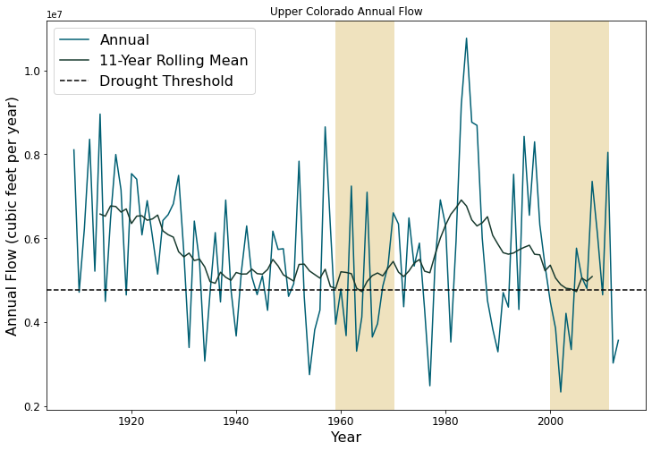
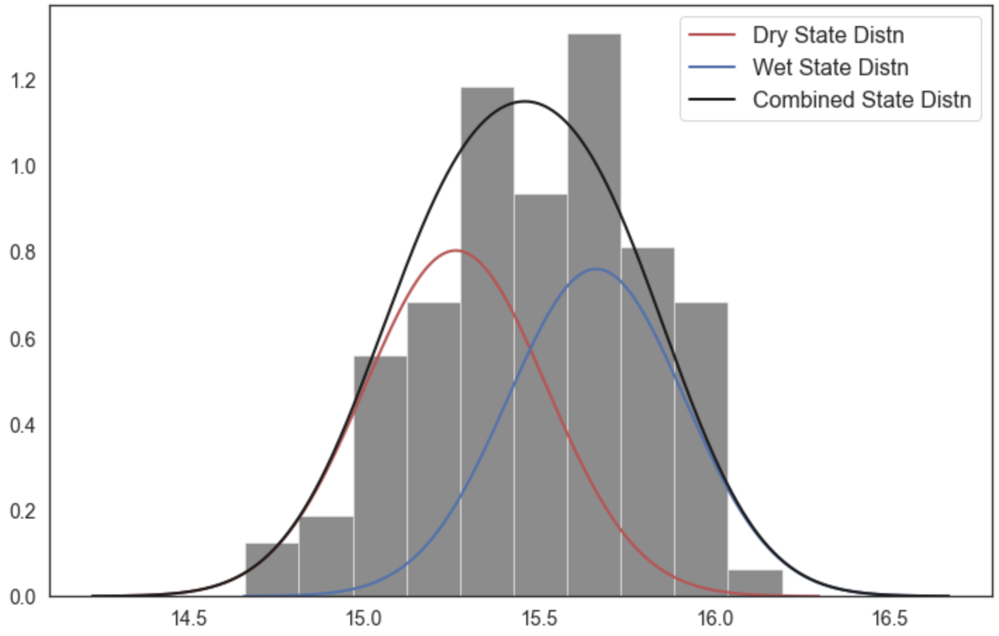

A Hidden-Markov Modeling Approach to Creating Synthetic Streamflow Scenarios Tutorial
****************************************************************************************************

.. note::

    | Run the tutorial interactively:  `HMM Notebook <nb_hmm_>`_.
    | Please be aware that notebooks can take a couple minutes to launch.
    | To run the notebooks yourself, download the files `here <https://github.com/IMMM-SFA/msd_uncertainty_ebook/tree/main/notebooks>`_ and use these `requirements <https://github.com/IMMM-SFA/msd_uncertainty_ebook/blob/main/requirements.txt>`_.

A Hidden-Markov Modeling Approach to Creating Synthetic Streamflow Scenarios
============================================================================

In this notebook, we will be covering the basics of fitting a Hidden
Markov Model-based synthetic streamflow generator for a single site in
the Upper Colorado River Basin. First, we will characterize the observed
historical flow in the basin from 1909-2013. Then, we will fit a
synthetic streamflow generator to the observed flows in the basin in
order to create stationary synthetic flows. Finally, we will create a
non-stationary version of the generator to create flows that could be
representative of plausible future climate in the region. We ultimately
show how to place the synthetically generated flows in the context of
physically-informed CMIP5 projections to compare the two methods.

Background
----------

In the Western United States (US), and particularly the Colorado River
Basin, a recent study used tree-ring reconstructions to suggest that the
megadrought that has been occurring in the Southwest over the past 22
years is the region’s worst drought since about 800 AD (Williams et al.,
2022). The study’s lead author, UCLA climatologist Park Williams,
suggested that had the sequence of wet-dry years occurred without
anthropogenic forcing, the 2000s would have likely still been dry, but
not on the same level as the worst of the last millennium’s
megadroughts.

The recent trend of warming and reduced soil moisture in the Southwest
US is highly challenging from a water systems planning and management
perspective for the Colorado River Basin. Given the wide recognition
that the river is over-allocated, the most recent drought highlights the
difficulty of sustaining the flow requirements as dictated by the
Colorado Compact. Thus, there has been an increasing focus in
exploratory modeling efforts to clarify how vulnerable water systems in
this region are to plausible drought streamflow scenarios for the
future. In this tutorial, we’ll discuss how to create these scenarios
using a Hidden Markov Model (HMM)- based streamflow synthetic generator.
As discussed in `Section
2.1 <https://uc-ebook.org/docs/html/2_diagnostic_modeling_overview_and_perspectives.html#overview-of-model-diagnostics>`__
and
`4.2 <https://uc-ebook.org/docs/html/4_sensitivity_analysis_diagnostic_and_exploratory_modeling.html#consequential-dynamics-what-is-controlling-model-behaviors-of-interest>`__
of the eBook, future climate conditions in the basin represent a deep
uncertainty that can lead to highly consequential water scarcity
outcomes. It is advantageous to create a model such as the HMM-based
generator in order to facilitate the creation of many ensembles of
streamflow that can ultimately be used to force regional water systems
models to understand how variability and drought extremes affect
regional water shortages, operations, and policies.

.. raw:: html

  <figure>
  

  <figcaption style="text-align:center"> Lake Powell shows persistent effects from drought (Source: U.S. Bureau of Reclamation) </figcaption>
  </figure>

Let’s Get Started!
==================

Observed Record
---------------

First, let’s take a look at the observed data from 1909-2013 for a
specific site. In this example, we use the outlet gauge of the Upper
Colorado River (USGS Gauge 09163500 at the Colorado-Utah state line).
Below, we create a plot of the annual streamflow.

.. code:: ipython3

    # Import libraries
    import matplotlib as mpl
    import matplotlib.pyplot as plt
    import matplotlib.patches as patches
    import numpy as np
    import pandas as pd
    from random import random
    from SALib.sample import latin
    from scipy import stats as ss
    import statistics
    import statsmodels.api as sm

    # Import helper functions from local package
    from functions import fitmodel
    from functions import plotstates
    from functions import plotdist

.. code:: ipython3

    # Read in annual historical data
    AnnualQ = pd.read_csv('data/uc_historical.csv')
    AnnualQ['Year'] = list(range(1909, 2014))

    # Plot a line graph
    fig, ax = plt.subplots(figsize=(12, 8))
    ax.plot(AnnualQ.iloc[:, 1],
            AnnualQ.iloc[:, 0],
            color='#005F73',
            label='Annual')

    # Add labels and title
    ax.set_title("Upper Colorado Annual Flow")
    ax.set_xlabel("Year", fontsize=16)
    ax.set_ylabel("Annual Flow (cubic feet per year)", fontsize=16)
    plt.xticks(fontsize=12)
    plt.yticks(fontsize=12)
    mpl.rc('legend', fontsize=16)
    legend = plt.legend(loc="upper right")
    plt.show()
    plt.close()

.. image:: _static/hmm_9_0.png

Let’s calculate an 11-year rolling mean of the same data to get a sense
of long-term trends.

.. code:: ipython3

    fig, ax = plt.subplots(figsize=(12, 8))

    # Plot the original line graph
    plt.plot(AnnualQ.iloc[:,1],
             AnnualQ.iloc[:,0],
             color='#005F73',
             label='Annual')

    # Plot an 11-year rolling mean
    plt.plot(AnnualQ.iloc[:, 1].rolling(11).mean(),
             AnnualQ.iloc[:, 0].rolling(11).mean(),
             color='#183A2E',
             label='11-Year Rolling Mean')

    # Add labels and title
    plt.title("Upper Colorado Annual Flow")
    ax.set_xlabel("Year",fontsize=16)
    ax.set_ylabel("Annual Flow (cubic feet per year)", fontsize=16)
    plt.xticks(fontsize=12)
    plt.yticks(fontsize=12)
    mpl.rc('legend', fontsize=16)
    legend = plt.legend()
    plt.show()
    plt.close()

.. image:: _static/hmm_11_0.png

The Colorado Compact, which prescribes flows between the Upper and Lower
Colorado Basins, was negotiated using data prior to 1922, a time period
revealed by the above figure to be one of the consistently wetter
periods on record. It’s clear today that since the 1980s, the Southwest
US has been experiencing aridification (Overpeck et al., 2020) and that
this observed record alone isn’t an accurate representation of what
future climate might look like in this region.

Let’s get a little more specific and formally quantify decadal droughts
that have occurred in the observed period. We use a metric proposed in
Ault et al. (2014). The authors define a decadal drought as when the
11-year rolling mean falls below a threshold that is 1/2 a standard
deviation below the overall mean of the record. We can then highlight
the block of years that fall in a decadal drought using yellow
rectangles below.

.. code:: ipython3

    # Define drought threshold
    std = statistics.stdev(AnnualQ.iloc[:, 0])
    threshold = np.mean(AnnualQ.iloc[:, 0] - (0.5 * std))

    # Find where the rolling mean dip below the threshold?
    drought_instances = [i for i, v in enumerate(AnnualQ.iloc[:,0].rolling(11).mean()) if v < threshold]
    drought_years = AnnualQ.iloc[:, 1].rolling(11).mean()[drought_instances]

    # Add labels and title
    fig, ax = plt.subplots(figsize=(12, 8))
    ax.plot(AnnualQ.iloc[:,1],
            AnnualQ.iloc[:,0],
            color='#005F73',
            label='Annual')

    ax.plot(AnnualQ.iloc[:,1].rolling(11,center=True).mean(),
            AnnualQ.iloc[:,0].rolling(11,center=True).mean(),
            color='#183A2E',
            label='11-Year Rolling Mean')

    ax.axhline(y=threshold,
               color='black',
               linestyle='--',
               label='Drought Threshold')

    # Visualize the drought periods as yellow rectangles
    for i in drought_years:

        # Plot a box centered around those values and with 5 years on either side.
        rect = patches.Rectangle((i-5,0), 11,2e7, linewidth=1, edgecolor='#EFE2BE', facecolor='#EFE2BE')

        # Add the patch to the Axes
        ax.add_patch(rect)

    plt.title("Upper Colorado Annual Flow")
    ax.set_xlabel("Year", fontsize=16)
    ax.set_ylabel("Annual Flow (cubic feet per year)", fontsize=16)
    plt.xticks(fontsize=12)
    plt.yticks(fontsize=12)
    mpl.rc('legend', fontsize=16)
    legend = plt.legend()
    plt.show()
    plt.close()

By this metric, the Upper Colorado Basin region has experienced two
decadal droughts over the last century.

Synthetic Stationary Generator to Better Quantify Natural Variability
---------------------------------------------------------------------

It is important to remember that the streamflow that we have observed in
the region over the last century is only one instance of the hydrology
that could occur since the atmosphere is an inherently stochastic
system. Thus, we require a tool that will allow us to see multiple
plausible realizations of the streamflow record to understand the
internal variability that characterizes the historical period. One
observed realization of historical streamflow is limited in its ability
to capture rare extremes; plausible (but not observed) alternative
instances of streamflow records can help to fill this gap. The tool that
we use to develop synthetic flows for the region is a Gaussian Hidden
Markov Model (HMM). If a system follows a Markov process, it switches
between a number of “hidden states” dictated by a transition matrix.
Each state has its own Gaussian probability distribution (defined by a
mean and standard deviation) and one can draw from this distribution to
create synthetic flows that fit the properties of the historical
distribution. HMMs are an attractive choice for this region because they
can simulate persistence (i.e., long duration droughts), which is a
characteristic of the region’s hydro-climatology. The figure below shows
an example of a 2-state Gaussian HMM that we will be fitting for this
example.

.. raw:: html

  <figure>
      

  <figcaption style="text-align:center"> Two-state Gaussian HMM with mean and standard deviation parameters</figcaption>
  </figure>

Below is the code that fits the HMM model to the last 2/3 of the
historical record of log annual flows at the CO-UT stateline gauge and
creates an alternative trace of 105 years. A subset of the dataset is
chosen in order to minimize overfitting and to retain a set of data for
validation of the model. When we fit our model, we utilize the
Baum-Welch algorithm (a special version of the expectation-maximization
algorithm) to find the optimal parameters that maximize the likelihood
of seeing the observed flows. Ultimately, the algorithm will return a
mean and standard deviation associated with each state (mus and sigmas
defined below) and a 2x2 transition probability matrix that captures the
likelihood of transitioning between states (P). We can also retrieve the
annual hidden states across the observed series, also known as the
Viterbi sequence of states, which classifies each year in a “wet” or
“dry” state.

.. code:: ipython3

    # Number of years for alternative trace
    n_years = 105

    # Import historical data that it used to fit HMM model
    AnnualQ_h = pd.read_csv('data/uc_historical.csv')

    # Fit the model and pull out relevant parameters and samples
    logQ = np.log(AnnualQ_h)
    hidden_states, mus, sigmas, P, logProb, samples, model = fitmodel.fitHMM(logQ, n_years)

We’ve fit our HMM, but what does the model look like? Let’s plot the
annual time series of hidden states, or the Viterbi sequence. In the
code, above, we have defined that the drier state is always represented
by state 0. Thus, we know that hidden_states = 0 corresponds to the dry
state and hidden_states = 1 to the wet state.

.. code:: ipython3

    # Plot Vitebi sequence
    plotstates.plotTimeSeries(np.log(AnnualQ.iloc[:,0]), hidden_states, 'Annual Flow (cube feet per year)')

.. image:: _static/hmm_21_0.png

In the figure above, we see that the years with the higher log flows
tend to be classified in a “wet” state and the opposite is true of the
“dry” state. We can also print the transition matrix, which shows the
likelihood of transitioning between states. Note that the system has a
high likelihood of persisting in the same state.

.. code:: ipython3

    print(model.transmat_)

.. parsed-literal::

    [[0.65095026 0.34904974]
     [0.3205531  0.6794469 ]]

Let’s also plot the distribution of log annual flows associated with the
wet and dry states.

.. code:: ipython3

    # Plot wet and dry state distributions
    plotdist.plotDistribution(logQ, mus, sigmas, P)

The wet state distribution is characterized by a greater mean flow, but
note that there is significant overlap in the tails of the distributions
below which demonstrates why years with similiar flows can be classified
in different states.

Now let’s see what the drought dynamics look like in the synthetic
scenario that we created using the same definition that we had used for
the historical period.

.. code:: ipython3

    # Retrieve samples and back-transform out of log space
    AnnualQ_s = np.exp(samples[0])
    AnnualQ_s = pd.DataFrame(AnnualQ_s)
    AnnualQ_s['Year'] = list(range(1909, 2014))

    # Define drought threshold
    std=statistics.stdev(AnnualQ_s.iloc[:, 0])
    threshold=np.mean(AnnualQ_s.iloc[:, 0] - (0.5 * std))

    # Where does the rolling mean dip below the threshold
    drought_instances = [i for i,v in enumerate(AnnualQ_s.iloc[:, 0].rolling(11).mean()) if v < threshold]
    drought_years = AnnualQ_s.iloc[:, 1].rolling(11).mean()[drought_instances]

    #Visualize the streamflow scenario
    fig, ax = plt.subplots(figsize=(12, 8))

    #Plot the original line graph
    ax.plot(AnnualQ_s.iloc[:,1],
            AnnualQ_s.iloc[:,0],
            color='#005F73',
            label='Annual')

    #Plot a 11-year rolling mean
    ax.plot(AnnualQ_s.iloc[:,1],
            AnnualQ_s.iloc[:,0].rolling(11, center=True).mean(),
            color='#183A2E',
            label='11-Year Rolling Mean')

    # Add labels and title
    ax.axhline(y=threshold,
               color='black',
               linestyle='--',
               label='Drought Threshold')

    for i in drought_years:

        #Plot a box centered around those values and with 5 years on either side.
        rect = patches.Rectangle((i - 5,
                                  0),
                                  11,
                                  2e7,
                                  linewidth=1,
                                  edgecolor='#EFE2BE',
                                  facecolor='#EFE2BE')

        # Add the patch to the Axes
        ax.add_patch(rect)

    plt.title("Upper Colorado Annual Flow (Synthetic Stationary)",fontsize=16)
    plt.xlabel("Year", fontsize=16)
    plt.ylabel("Annual Flow (cubic feet per year)", fontsize=16)
    mpl.rc('legend', fontsize=16)
    plt.legend()
    plt.xticks(fontsize=12)
    plt.yticks(fontsize=12)
    plt.show()
    plt.close()

.. image:: _static/hmm_28_0.png

You can sample from the model and create more 105-year traces and note
how the location and number of decadal droughts changes. This
demonstrates how different the historical record can look just within
the range of natural variability. It’s also important to remember that
when droughts occur can also define the ultimate effect of the drought
(i.e. is it a time when there is a large population growth or a time
when humans can adapt by conserving or building more infrastructure?). A
hydrologic drought need not manifest into an agricultural or operational
drought of the same magnitude if stored surface water is available.

We externally run the HMM many times to create a dataset of 100
instances of the 105-year traces and 1000 instances of the 105-year
traces that are available in the package
(“synthetic_stationary_small_sample_100.csv”,“synthetic_stationary_large_sample_1000”).
The shaded green lines correspond to the flow duration curves (FDCs) for
the generated streamflow traces in comparison with the FDC of the
historical record in beige.

.. raw:: html

  <figure>
      

  <figcaption style="text-align:center">Generated streamflow traces in comparison with the FDC of the historical record.</figcaption>
  </figure>

As expected, the stationary synthetic FDCs envelope the historical FDC
and particularly, the synthetic traces offer many more instances of low
flow conditions that could lead to more extreme drought conditions than
what has been observed historically. It is also useful to check for
convergence of samples and to determine how many samples are needed to
fully represent internal variability. Above we see that the extension to
1000 instances of 105-year traces fills out regions of the FDC,
including creating some more extreme drought conditions, but that
additional samples will likely not fill out the FDC substantially more.

Non-Stationary Synthetic Generator to Impose Climate Changes
------------------------------------------------------------

Now, we create flows under non-stationary conditions to get a better
understanding of what flows can look like under climate changes. In
order to create flows under non-stationary conditions, we can toggle the
parameters of the HMM model in order to create systematic changes to the
model that can represent a changing climate. The HMM has 6 parameters
that define it. When we fit the historical model, the parameters that
are fit represent a baseline parameter value. In this non-stationary
generator, we define a range to sample these parameters from.

+-----------------------+---------------+-------------+-------------+
| Parameter             | Current Value | Lower Bound | Upper Bound |
+=======================+===============+=============+=============+
| Log-Space Wet State   | 1.00          | 0.98        | 1.02        |
| Mean Multiplier       |               |             |             |
+-----------------------+---------------+-------------+-------------+
| Log-Space Dry State   | 1.00          | 0.98        | 1.02        |
| Mean Multiplier       |               |             |             |
+-----------------------+---------------+-------------+-------------+
| Log-Space Wet State   | 1.00          | 0.75        | 1.25        |
| Standard Deviation    |               |             |             |
| Multiplier            |               |             |             |
+-----------------------+---------------+-------------+-------------+
| Log-Space Dry State   | 1.00          | 0.75        | 1.25        |
| Standard Deviation    |               |             |             |
| Multiplier            |               |             |             |
+-----------------------+---------------+-------------+-------------+
| Change in Dry-Dry     | 0.00          | -0.30       | +0.30       |
| Transition            |               |             |             |
| Probability           |               |             |             |
+-----------------------+---------------+-------------+-------------+
| Change in Wet-Wet     | 0.00          | -0.30       | +0.30       |
| Transition            |               |             |             |
| Probability           |               |             |             |
+-----------------------+---------------+-------------+-------------+

Now let’s sample 1000 times from these bounds to create 1000 new
parameterizations of the model. Here we use SALib and the Latin
Hypercube sample function.

.. code:: ipython3

    # Create problem structure with parameters that we want to sample
    problem = {
        'num_vars': 6,
        'names': ['wet_mu', 'dry_mu', 'wet_std','dry_std','dry_tp',"wet_tp"],
        'bounds': [[0.98, 1.02],
                   [0.98, 1.02],
                   [0.75,1.25],
                   [0.75,1.25],
                   [-0.3,0.3],
                   [-0.3,0.3]]
    }

    # generate 1000 parameterizations
    n_samples = 1000

    # set random seed for reproducibility
    seed_value = 123

    # Generate our samples
    LHsamples = latin.sample(problem, n_samples, seed_value)

Now let’s look at what some of the traces look like in our
non-stationary generator. Let’s choose a random instance from the
1000-member space and adjust the parameters accordingly.

.. code:: ipython3

    # Define static parameters
    n_years = 105

    # Sample parameter; Adjust to any sample number from 0-999
    sample = 215

    # Create empty arrays to store the new Gaussian HMM parameters for each SOW
    Pnew = np.empty([2,2])
    piNew = np.empty([2])
    musNew_HMM = np.empty([2])
    sigmasNew_HMM = np.empty([2])
    logAnnualQ_s = np.empty([n_years])

    # Calculate new transition matrix and stationary distribution of SOW at last node as well as new means and standard deviations
    Pnew[0, 0] = max(0.0, min(1.0, P[0, 0] + LHsamples[sample][4]))
    Pnew[1, 1] = max(0.0, min(1.0, P[1, 1] + LHsamples[sample][5]))
    Pnew[0, 1] = 1 - Pnew[0, 0]
    Pnew[1, 0] = 1 - Pnew[1, 1]
    eigenvals, eigenvecs = np.linalg.eig(np.transpose(Pnew))
    one_eigval = np.argmin(np.abs(eigenvals - 1))
    piNew = np.divide(np.dot(np.transpose(Pnew), eigenvecs[:, one_eigval]),
                      np.sum(np.dot(np.transpose(Pnew), eigenvecs[:,one_eigval])))

    musNew_HMM[0] = mus[0] * LHsamples[sample][1]
    musNew_HMM[1] = mus[1] * LHsamples[sample][0]
    sigmasNew_HMM[0] = sigmas[0] * LHsamples[sample][3]
    sigmasNew_HMM[1] = sigmas[1] * LHsamples[sample][2]

    # Generate first state and log-space annual flow at last node
    states = np.empty([n_years])
    if random() <= piNew[0]:
        states[0] = 0
        logAnnualQ_s[0] = ss.norm.rvs(musNew_HMM[0], sigmasNew_HMM[0])
    else:
        states[0] = 1
        logAnnualQ_s[0] = ss.norm.rvs(musNew_HMM[1], sigmasNew_HMM[1])

    # Generate remaining state trajectory and log space flows at last node
    for j in range(1, n_years):
        if random() <= Pnew[int(states[j-1]), int(states[j-1])]:
            states[j] = states[j-1]
        else:
            states[j] = 1 - states[j-1]

        if states[j] == 0:
            logAnnualQ_s[j] = ss.norm.rvs(musNew_HMM[0], sigmasNew_HMM[0])
        else:
            logAnnualQ_s[j] = ss.norm.rvs(musNew_HMM[1], sigmasNew_HMM[1])

    # Convert log-space flows to real-space flows
    AnnualQ_s = np.exp(logAnnualQ_s)-1

Now let’s see what this synthetic trace looks like.

.. code:: ipython3

    # Retrieve samples and back-transform out of log space
    AnnualQ_s = pd.DataFrame(AnnualQ_s)
    AnnualQ_s['Year'] = list(range(1909, 2014))

    # Define drought threshold
    std = statistics.stdev(AnnualQ_s.iloc[:, 0])
    threshold = np.mean(AnnualQ_s.iloc[:, 0] - (0.5 * std))

    # Where does the rolling mean dip below the threshold
    drought_instances = [i for i, v in enumerate(AnnualQ_s.iloc[:, 0].rolling(11).mean()) if v < threshold]
    drought_years = AnnualQ_s.iloc[:, 1].rolling(11).mean()[drought_instances]

    # Visualize the streamflow scenario
    fig, ax = plt.subplots(figsize=(12, 8))

    # Plot the original line graph
    ax.plot(AnnualQ_s.iloc[:,1],
            AnnualQ_s.iloc[:,0],
            color='#005F73',
            label='Annual')

    # Plot a 11-year rolling mean
    ax.plot(AnnualQ_s.iloc[:, 1],
            AnnualQ_s.iloc[:, 0].rolling(11, center=True).mean(),
            color='#183A2E',
            label='11-Year Rolling Mean')

    # Add labels and title
    ax.axhline(y=threshold,
               color='black',
               linestyle='--',
               label='Drought Threshold')

    for i in drought_years:

        # Plot a box centered around those values and with 5 years on either side.
        rect = patches.Rectangle((i - 5,0),
                                 11,
                                 2e7,
                                 linewidth=1,
                                 edgecolor='#EFE2BE',
                                 facecolor='#EFE2BE')

        # Add the patch to the Axes
        ax.add_patch(rect)

    plt.title("Annual Flow (Synthetic Non-Stationary)", fontsize=16)
    plt.xlabel("Year", fontsize=16)
    plt.ylabel("Annual Flow (cubic feet per year)", fontsize=16)
    plt.xticks(fontsize=12)
    plt.yticks(fontsize=12)
    mpl.rc('legend', fontsize=16)
    legend = plt.legend(loc="upper right")
    plt.show()
    plt.close()

.. image:: _static/hmm_40_0.png

Above is the example trace from the new non-stationary model. You may
see fewer or more decadal drought instances. We can further summarize
overall decadal drought characteristics across the samples. Let’s plot a
histogram of the total number of times we go below the drought threshold
across these realizations.

.. code:: ipython3

    decadal_drought_occurence=np.empty([1000])

    for y in range(1000):

        # Create empty arrays to store the new Gaussian HMM parameters for each SOW
        Pnew = np.empty([2, 2])
        piNew = np.empty([2])
        musNew_HMM = np.empty([2])
        sigmasNew_HMM = np.empty([2])
        logAnnualQ_s = np.empty([n_years])

        # Calculate new transition matrix and stationary distribution of SOW at last node
        # as well as new means and standard deviations

        Pnew[0, 0] = max(0.0,min(1.0, P[0, 0] + LHsamples[y][4]))
        Pnew[1, 1] = max(0.0,min(1.0, P[1, 1] + LHsamples[y][5]))
        Pnew[0, 1] = 1 - Pnew[0, 0]
        Pnew[1, 0] = 1 - Pnew[1, 1]
        eigenvals, eigenvecs = np.linalg.eig(np.transpose(Pnew))
        one_eigval = np.argmin(np.abs(eigenvals - 1))
        piNew = np.divide(np.dot(np.transpose(Pnew), eigenvecs[:, one_eigval]),
                          np.sum(np.dot(np.transpose(Pnew), eigenvecs[:, one_eigval])))

        musNew_HMM[0] = mus[0] * LHsamples[y][1]
        musNew_HMM[1] = mus[1] * LHsamples[y][0]
        sigmasNew_HMM[0] = sigmas[0] * LHsamples[y][3]
        sigmasNew_HMM[1] = sigmas[1] * LHsamples[y][2]

        # Generate first state and log-space annual flow at last node
        states = np.empty([n_years])
        if random() <= piNew[0]:
            states[0] = 0
            logAnnualQ_s[0] = ss.norm.rvs(musNew_HMM[0], sigmasNew_HMM[0])
        else:
            states[0] = 1
            logAnnualQ_s[0] = ss.norm.rvs(musNew_HMM[1], sigmasNew_HMM[1])

        # generate remaining state trajectory and log space flows at last node
        for j in range(1, n_years):
            if random() <= Pnew[int(states[j-1]), int(states[j-1])]:
                states[j] = states[j-1]
            else:
                states[j] = 1 - states[j-1]

            if states[j] == 0:
                logAnnualQ_s[j] = ss.norm.rvs(musNew_HMM[0], sigmasNew_HMM[0])
            else:
                logAnnualQ_s[j] = ss.norm.rvs(musNew_HMM[1], sigmasNew_HMM[1])

        # Convert log-space flows to real-space flows
        AnnualQ_s = np.exp(logAnnualQ_s) - 1
        AnnualQ_s = pd.DataFrame(AnnualQ_s)
        AnnualQ_s['Year'] = list(range(1909, 2014))

        # Define drought threshold
        std = statistics.stdev(AnnualQ_s.iloc[:, 0])
        threshold = np.mean(AnnualQ_s.iloc[:, 0] - (0.5 * std))

        # Where does the rolling mean dip below the threshold
        drought_instances = [i for i, v in enumerate(AnnualQ_s.iloc[:, 0].rolling(11).mean()) if v < threshold]
        decadal_drought_occurence[y] = len(drought_instances)

.. code:: ipython3

    fig, ax = plt.subplots(figsize=(12, 8))
    ax.hist(decadal_drought_occurence,label='Non-Stationary generator',color="#005F73")
    ax.set_xlabel('Number of Instances of Decadal Drought',fontsize=16)
    ax.set_ylabel('Frequency',fontsize=16)
    ax.axvline(x=2, color='r', linestyle='-',label='Observed')
    mpl.rc('legend', fontsize = 16)
    plt.xticks(fontsize = 12)
    plt.yticks(fontsize = 12)
    plt.show()
    plt.close()

.. image:: _static/hmm_43_0.png

Note how many more instances of the decadal droughts we are creating
with the non-stationary generator than our observed 105-year trace which
creates a rich space in which we can test our models. Just as we did
with the stationary generator, we can externally run the non-stationary
generator to create 10,000 instances of the 105-year traces that are
available in the package
(“synthetic_nonstationary_large_sample_10000.csv”). The shaded green and
blue lines correspond to the FDCs for the stationary and non-stationary
generated streamflow traces in comparison with the FDC of the historical
record in beige. Note how the non-stationary generator produces even
more drought extremes than the stationary non-synthetic traces.

.. raw:: html

  <figure>
      

  <figcaption style="text-align:center">Generated streamflow traces in comparison with the FDC of the historical record.</figcaption>
  </figure>

Placing CMIP5 Projections in the Context of Non-Stationary Flows
----------------------------------------------------------------

We have broadened the drought conditions that we are creating which that
can be very useful to understand how our water systems model performs
under potentially extreme scenarios. However, it’s useful to compare our
bottom-up synthetically generated flows in the context of global
physically-driven CMIP5 projections to get a better understanding of how
the two approaches compare. We first aquire 97 CMIP5 projections from
the Colorado River Water Availability Study (CWCB, 2012). In each of
these projections, monthly precipitation factor changes and temperature
delta changes were computed between mean projected 2035–2065 climate
statistics and mean historical climate statistics from 1950–2013. These
97 different combinations of 12 monthly precipitation multipliers and 12
monthly temperature delta shifts were applied to historical
precipitation and temperature time series from 1950–2013. The resulting
climate time series were run through a Variable Infiltration Capacity
(VIC) model of the UCRB, resulting in 97 time series of projected future
streamflows at the Colorado‐Utah state line.

We fit an HMM to each trace of projected streamflow and get a set of
corresponding HMM parameters. Then we take the ratio between these
parameters and the baseline HMM parameters that we calculated earlier in
the notebook in order to calculate the multipliers associated with each
CMIP5 projection. This is all done externally, so we import the
resulting multipliers in the next line.

.. code:: ipython3

    # Read in CMIP5 and paleo multipliers
    CMIP5_multipliers = pd.read_csv('data/CMIP5_SOWs.txt', header=None, sep=" ")

Let’s plot a response surface that will allow us to see how combinations
of HMM parameters tend to influence decadal drought. In order to get a
continuous surface, we’ll fit a non-linear regression to the parameter
values and then predict the decadal drought over a set of grid points.
We fit the response surface for two parameters that should have an
affect on decadal drought: the dry distribution mean and the dry-dry
transition probabilites.

.. code:: ipython3

    # Choose two parameters to fit the response surface for
    mu_dry=[i[1] for i in LHsamples]
    tp_dry=[i[4] for i in LHsamples]

    # Create an interpolation grid
    xgrid = np.arange(np.min(mu_dry),
                      np.max(mu_dry),
                      (np.max(mu_dry) - np.min(mu_dry)) / 100)

    ygrid = np.arange(np.min(tp_dry),
                      np.max(tp_dry),
                      (np.max(tp_dry) - np.min(tp_dry)) / 100)

    # Fit regression
    d = {'Dry_Tp': tp_dry,
         'Dry_Mu': mu_dry,
         'Drought_Occurrence':decadal_drought_occurence}

    df = pd.DataFrame(d)
    df['Intercept'] = np.ones(np.shape(df)[0])
    df['Interaction'] = df['Dry_Tp'] * df['Dry_Mu']
    cols = ['Intercept'] + ['Dry_Mu'] + ['Dry_Tp'] + ['Interaction']
    ols = sm.OLS(df['Drought_Occurrence'], df[cols])
    result = ols.fit()

    # Calculate drought occurence for each grid point
    X, Y = np.meshgrid(xgrid, ygrid)
    x = X.flatten()
    y = Y.flatten()
    grid = np.column_stack([np.ones(len(x)), x, y, x * y])
    z = result.predict(grid)
    z[z < 0.0] = 0.0 # replace negative shortage predictions with 0

Let’s plot our results:

.. code:: ipython3

    # Set color gradient for response surface
    drought_map = mpl.cm.get_cmap('RdBu_r')

    # Reshape our predicted drought occurrence and define bounds of colors
    Z = np.reshape(z, np.shape(X))
    vmin = np.min([np.min(z), np.min(df['Drought_Occurrence'].values)])
    vmax = 15
    norm = mpl.colors.Normalize(vmin, vmax)

    # Plot response surface and CMIP5 projections
    fig, ax = plt.subplots(figsize=(12, 8))
    ax.contourf(X, Y, Z, cmap=drought_map, norm=norm)
    ax.scatter(CMIP5_multipliers.iloc[:,7],
               CMIP5_multipliers.iloc[:,12],
               c='#ffffb3',
               edgecolor='none',
               s=30)
    cbar = ax.figure.colorbar(mpl.cm.ScalarMappable(norm=norm, cmap=drought_map), ax=ax)
    ax.set_xlim(np.nanmin(X), np.nanmax(X))
    ax.set_ylim(np.nanmin(Y), np.nanmax(Y))
    ax.set_xlabel('Dry State Mu', fontsize=14)
    ax.set_ylabel('Dry-Dry Transition Probability', fontsize=14)
    ax.tick_params(axis='both', labelsize=14)
    cbar.ax.set_ylabel('Decadal Drought Occurrence', rotation=-90, fontsize=14, labelpad=15)
    cbar.ax.tick_params(axis='y',labelsize=14)
    plt.show()
    plt.close()

We see the influence of the dry state mean and dry-dry transition
parameters. We’re likely to see more decadal droughts when we (1)
increase the dry-dry transition probability, which inherently will
increase persistence of the dry state, and (2) when we make the dry
state log mean drier. Note that the CMIP5 scenarios tend to span the
extent of the dry mean sample space, but are less representative of the
dry transition probability sample space, which suggests that the types
of hydrological droughts represented in the projections tend to only be
wetter to slightly drier than our baseline. Both methods of producing
these scenarios are valid, though studies have suggested that
globally-resolved GCMs may be inappropriate to represent regional
extremes. Ultimately, if your goal is to produce a variety of ensembles
that are characterized by many different drought characteristics, you
will likely find that a generator approach will serve this purpose
better.

Tips to Create an HMM-Based Generator for your System
-----------------------------------------------------

In this tutorial, we demonstrated how to fit an HMM-based generator for
a single gauge located in the Upper Colorado River Basin. In order to
apply this methodology to your problem, you will need to first ask:

(1) Is this model appropriate for my location of interest? We have
    applied this style of generator to locations where persistent wet
    and dry states are characteristic, which tends to be in the Western
    US. Ultimately the best way to judge if an HMM is useful for your
    application is to fit the model and explore the resulting
    distributions. Are there two (or more) distinct states that emerge?
    If not, then your location may not exhibit the type of persistence
    that an HMM-based generator is useful for. You can consider
    exploring other styles of generators such as the Kirsch-Nowak
    generator (Kirsch et al., 2013).

(2) Do I have the right datasets? We use annual data for our location of
    interest. In this notebook, the HMM is fit to log annual flows.
    Ultimately, it can be disaggregated to daily flows (using a
    reference historical daily dataset) to be useful in water resources
    operational applications. You could also disaggregate to a finer
    resolution than daily if the historical dataset exists.

If you meet these requirements, feel free to proceed through fitting the
model using the code available in the notebook. Be sure to consider the
appropirate number of samples to generate (both in a stationary and
non-stationary case). Make sure that you test multiple sample sizes and
continue to increase your sample size until you converge to a consistent
representation of extremes. What is the appropriate number of LHS
samples of the parameters to use? In this experiment we used 1,000
samples of parameters due to extensive stability tests described in
Quinn et al. (2020).

Finally, to learn more about this test case refer to Hadmichael et
al. (2020a) and Hadmichael et al. (2020b). For another study on
synthetic drought generation to support vulnerability assessments in the
Research Triangle region of North Carolina, please refer to Herman et
al. (2016)

References
----------

Ault, T. R., Cole, J. E., Overpeck, J. T., Pederson, G. T., & Meko, D.
M. (2014). Assessing the risk of persistent drought using climate model
simulations and paleoclimate data. Journal of Climate, 27(20),
7529-7549.

CWCB (2012).Colorado River Water Availability Study Phase I Report.
Colorado Water Conservation Board

Hadjimichael, A., Quinn, J., Wilson, E., Reed, P., Basdekas, L., Yates,
D., & Garrison, M. (2020a). Defining robustness, vulnerabilities, and
consequential scenarios for diverse stakeholder interests in
institutionally complex river basins. Earth’s Future, 8(7),
e2020EF001503.

Hadjimichael, A., Quinn, J., & Reed, P. (2020). Advancing diagnostic
model evaluation to better understand water shortage mechanisms in
institutionally complex river basins. Water Resources Research, 56(10),
e2020WR028079.

Herman, J. D., Zeff, H. B., Lamontagne, J. R., Reed, P. M., &
Characklis, G. W. (2016). Synthetic drought scenario generation to
support bottom-up water supply vulnerability assessments. Journal of
Water Resources Planning and Management, (11), 04016050.

Kirsch, B. R., Characklis, G. W., & Zeff, H. B. (2013). Evaluating the
impact of alternative hydro-climate scenarios on transfer agreements:
Practical improvement for generating synthetic streamflows. Journal of
Water Resources Planning and Management, 139(4), 396-406.

Overpeck, J.T. & Udall, B. (2020) “Climate change and the aridification
of North America.” Proceedings of the national academy of sciences
117.22 11856-11858.

Quinn, J. D., Hadjimichael, A., Reed,P. M., & Steinschneider, S. (2020).
Canexploratory modeling of water scarcity vulnerabilities and robustness
bescenario neutral?Earth’s Future,8,e2020EF001650.
https://doi.org/10.1029/2020EF001650Received

Williams, A. P., Cook, B. I., & Smerdon, J. E. (2022). Rapid
intensification of the emerging southwestern North American megadrought
in 2020–2021. Nature Climate Change, 12(3), 232-234.
